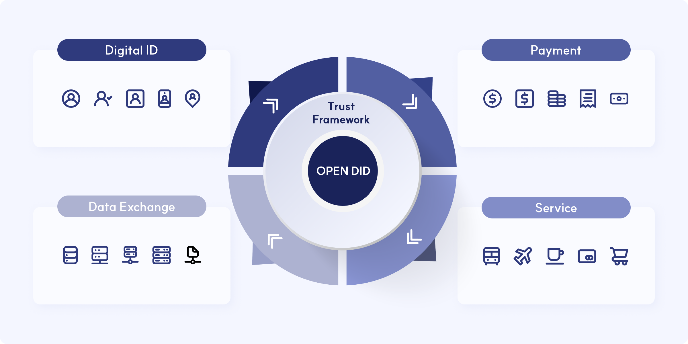

Open DID
==

We aim to provide various members of the digital world with a digital identity verification system based on trust and responsibility through the OPEN DID platform. This will help reduce social costs and fulfill "social responsibility for realizing human value" for marginalized groups.

OPEN DID is designed with key elements to enable many countries and members to build such an ecosystem.

* The OPEN DID system consists of a Trust Environment for establishing a trust chain among participating Entities, a Wallet for storing and managing various credentials based on Digital ID, a Digital ID embracing various credentials, and Security for data protection.
* The value of this OPEN DID open source is expected to become the foundation of all digital activities online in the future.



## 1. Principles
The OPEN DID system aims to provide open source based on the following principles. These principles are intended to build a reliable digital identity verification environment and ensure that all participants can use it fairly and safely.

* **Independent Operation**: Components of the OPEN DID system should minimize dependencies on each other and be able to operate individually.

* **Technology Independence**: The OPEN DID system should be designed to embrace and be compatible with various technologies without relying on specific technologies or tools.

* **Documentation**: Documentation on the design, implementation, and operation should be provided to ensure sustainable management and technology selection for the components of the OPEN DID system.

* **Compliance with Open Standards**: When implementing technologies or functions in the OPEN DID system, open standards (preventing vendor and technology lock-in) must be adhered to.

* **Module Diversity**: Providers participating in the OPEN DID system should be able to freely choose and combine the desired components as needed.

* **Enhanced Security**: The OPEN DID system should include appropriate security features to protect user authentication and data.

* **Compliance with Global Standards**: The OPEN DID system should comply with global standards for personal data protection (Privacy by design approach) and data protection principles in practice.

* **Zero Trust Communication**: Each component of the OPEN DID system should be able to establish secure and trustworthy communication mechanisms with each other.

* **Free Contribution**: The OPEN DID project should allow anyone to contribute freely.

* **Transparency**: Decisions and changes in the OPEN DID project should be made transparently and publicly.

* **Restriction on Commercial Licenses**: No commercial licenses are used within any components of OPEN DID.

* **Adherence to Principles**: Each principle of the OPEN DID system should be applied in system design and implementation without violating other principles.

## 2. Glossary
Understanding the key terms used in the OpenDID platform is crucial for grasping the concepts of the project.

For detailed descriptions of each term, please refer to [glossary.md](docs/guide/glossary.md).

## 3. System Architecture
To understand the overall system architecture of OpenDID, refer to the components and software architecture of OpenDID.

This section explains the role of each component in OpenDID and how they interact to form the data flow.
- [Components](docs/concepts/components.md): Describes the components of OpenDID.
- [Software Architecture](docs/architecture/Software%20Architecture.md): Explains the overall system architecture and data flow.

## 4. OpenDID Standards
Learn about the standards defined by OpenDID. 

OpenDID standards are designed to promote interoperability, enhance security, and adhere to the core principles of decentralized identity management.

These standards apply consistent rules and protocols throughout the project.

For more information, refer to the following documents:
1. Concepts: Explains the key concepts of OpenDID.
2. Security: Covers security-related topics, explaining how the OpenDID platform is protected from security threats.
<!--3. [Protocol](docs/protocol): Describes the communication protocols used by OpenDID and how interaction between DID networks is handled.-->


## 5. DID Repository List

#### Demo

1. [did-demo-app](https://github.com/OmniOneID/did-demo-app)

#### Document

1. [did-doc-architecture](https://github.com/OmniOneID/did-doc-architecture)
1. [did-release](https://github.com/OmniOneID/did-release)

#### Server SDK

1. [did-blockchain-sdk-server](https://github.com/OmniOneID/did-blockchain-sdk-server)
1. [did-core-sdk-server](https://github.com/OmniOneID/did-core-sdk-server)
1. [did-crypto-sdk-server](https://github.com/OmniOneID/did-crypto-sdk-server)
1. [did-datamodel-sdk-server](https://github.com/OmniOneID/did-datamodel-sdk-server)
1. [did-wallet-sdk-server](https://github.com/OmniOneID/did-wallet-sdk-server)
1. [did-cli-tool-server](https://github.com/OmniOneID/did-cli-tool-server)
1. [did-common-sdk-server](https://github.com/OmniOneID/did-common-sdk-server)
1. [did-zkp-sdk-server](https://github.com/OmniOneID/did-zkp-sdk-server)

#### Mobile SDK 

1. [did-client-sdk-aos](https://github.com/OmniOneID/did-client-sdk-aos)
1. [did-client-sdk-ios](https://github.com/OmniOneID/did-client-sdk-ios)
1. [did-client-sdk-aos-kotlin](https://github.com/OmniOneID/did-client-sdk-aos-kotlin)

#### Server Application 

1. [did-besu-contact](https://github.com/OmniOneID/did-besu-contract)
1. [did-issuer-server](https://github.com/OmniOneID/did-issuer-server)
1. [did-ta-server](https://github.com/OmniOneID/did-ta-server)
1. [did-verifier-server](https://github.com/OmniOneID/did-verifier-server)
1. [did-api-server](https://github.com/OmniOneID/did-api-server)
1. [did-ca-server](https://github.com/OmniOneID/did-ca-server)
1. [did-demo-server](https://github.com/OmniOneID/did-demo-server)
1. [did-wallet-server](https://github.com/OmniOneID/did-wallet-server)
1. [did-ledger-service-server](https://github.com/OmniOneID/did-ledger-service-server)
1. [did-orchestrator-server](https://github.com/OmniOneID/did-orchestrator-server)

#### Mobile Application 

1. [did-ca-aos](https://github.com/OmniOneID/did-ca-aos)
1. [did-ca-ios](https://github.com/OmniOneID/did-ca-ios)

## 6. Folder Structure
```
did-doc-architecture
    ├── CLA.md
    ├── CODE_OF_CONDUCT.md
    ├── CONTRIBUTING.md
    ├── MAINTAINERS.md
    ├── README.md
    ├── README_ko.md
    └── docs
        ├── architecture
        ├── assets
        ├── concepts
        ├── data standard
        ├── guide
        ├── rules
        └── security
```

| Name               | Description                                   |
| ------------------ | --------------------------------------------- |
| CLA.md             | Contributor License Agreement                 |
| CODE_OF_CONDUCT.md | Code of conduct for contributors              |
| CONTRIBUTING.md    | Contribution guidelines and procedures        |
| MAINTAINERS.md     | General guidelines for maintaining            |
| README.md          | Overview and description of the project       |
| docs               | Documentation                                 |
| ┖ architecture     | Open DID architecture                         |
| ┖ assets           | Tables and image data                         |
| ┖ concepts         | Explanation of key concepts                   |
| ┖ data standard    | Data Standard Specifications                  |
| ┖ guide            | Document Creation Method and OSD Syntax       |
| ┖ rules            | Code Style and Commit Guidelines              |
| ┖ security         | Security policies and vulnerability reporting |


## 7. Contributing
Please read [CONTRIBUTING.md](CONTRIBUTING.md) and [CODE_OF_CONDUCT.md](CODE_OF_CONDUCT.md) for details on our code of conduct, and the process for submitting pull requests to us.

## 8. License
[Apache 2.0](https://github.com/OmniOneID/did-doc-architecture/blob/main/LICENSE)
