---
puppeteer:
    pdf:
        format: A4
        displayHeaderFooter: true
        landscape: false
        scale: 0.8
        margin:
            top: 1.2cm
            right: 1cm
            bottom: 1cm
            left: 1cm
    image:
        quality: 100
        fullPage: false
---

Key Management Information
==

- Subject: Key Management
- Author: OpenSource Development Team
- Date: 2025-06-25
- Version: v2.0.0

| Version | Date       | Changes         |
| ------- | ---------- | --------------- |
| v2.0.0  | 2025-06-25 | Initial version |

 

Table of Contents
--

<!-- TOC tocDepth:2..4 chapterDepth:2..6 -->

- [1. Overview](#1-overview)
- [2. iOS](#2-ios)
    - [2.1. Key Generation](#21-key-generation)
        - [2.1.1. General Key Generation](#211-general-key-generation)
        - [2.1.2. PIN Key Generation](#212-pin-key-generation)
        - [2.1.3. Bio Key Generation](#213-bio-key-generation)
    - [2.2. Signing](#22-signing)
        - [2.2.1. General Key Signing](#221-general-key-signing)
        - [2.2.2. PIN Key Signing](#222-pin-key-signing)
        - [2.2.3. Bio Key Signing](#223-bio-key-signing)
- [3. Android](#3-android)
    - [3.1. Key Generation](#31-key-generation)
        - [3.1.1. General Key Generation](#311-general-key-generation)
        - [3.1.2. PIN Key Generation](#312-pin-key-generation)
        - [3.1.3. Bio Key Generation](#313-bio-key-generation)
    - [3.2. Signing](#32-signing)
        - [3.2.1. General Key Signing](#321-general-key-signing)
        - [3.2.2. PIN Key Signing](#322-pin-key-signing)
        - [3.2.3. Bio Key Signing](#323-bio-key-signing)

<!-- /TOC -->

## 1. Overview

This document describes the generation and signing of keys within the core of the client SDK used in OpenDID, for both iOS and Android platforms. 
On both platforms, biometric authentication keys are stored in hardware-backed secure environments — the Secure Enclave on iOS and the Android Keystore on Android. 
All keys used for signing operations utilize the Secp256R1 elliptic curve algorithm. 

## 2. iOS
### 2.1. Key Generation
#### 2.1.1. General Key Generation

  

  <table>
  <thead>
    <tr>
      <th>Idx</th>
      <th>Function</th>
      <th>Return</th>
      <th>Category</th>
    </tr>
  </thead>
  <tbody>
    <tr>
      <td>1</td>
      <td>generateKey (Secp256r1, wallet, none)</td>
      <td>-</td>
      <td>API</td>
    </tr>
    <tr>
      <td>2</td>
      <td>P256.Signing.PrivateKey</td>
      <td>Private Key, Public Key</td>
      <td>Framework</td>
    </tr>
    <tr>
      <td>3</td>
      <td>SecKeyCreateRandomKey (kSecAttrKeyTypeECSECPrimeRandom, kSecAttrTokenIDSecureEnclave)</td>
      <td>Public Key</td>
      <td>Framework</td>
    </tr>
    <tr>
      <td>4</td>
      <td>SecKeyCreateEncryptedData (eciesEncryptionStandardX963SHA256AESGCM)</td>
      <td>Encrypted wallet data</td>
      <td>Framework</td>
    </tr>
    <tr>
      <td>5</td>
      <td>SecKeyCreateSignature (ecdsaSignatureDigestX962SHA256)</td>
      <td>Wallet signature value</td>
      <td>Framework</td>
    </tr>
  </tbody>
</table>

<!--  -->

<!-- 
| Idx | Function                                                                                 | Return               |
|-----|------------------------------------------------------------------------------------------|----------------------|
| 1   | generateKey (Secp256r1, wallet, none)                                                 | -                    |
| 2   | P256.Signing.PrivateKey                                                                  | Private Key, Public Key      |
| 3   | SecKeyCreateRandomKey (kSecAttrKeyTypeECSECPrimeRandom, kSecAttrTokenIDSecureEnclave) | Public Key               |
| 4   | SecKeyCreateEncryptedData (eciesEncryptionStandardX963SHA256AESGCM)                   | Encrypted wallet data |
| 5   | SecKeyCreateSignature (ecdsaSignatureDigestX962SHA256)                                | Wallet signature value          | -->

#### 2.1.2. PIN Key Generation

  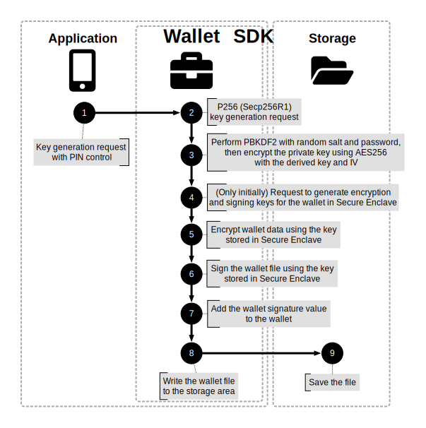

  <table>
  <thead>
    <tr>
      <th>Idx</th>
      <th>Function</th>
      <th>Return</th>
      <th>Category</th>
    </tr>
  </thead>
  <tbody>
    <tr>
      <td>1</td>
      <td>generateKey (Secp256r1, wallet, pin, password)</td>
      <td>-</td>
      <td>API</td>
    </tr>
    <tr>
      <td>2</td>
      <td>P256.Signing.PrivateKey</td>
      <td>Private Key, Public Key</td>
      <td>Framework</td>
    </tr>
    <tr>
      <td>4</td>
      <td>SecKeyCreateRandomKey (kSecAttrKeyTypeECSECPrimeRandom, kSecAttrTokenIDSecureEnclave)</td>
      <td>Public Key</td>
      <td>Framework</td>
    </tr>
    <tr>
      <td>5</td>
      <td>SecKeyCreateEncryptedData (eciesEncryptionStandardX963SHA256AESGCM)</td>
      <td>Encrypted wallet data</td>
      <td>Framework</td>
    </tr>
    <tr>
      <td>6</td>
      <td>SecKeyCreateSignature (ecdsaSignatureDigestX962SHA256)</td>
      <td>Wallet signature value</td>
      <td>Framework</td>
    </tr>
  </tbody>
</table>

<!--  -->

<!-- | Idx | Function                                                                                           | Return               |
|-----|----------------------------------------------------------------------------------------------------|----------------------|
| 1   | generateKey (Secp256r1, wallet, pin, password)                                                  | -                    |
| 2   | P256.Signing.PrivateKey                                                                            | Private Key, Public Key      |
| 4   | SecKeyCreateRandomKey (kSecAttrKeyTypeECSECPrimeRandom, kSecAttrTokenIDSecureEnclave)           | Public Key               |
| 5   | SecKeyCreateEncryptedData (eciesEncryptionStandardX963SHA256AESGCM)                             | Encrypted wallet data |
| 6   | SecKeyCreateSignature (ecdsaSignatureDigestX962SHA256)                                          | Wallet signature value          | -->

#### 2.1.3. Bio Key Generation

  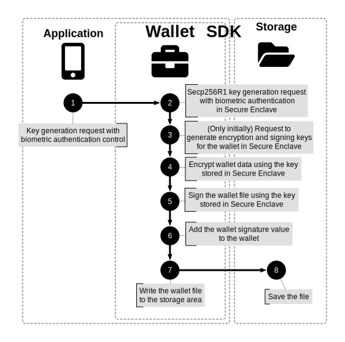

  <table>
  <thead>
    <tr>
      <th>Idx</th>
      <th>Function</th>
      <th>Return</th>
      <th>Category</th>
    </tr>
  </thead>
  <tbody>
    <tr>
      <td>1</td>
      <td>generateKey (Secp256r1, secureEnclave, biometryCurrentSet)</td>
      <td>-</td>
      <td>API</td>
    </tr>
    <tr>
      <td>2</td>
      <td>SecKeyCreateRandomKey (kSecAttrKeyTypeECSECPrimeRandom, kSecAttrTokenIDSecureEnclave, biometryCurrentSet)</td>
      <td>Public Key</td>
      <td>Framework</td>
    </tr>
    <tr>
      <td>3</td>
      <td>SecKeyCreateRandomKey (kSecAttrKeyTypeECSECPrimeRandom, kSecAttrTokenIDSecureEnclave)</td>
      <td>Public Key</td>
      <td>Framework</td>
    </tr>
    <tr>
      <td>4</td>
      <td>SecKeyCreateEncryptedData (eciesEncryptionStandardX963SHA256AESGCM)</td>
      <td>Encrypted wallet data</td>
      <td>Framework</td>
    </tr>
    <tr>
      <td>5</td>
      <td>SecKeyCreateSignature (ecdsaSignatureDigestX962SHA256)</td>
      <td>Wallet signature value</td>
      <td>Framework</td>
    </tr>
  </tbody>
</table>

<!--  -->

<!-- | Idx | Function                                                                                                              | Return               |
|-----|-----------------------------------------------------------------------------------------------------------------------|----------------------|
| 1   | generateKey (Secp256r1, secureEnclave, biometryCurrentSet)                                                        | -                    |
| 2   | SecKeyCreateRandomKey (kSecAttrKeyTypeECSECPrimeRandom, kSecAttrTokenIDSecureEnclave, biometryCurrentSet)         | Public Key               |
| 3   | SecKeyCreateRandomKey (kSecAttrKeyTypeECSECPrimeRandom, kSecAttrTokenIDSecureEnclave)                             | Public Key               |
| 4   | SecKeyCreateEncryptedData (eciesEncryptionStandardX963SHA256AESGCM)                                               | Encrypted wallet data |
| 5   | SecKeyCreateSignature (ecdsaSignatureDigestX962SHA256)                                                            | Wallet signature value          | -->

### 2.2. Signing
#### 2.2.1. General Key Signing

  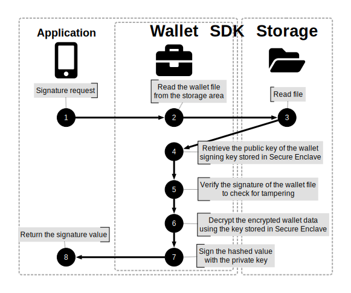

  <table>
  <thead>
    <tr>
      <th>Idx</th>
      <th>Function</th>
      <th>Return</th>
      <th>Category</th>
    </tr>
  </thead>
  <tbody>
    <tr>
      <td>1</td>
      <td>sign (digest)</td>
      <td>Signature value</td>
      <td>API</td>
    </tr>
    <tr>
      <td>4</td>
      <td>SecItemCopyMatching (kSecAttrKeyTypeECSECPrimeRandom)</td>
      <td>Public Key</td>
      <td>Framework</td>
    </tr>
    <tr>
      <td>5</td>
      <td>verify (wallet.signature, wallet.digest, publicKey)</td>
      <td>Signature verification result</td>
      <td>Framework</td>
    </tr>
    <tr>
      <td>6</td>
      <td>SecKeyCreateDecryptedData (eciesEncryptionStandardX963SHA256AESGCM)</td>
      <td>Decrypted wallet data</td>
      <td>Framework</td>
    </tr>
    <tr>
      <td>7</td>
      <td>P256.Signing.PrivateKey(privateKey).signature (digest)</td>
      <td>Signature value</td>
      <td>Framework</td>
    </tr>
  </tbody>
</table>

<!--  -->

<!-- |Idx|Function                                                                  |Return            |
|---|---------------------------------------------------------------------------|------------------|
|1  |sign (digest)                                                          |Signature value            |
|4  |SecItemCopyMatching (kSecAttrKeyTypeECSECPrimeRandom)                 |Public Key            |
|5  |verify (wallet.signature, wallet.digest, publicKey)                   |Signature verification result    |
|6  |SecKeyCreateDecryptedData (eciesEncryptionStandardX963SHA256AESGCM)   |Decrypted wallet data|
|7  |P256.Signing.PrivateKey(privateKey).signature (digest)                |Signature value            | -->

#### 2.2.2. PIN Key Signing

  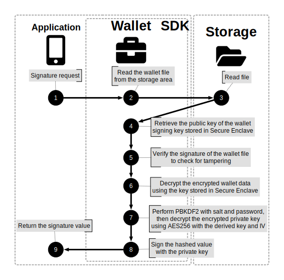

  <table>
  <thead>
    <tr>
      <th>Idx</th>
      <th>Function</th>
      <th>Return</th>
      <th>Category</th>
    </tr>
  </thead>
  <tbody>
    <tr>
      <td>1</td>
      <td>sign (digest, password)</td>
      <td>Signature value</td>
      <td>API</td>
    </tr>
    <tr>
      <td>4</td>
      <td>SecItemCopyMatching (kSecAttrKeyTypeECSECPrimeRandom)</td>
      <td>Public Key</td>
      <td>Framework</td>
    </tr>
    <tr>
      <td>5</td>
      <td>verify (wallet.signature, wallet.digest, publicKey)</td>
      <td>Signature verification result</td>
      <td>Framework</td>
    </tr>
    <tr>
      <td>6</td>
      <td>SecKeyCreateDecryptedData (eciesEncryptionStandardX963SHA256AESGCM)</td>
      <td>Decrypted wallet data</td>
      <td>Framework</td>
    </tr>
    <tr>
      <td>8</td>
      <td>P256.Signing.PrivateKey(privateKey).signature (digest)</td>
      <td>Signature value</td>
      <td>Framework</td>
    </tr>
  </tbody>
</table>

<!--  -->

<!-- |Idx|Function                                                                  |Return               |
|---|--------------------------------------------------------------------------|---------------------|
|1  |sign (digest, password)                                               |Signature value               |
|4  |SecItemCopyMatching (kSecAttrKeyTypeECSECPrimeRandom)                |Public Key               |
|5  |verify (wallet.signature, wallet.digest, publicKey)                  |Signature verification result       |
|6  |SecKeyCreateDecryptedData (eciesEncryptionStandardX963SHA256AESGCM)  |Decrypted wallet data|
|8  |P256.Signing.PrivateKey(privateKey).signature (digest)               |Signature value               | -->

#### 2.2.3. Bio Key Signing

  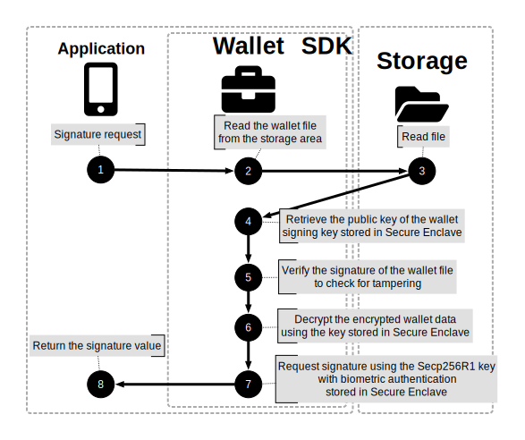

  <table>
  <thead>
    <tr>
      <th>Idx</th>
      <th>Function</th>
      <th>Return</th>
      <th>Category</th>
    </tr>
  </thead>
  <tbody>
    <tr>
      <td>1</td>
      <td>sign (digest)</td>
      <td>Signature value</td>
      <td>API</td>
    </tr>
    <tr>
      <td>4</td>
      <td>SecItemCopyMatching (kSecAttrKeyTypeECSECPrimeRandom)</td>
      <td>Public Key</td>
      <td>Framework</td>
    </tr>
    <tr>
      <td>5</td>
      <td>verify (wallet.signature, wallet.digest, publicKey)</td>
      <td>Signature verification result</td>
      <td>Framework</td>
    </tr>
    <tr>
      <td>6</td>
      <td>SecKeyCreateDecryptedData (eciesEncryptionStandardX963SHA256AESGCM)</td>
      <td>Decrypted wallet data</td>
      <td>Framework</td>
    </tr>
    <tr>
      <td>7</td>
      <td>SecKeyCreateSignature (keyPairRef, ecdsaSignatureDigestX962SHA256, digest)</td>
      <td>Signature value</td>
      <td>Framework</td>
    </tr>
  </tbody>
</table>

<!--  -->

<!-- |Idx|Function                                                                  |Return               |
|---|--------------------------------------------------------------------------|---------------------|
|1  |sign (digest)                                                         |Signature value               |
|4  |SecItemCopyMatching (kSecAttrKeyTypeECSECPrimeRandom)                |Public Key               |
|5  |verify (wallet.signature, wallet.digest, publicKey)                  |Signature verification result       |
|6  |SecKeyCreateDecryptedData (eciesEncryptionStandardX963SHA256AESGCM)  |Decrypted wallet data|
|7  |SecKeyCreateSignature (keyPairRef, ecdsaSignatureDigestX962SHA256, digest)|Signature value           | -->

## 3. Android
### 3.1. Key Generation
#### 3.1.1. General Key Generation

  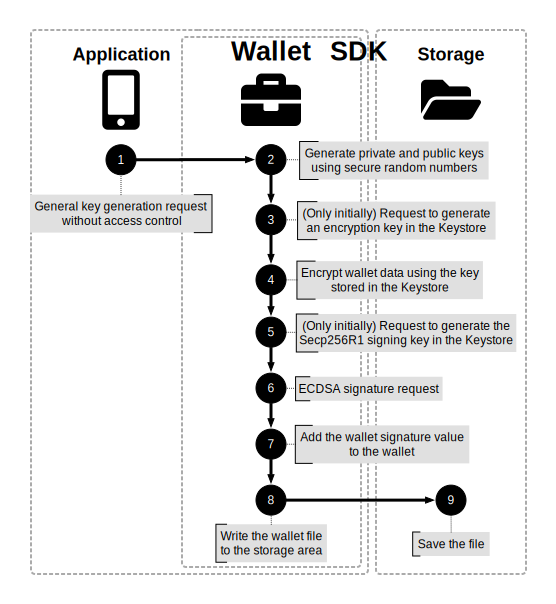

  <table>
  <thead>
    <tr>
      <th>Idx</th>
      <th>Function</th>
      <th>Return</th>
      <th>Category</th>
    </tr>
  </thead>
  <tbody>
    <tr>
      <td>1</td>
      <td>generateKey (Secp256r1, wallet, none)</td>
      <td>-</td>
      <td>API</td>
    </tr>
    <tr>
      <td>3</td>
      <td>KeyGenParameterSpec (PURPOSE_ENCRYPT &#124; PURPOSE_DECRYPT, BLOCK_MODE_GCM, ENCRYPTION_PADDING_NONE)</td>
      <td>secretKey</td>
      <td>Android SDK</td>
    </tr>
    <tr>
      <td>4</td>
      <td>Cipher (AES/GCM/NoPadding, ENCRYPT_MODE, secretKey)</td>
      <td>Encrypted wallet data</td>
      <td>Android SDK</td>
    </tr>
    <tr>
      <td>5</td>
      <td>KeyGenParameterSpec (PURPOSE_SIGN &#124; PURPOSE_VERIFY, DIGEST_NONE)</td>
      <td>Public Key</td>
      <td>Android SDK</td>
    </tr>
    <tr>
      <td>6</td>
      <td>Signature (NoneWithECDSA, wallet.digest)</td>
      <td>Wallet signature value</td>
      <td>Android SDK</td>
    </tr>
  </tbody>
</table>
 

<!--  -->

<!-- 
|Idx|Function                                                                                             |Return               |
|---|------------------------------------------------------------------------------------------------------|---------------------|
|1  |generateKey (Secp256r1, wallet, none)                                                             |-                    |
|3  |KeyGenParameterSpec (PURPOSE_ENCRYPT &#124; PURPOSE_DECRYPT, BLOCK_MODE_GCM, ENCRYPTION_PADDING_NONE)|secretKey           |
|4  |Cipher (AES/GCM/NoPadding, ENCRYPT_MODE, secretKey)                                               |Encrypted wallet data|
|5  |KeyGenParameterSpec (PURPOSE_SIGN &#124; PURPOSE_VERIFY, DIGEST_NONE)                             |Public Key               |
|6  |Signature (NoneWithECDSA, wallet.digest)                                                          |Wallet signature value          | -->

#### 3.1.2. PIN Key Generation

  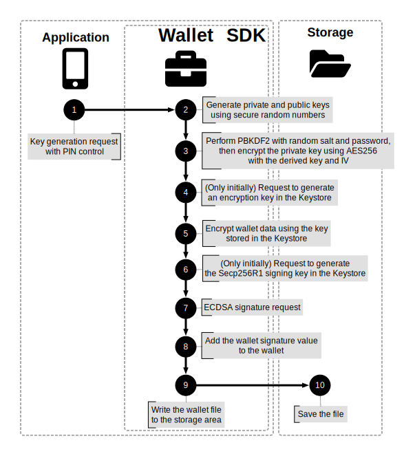

  <table>
  <thead>
    <tr>
      <th>Idx</th>
      <th>Function</th>
      <th>Return</th>
      <th>Category</th>
    </tr>
  </thead>
  <tbody>
    <tr>
      <td>1</td>
      <td>generateKey (Secp256r1, wallet, pin, password)</td>
      <td>-</td>
      <td>API</td>
    </tr>
    <tr>
      <td>4</td>
      <td>KeyGenParameterSpec (PURPOSE_ENCRYPT &#124; PURPOSE_DECRYPT, BLOCK_MODE_GCM, ENCRYPTION_PADDING_NONE)</td>
      <td>secretKey</td>
      <td>Android SDK</td>
    </tr>
    <tr>
      <td>5</td>
      <td>Cipher (AES/GCM/NoPadding, ENCRYPT_MODE, secretKey)</td>
      <td>Encrypted wallet data</td>
      <td>Android SDK</td>
    </tr>
    <tr>
      <td>6</td>
      <td>KeyGenParameterSpec (PURPOSE_SIGN &#124; PURPOSE_VERIFY, DIGEST_NONE)</td>
      <td>Public Key</td>
      <td>Android SDK</td>
    </tr>
    <tr>
      <td>7</td>
      <td>Signature (NoneWithECDSA, wallet.digest)</td>
      <td>Wallet signature value</td>
      <td>Android SDK</td>
    </tr>
  </tbody>
</table>

<!--  -->

<!-- |Idx|Function                                                                                             |Return               |
|---|------------------------------------------------------------------------------------------------------|---------------------|
|1  |generateKey (Secp256r1, wallet, pin, password)                                                     |-                    |
|4  |KeyGenParameterSpec (PURPOSE_ENCRYPT &#124; PURPOSE_DECRYPT, BLOCK_MODE_GCM, ENCRYPTION_PADDING_NONE)|secretKey           |
|5  |Cipher (AES/GCM/NoPadding, ENCRYPT_MODE, secretKey)                                               |Encrypted wallet data|
|6  |KeyGenParameterSpec (PURPOSE_SIGN &#124; PURPOSE_VERIFY, DIGEST_NONE)                             |Public Key               |
|7  |Signature (NoneWithECDSA, wallet.digest)                                                          |Wallet signature value          | -->

### 3.1.3. Bio Key Generation

  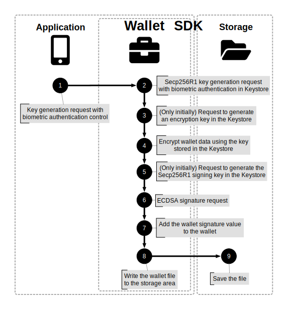

  <table>
  <thead>
    <tr>
      <th>Idx</th>
      <th>Function</th>
      <th>Return</th>
      <th>Category</th>
    </tr>
  </thead>
  <tbody>
    <tr>
      <td>1</td>
      <td>generateKey (Secp256r1, keystore, biometry)</td>
      <td>-</td>
      <td>API</td>
    </tr>
    <tr>
      <td>2</td>
      <td>KeyGenParameterSpec (PURPOSE_SIGN &#124; PURPOSE_VERIFY, DIGEST_NONE)</td>
      <td>Public Key</td>
      <td>Android SDK</td>
    </tr>
    <tr>
      <td>3</td>
      <td>KeyGenParameterSpec (PURPOSE_ENCRYPT &#124; PURPOSE_DECRYPT, BLOCK_MODE_GCM, ENCRYPTION_PADDING_NONE)</td>
      <td>secretKey</td>
      <td>Android SDK</td>
    </tr>
    <tr>
      <td>4</td>
      <td>Cipher (AES/GCM/NoPadding, ENCRYPT_MODE, secretKey)</td>
      <td>Encrypted wallet data</td>
      <td>Android SDK</td>
    </tr>
    <tr>
      <td>5</td>
      <td>KeyGenParameterSpec (PURPOSE_SIGN &#124; PURPOSE_VERIFY, DIGEST_NONE)</td>
      <td>Public Key</td>
      <td>Android SDK</td>
    </tr>
    <tr>
      <td>6</td>
      <td>Signature (NoneWithECDSA, wallet.digest)</td>
      <td>Wallet signature value</td>
      <td>Android SDK</td>
    </tr>
  </tbody>
</table>

<!--  -->

<!-- |Idx|Function                                                                                             |Return               |
|---|------------------------------------------------------------------------------------------------------|---------------------|
|1  |generateKey (Secp256r1, keystore, biometry)                                                             |-                    |
|2  |KeyGenParameterSpec (PURPOSE_SIGN &#124; PURPOSE_VERIFY, DIGEST_NONE)                             |Public Key               |
|3  |KeyGenParameterSpec (PURPOSE_ENCRYPT &#124; PURPOSE_DECRYPT, BLOCK_MODE_GCM, ENCRYPTION_PADDING_NONE)|secretKey           |
|4  |Cipher (AES/GCM/NoPadding, ENCRYPT_MODE, secretKey)                                               |Encrypted wallet data|
|5  |KeyGenParameterSpec (PURPOSE_SIGN &#124; PURPOSE_VERIFY, DIGEST_NONE)                             |Public Key               |
|6  |Signature (NoneWithECDSA, wallet.digest)                                                          |Wallet signature value          | -->

### 3.2. Signing
#### 3.2.1. General Key Signing

  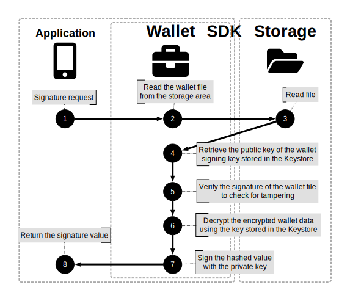

  <table>
  <thead>
    <tr>
      <th>Idx</th>
      <th>Function</th>
      <th>Return</th>
      <th>Category</th>
    </tr>
  </thead>
  <tbody>
    <tr>
      <td>1</td>
      <td>sign (digest)</td>
      <td>Signature value</td>
      <td>API</td>
    </tr>
    <tr>
      <td>4</td>
      <td>KeyStore (AndroidKeyStore).getCertificate.getPublicKey</td>
      <td>Public Key</td>
      <td>Android SDK</td>
    </tr>
    <tr>
      <td>5</td>
      <td>verify (wallet.signature, wallet.digest, publicKey)</td>
      <td>Signature verification result</td>
      <td>Android SDK</td>
    </tr>
    <tr>
      <td>6</td>
      <td>Cipher (AES/GCM/NoPadding, DECRYPT_MODE, secretKey)</td>
      <td>Decrypted wallet data</td>
      <td>Android SDK</td>
    </tr>
    <tr>
      <td>7</td>
      <td>Signature (NoneWithECDSA, privateKey, digest)</td>
      <td>Signature value</td>
      <td>Android SDK</td>
    </tr>
  </tbody>
</table>

<!--  -->

<!-- |Idx|Function                                                                            |Return               |
|---|------------------------------------------------------------------------------------|---------------------|
|1  |sign (digest)                                                                    |Signature value               |
|4  |KeyStore (AndroidKeyStore).getCertificate.getPublicKey                           |Public Key               |
|5  |verify (wallet.signature, wallet.digest, publicKey)                              |Signature verification result       |
|6  |Cipher (AES/GCM/NoPadding, DECRYPT_MODE, secretKey)                           |Decrypted wallet data|
|7  |Signature (NoneWithECDSA, privateKey, digest)                                    |Signature value               | -->

#### 3.2.2. PIN Key Signing

  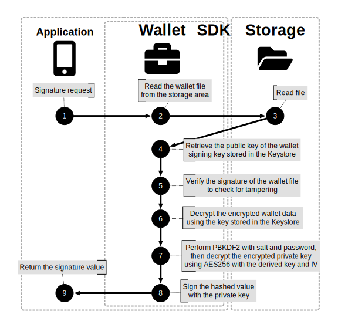

  <table>
  <thead>
    <tr>
      <th>Idx</th>
      <th>Function</th>
      <th>Return</th>
      <th>Category</th>
    </tr>
  </thead>
  <tbody>
    <tr>
      <td>1</td>
      <td>sign (digest, password)</td>
      <td>Signature value</td>
      <td>API</td>
    </tr>
    <tr>
      <td>4</td>
      <td>KeyStore (AndroidKeyStore).getCertificate.getPublicKey</td>
      <td>Public Key</td>
      <td>Android SDK</td>
    </tr>
    <tr>
      <td>5</td>
      <td>verify (wallet.signature, wallet.digest, publicKey)</td>
      <td>Signature verification result</td>
      <td>Android SDK</td>
    </tr>
    <tr>
      <td>6</td>
      <td>Cipher (AES/GCM/NoPadding, DECRYPT_MODE, secretKey)</td>
      <td>Decrypted wallet data</td>
      <td>Android SDK</td>
    </tr>
    <tr>
      <td>8</td>
      <td>Signature (NoneWithECDSA, privateKey, digest)</td>
      <td>Signature value</td>
      <td>Android SDK</td>
    </tr>
  </tbody>
</table>

<!--  -->

<!-- |Idx|Function                                                                            |Return               |
|---|------------------------------------------------------------------------------------|---------------------|
|1  |sign (digest, password)                                                          |Signature value               |
|4  |KeyStore (AndroidKeyStore).getCertificate.getPublicKey                           |Public Key               |
|5  |verify (wallet.signature, wallet.digest, publicKey)                              |Signature verification result       |
|6  |Cipher (AES/GCM/NoPadding, DECRYPT_MODE, secretKey)                           |Decrypted wallet data|
|8  |Signature (NoneWithECDSA, privateKey, digest)                                    |Signature value               | -->

#### 3.2.3. Bio Key Signing

  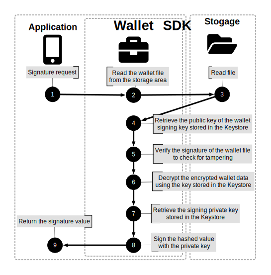

  <table>
  <thead>
    <tr>
      <th>Idx</th>
      <th>Function</th>
      <th>Return</th>
      <th>Category</th>
    </tr>
  </thead>
  <tbody>
    <tr>
      <td>1</td>
      <td>sign (digest)</td>
      <td>Signature value</td>
      <td>API</td>
    </tr>
    <tr>
      <td>4</td>
      <td>KeyStore (AndroidKeyStore).getCertificate.getPublicKey</td>
      <td>Public Key</td>
      <td>Android SDK</td>
    </tr>
    <tr>
      <td>5</td>
      <td>verify (wallet.signature, wallet.digest, publicKey)</td>
      <td>Signature verification result</td>
      <td>Android SDK</td>
    </tr>
    <tr>
      <td>6</td>
      <td>Cipher (AES/GCM/NoPadding, DECRYPT_MODE, secretKey)</td>
      <td>Decrypted wallet data</td>
      <td>Android SDK</td>
    </tr>
    <tr>
      <td>7</td>
      <td>KeyStore (AndroidKeyStore).getCertificate.getPrivateKey</td>
      <td>Private Key Identifier</td>
      <td>Android SDK</td>
    </tr>
    <tr>
      <td>8</td>
      <td>Signature (NoneWithECDSA, privateKey, digest)</td>
      <td>Signature value</td>
      <td>Android SDK</td>
    </tr>
  </tbody>
</table>

<!--  -->

<!-- |Idx|Function                                                              |Return               |
|---|----------------------------------------------------------------------|---------------------|
|1  |sign (digest)                                                     |Signature value               |
|4  |KeyStore (AndroidKeyStore).getCertificate.getPublicKey           |Public Key               |
|5  |verify (wallet.signature, wallet.digest, publicKey)              |Signature verification result       |
|6  |Cipher (AES/GCM/NoPadding, DECRYPT_MODE, secretKey)           |Decrypted wallet data|
|7  |KeyStore (AndroidKeyStore).getCertificate.getPrivateKey          |Private Key Identifier              |
|8  |Signature (NoneWithECDSA, privateKey, digest)                    |Signature value               | -->

