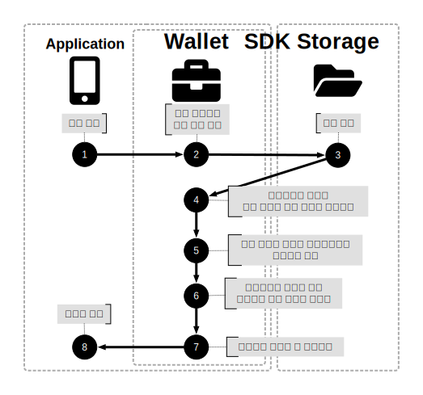

---
puppeteer:
    pdf:
        format: A4
        displayHeaderFooter: true
        landscape: false
        scale: 0.8
        margin:
            top: 1.2cm
            right: 1cm
            bottom: 1cm
            left: 1cm
    image:
        quality: 100
        fullPage: false
---

키 운영 설명
==

- 주제 : 키 운영
- 작성 : 오픈소스개발팀
- 일자 : 2025-06-25
- 버전 : v2.0.0

| 버전    | 일자       | 변경     |
|---------|------------|----------|
| v2.0.0  | 2025-06-25 | 최초 작성 |

 

목차
--

<!-- TOC tocDepth:2..4 chapterDepth:2..6 -->

- [1. 개요](#1-개요)
- [2. iOS](#2-ios)
    - [2.1. 키 생성](#21-키-생성)
        - [2.1.1. 일반 키 생성](#211-일반-키-생성)
        - [2.1.2. PIN 키 생성](#212-pin-키-생성)
        - [2.1.3. Bio 키 생성](#213-bio-키-생성)
    - [2.2. 서명](#22-서명)
        - [2.2.1. 일반 키 서명](#221-일반-키-서명)
        - [2.2.2. PIN 키 서명](#222-pin-키-서명)
        - [2.2.3. Bio 키 서명](#223-bio-키-서명)
- [3. 안드로이드](#3-안드로이드)
    - [3.1. 키 생성](#31-키-생성)
        - [3.1.1. 일반 키 생성](#311-일반-키-생성)
        - [3.1.2. PIN 키 생성](#312-pin-키-생성)
        - [3.1.3. Bio 키 생성](#313-bio-키-생성)
    - [3.2. 서명](#32-서명)
        - [3.2.1. 일반 키 서명](#321-일반-키-서명)
        - [3.2.2. PIN 키 서명](#322-pin-키-서명)
        - [3.2.3. Bio 키 서명](#323-bio-키-서명)

<!-- /TOC -->

## 1. 개요

본 문서는 OpenDID에서 사용된 클라이언트 SDK의 코어 내의 iOS 그리고 안드로이드에서의 키의 생성과 키의 서명에 대하여 설명합니다. 
생체인증 키의 경우 iOS는 SecureEnclave, 안드로이드는 키스토어에 저장됩니다. 
서명에 사용되는 키의 알고리즘의 모두 Secp256R1입니다. 

## 2. iOS
### 2.1. 키 생성
#### 2.1.1. 일반 키 생성

  

  <table>
  <thead>
    <tr>
      <th>Idx</th>
      <th>Function</th>
      <th>Return</th>
      <th>Category</th>
    </tr>
  </thead>
  <tbody>
    <tr>
      <td>1</td>
      <td>generateKey (Secp256r1, wallet, none)</td>
      <td>-</td>
      <td>API</td>
    </tr>
    <tr>
      <td>2</td>
      <td>P256.Signing.PrivateKey</td>
      <td>개인키, 공개키</td>
      <td>Framework</td>
    </tr>
    <tr>
      <td>3</td>
      <td>SecKeyCreateRandomKey (kSecAttrKeyTypeECSECPrimeRandom, kSecAttrTokenIDSecureEnclave)</td>
      <td>공개키</td>
      <td>Framework</td>
    </tr>
    <tr>
      <td>4</td>
      <td>SecKeyCreateEncryptedData (eciesEncryptionStandardX963SHA256AESGCM)</td>
      <td>암호화된 월렛 데이터</td>
      <td>Framework</td>
    </tr>
    <tr>
      <td>5</td>
      <td>SecKeyCreateSignature (ecdsaSignatureDigestX962SHA256)</td>
      <td>월렛 서명값</td>
      <td>Framework</td>
    </tr>
  </tbody>
</table>

<!--  -->

<!-- 
| Idx | Function                                                                                 | Return               |
|-----|------------------------------------------------------------------------------------------|----------------------|
| 1   | generateKey (Secp256r1, wallet, none)                                                 | -                    |
| 2   | P256.Signing.PrivateKey                                                                  | 개인키, 공개키      |
| 3   | SecKeyCreateRandomKey (kSecAttrKeyTypeECSECPrimeRandom, kSecAttrTokenIDSecureEnclave) | 공개키               |
| 4   | SecKeyCreateEncryptedData (eciesEncryptionStandardX963SHA256AESGCM)                   | 암호화된 월렛 데이터 |
| 5   | SecKeyCreateSignature (ecdsaSignatureDigestX962SHA256)                                | 월렛 서명값          | -->

#### 2.1.2. PIN 키 생성

  

  <table>
  <thead>
    <tr>
      <th>Idx</th>
      <th>Function</th>
      <th>Return</th>
      <th>Category</th>
    </tr>
  </thead>
  <tbody>
    <tr>
      <td>1</td>
      <td>generateKey (Secp256r1, wallet, pin, password)</td>
      <td>-</td>
      <td>API</td>
    </tr>
    <tr>
      <td>2</td>
      <td>P256.Signing.PrivateKey</td>
      <td>개인키, 공개키</td>
      <td>Framework</td>
    </tr>
    <tr>
      <td>4</td>
      <td>SecKeyCreateRandomKey (kSecAttrKeyTypeECSECPrimeRandom, kSecAttrTokenIDSecureEnclave)</td>
      <td>공개키</td>
      <td>Framework</td>
    </tr>
    <tr>
      <td>5</td>
      <td>SecKeyCreateEncryptedData (eciesEncryptionStandardX963SHA256AESGCM)</td>
      <td>암호화된 월렛 데이터</td>
      <td>Framework</td>
    </tr>
    <tr>
      <td>6</td>
      <td>SecKeyCreateSignature (ecdsaSignatureDigestX962SHA256)</td>
      <td>월렛 서명값</td>
      <td>Framework</td>
    </tr>
  </tbody>
</table>

<!--  -->

<!-- | Idx | Function                                                                                           | Return               |
|-----|----------------------------------------------------------------------------------------------------|----------------------|
| 1   | generateKey (Secp256r1, wallet, pin, password)                                                  | -                    |
| 2   | P256.Signing.PrivateKey                                                                            | 개인키, 공개키      |
| 4   | SecKeyCreateRandomKey (kSecAttrKeyTypeECSECPrimeRandom, kSecAttrTokenIDSecureEnclave)           | 공개키               |
| 5   | SecKeyCreateEncryptedData (eciesEncryptionStandardX963SHA256AESGCM)                             | 암호화된 월렛 데이터 |
| 6   | SecKeyCreateSignature (ecdsaSignatureDigestX962SHA256)                                          | 월렛 서명값          | -->

#### 2.1.3. Bio 키 생성

  

  <table>
  <thead>
    <tr>
      <th>Idx</th>
      <th>Function</th>
      <th>Return</th>
      <th>Category</th>
    </tr>
  </thead>
  <tbody>
    <tr>
      <td>1</td>
      <td>generateKey (Secp256r1, secureEnclave, biometryCurrentSet)</td>
      <td>-</td>
      <td>API</td>
    </tr>
    <tr>
      <td>2</td>
      <td>SecKeyCreateRandomKey (kSecAttrKeyTypeECSECPrimeRandom, kSecAttrTokenIDSecureEnclave, biometryCurrentSet)</td>
      <td>공개키</td>
      <td>Framework</td>
    </tr>
    <tr>
      <td>3</td>
      <td>SecKeyCreateRandomKey (kSecAttrKeyTypeECSECPrimeRandom, kSecAttrTokenIDSecureEnclave)</td>
      <td>공개키</td>
      <td>Framework</td>
    </tr>
    <tr>
      <td>4</td>
      <td>SecKeyCreateEncryptedData (eciesEncryptionStandardX963SHA256AESGCM)</td>
      <td>암호화된 월렛 데이터</td>
      <td>Framework</td>
    </tr>
    <tr>
      <td>5</td>
      <td>SecKeyCreateSignature (ecdsaSignatureDigestX962SHA256)</td>
      <td>월렛 서명값</td>
      <td>Framework</td>
    </tr>
  </tbody>
</table>

<!--  -->

<!-- | Idx | Function                                                                                                              | Return               |
|-----|-----------------------------------------------------------------------------------------------------------------------|----------------------|
| 1   | generateKey (Secp256r1, secureEnclave, biometryCurrentSet)                                                        | -                    |
| 2   | SecKeyCreateRandomKey (kSecAttrKeyTypeECSECPrimeRandom, kSecAttrTokenIDSecureEnclave, biometryCurrentSet)         | 공개키               |
| 3   | SecKeyCreateRandomKey (kSecAttrKeyTypeECSECPrimeRandom, kSecAttrTokenIDSecureEnclave)                             | 공개키               |
| 4   | SecKeyCreateEncryptedData (eciesEncryptionStandardX963SHA256AESGCM)                                               | 암호화된 월렛 데이터 |
| 5   | SecKeyCreateSignature (ecdsaSignatureDigestX962SHA256)                                                            | 월렛 서명값          | -->

### 2.2. 서명
#### 2.2.1. 일반 키 서명

  

  <table>
  <thead>
    <tr>
      <th>Idx</th>
      <th>Function</th>
      <th>Return</th>
      <th>Category</th>
    </tr>
  </thead>
  <tbody>
    <tr>
      <td>1</td>
      <td>sign (digest)</td>
      <td>서명값</td>
      <td>API</td>
    </tr>
    <tr>
      <td>4</td>
      <td>SecItemCopyMatching (kSecAttrKeyTypeECSECPrimeRandom)</td>
      <td>공개키</td>
      <td>Framework</td>
    </tr>
    <tr>
      <td>5</td>
      <td>verify (wallet.signature, wallet.digest, publicKey)</td>
      <td>서명 검증 결과</td>
      <td>Framework</td>
    </tr>
    <tr>
      <td>6</td>
      <td>SecKeyCreateDecryptedData (eciesEncryptionStandardX963SHA256AESGCM)</td>
      <td>복호화된 월렛 데이터</td>
      <td>Framework</td>
    </tr>
    <tr>
      <td>7</td>
      <td>P256.Signing.PrivateKey(privateKey).signature (digest)</td>
      <td>서명값</td>
      <td>Framework</td>
    </tr>
  </tbody>
</table>

<!--  -->

<!-- |Idx|Function                                                                  |Return            |
|---|---------------------------------------------------------------------------|------------------|
|1  |sign (digest)                                                          |서명값            |
|4  |SecItemCopyMatching (kSecAttrKeyTypeECSECPrimeRandom)                 |공개키            |
|5  |verify (wallet.signature, wallet.digest, publicKey)                   |서명 검증 결과    |
|6  |SecKeyCreateDecryptedData (eciesEncryptionStandardX963SHA256AESGCM)   |복호화된 월렛 데이터|
|7  |P256.Signing.PrivateKey(privateKey).signature (digest)                |서명값            | -->

#### 2.2.2. PIN 키 서명

  

  <table>
  <thead>
    <tr>
      <th>Idx</th>
      <th>Function</th>
      <th>Return</th>
      <th>Category</th>
    </tr>
  </thead>
  <tbody>
    <tr>
      <td>1</td>
      <td>sign (digest, password)</td>
      <td>서명값</td>
      <td>API</td>
    </tr>
    <tr>
      <td>4</td>
      <td>SecItemCopyMatching (kSecAttrKeyTypeECSECPrimeRandom)</td>
      <td>공개키</td>
      <td>Framework</td>
    </tr>
    <tr>
      <td>5</td>
      <td>verify (wallet.signature, wallet.digest, publicKey)</td>
      <td>서명 검증 결과</td>
      <td>Framework</td>
    </tr>
    <tr>
      <td>6</td>
      <td>SecKeyCreateDecryptedData (eciesEncryptionStandardX963SHA256AESGCM)</td>
      <td>복호화된 월렛 데이터</td>
      <td>Framework</td>
    </tr>
    <tr>
      <td>8</td>
      <td>P256.Signing.PrivateKey(privateKey).signature (digest)</td>
      <td>서명값</td>
      <td>Framework</td>
    </tr>
  </tbody>
</table>

<!--  -->

<!-- |Idx|Function                                                                  |Return               |
|---|--------------------------------------------------------------------------|---------------------|
|1  |sign (digest, password)                                               |서명값               |
|4  |SecItemCopyMatching (kSecAttrKeyTypeECSECPrimeRandom)                |공개키               |
|5  |verify (wallet.signature, wallet.digest, publicKey)                  |서명 검증 결과       |
|6  |SecKeyCreateDecryptedData (eciesEncryptionStandardX963SHA256AESGCM)  |복호화된 월렛 데이터|
|8  |P256.Signing.PrivateKey(privateKey).signature (digest)               |서명값               | -->

#### 2.2.3. Bio 키 서명

  

  <table>
  <thead>
    <tr>
      <th>Idx</th>
      <th>Function</th>
      <th>Return</th>
      <th>Category</th>
    </tr>
  </thead>
  <tbody>
    <tr>
      <td>1</td>
      <td>sign (digest)</td>
      <td>서명값</td>
      <td>API</td>
    </tr>
    <tr>
      <td>4</td>
      <td>SecItemCopyMatching (kSecAttrKeyTypeECSECPrimeRandom)</td>
      <td>공개키</td>
      <td>Framework</td>
    </tr>
    <tr>
      <td>5</td>
      <td>verify (wallet.signature, wallet.digest, publicKey)</td>
      <td>서명 검증 결과</td>
      <td>Framework</td>
    </tr>
    <tr>
      <td>6</td>
      <td>SecKeyCreateDecryptedData (eciesEncryptionStandardX963SHA256AESGCM)</td>
      <td>복호화된 월렛 데이터</td>
      <td>Framework</td>
    </tr>
    <tr>
      <td>7</td>
      <td>SecKeyCreateSignature (keyPairRef, ecdsaSignatureDigestX962SHA256, digest)</td>
      <td>서명값</td>
      <td>Framework</td>
    </tr>
  </tbody>
</table>

<!--  -->

<!-- |Idx|Function                                                                  |Return               |
|---|--------------------------------------------------------------------------|---------------------|
|1  |sign (digest)                                                         |서명값               |
|4  |SecItemCopyMatching (kSecAttrKeyTypeECSECPrimeRandom)                |공개키               |
|5  |verify (wallet.signature, wallet.digest, publicKey)                  |서명 검증 결과       |
|6  |SecKeyCreateDecryptedData (eciesEncryptionStandardX963SHA256AESGCM)  |복호화된 월렛 데이터|
|7  |SecKeyCreateSignature (keyPairRef, ecdsaSignatureDigestX962SHA256, digest)|서명값           | -->

## 3. 안드로이드
### 3.1. 키 생성
#### 3.1.1. 일반 키 생성

  

  <table>
  <thead>
    <tr>
      <th>Idx</th>
      <th>Function</th>
      <th>Return</th>
      <th>Category</th>
    </tr>
  </thead>
  <tbody>
    <tr>
      <td>1</td>
      <td>generateKey (Secp256r1, wallet, none)</td>
      <td>-</td>
      <td>API</td>
    </tr>
    <tr>
      <td>3</td>
      <td>KeyGenParameterSpec (PURPOSE_ENCRYPT &#124; PURPOSE_DECRYPT, BLOCK_MODE_GCM, ENCRYPTION_PADDING_NONE)</td>
      <td>secretKey</td>
      <td>Android SDK</td>
    </tr>
    <tr>
      <td>4</td>
      <td>Cipher (AES/GCM/NoPadding, ENCRYPT_MODE, secretKey)</td>
      <td>암호화된 월렛 데이터</td>
      <td>Android SDK</td>
    </tr>
    <tr>
      <td>5</td>
      <td>KeyGenParameterSpec (PURPOSE_SIGN &#124; PURPOSE_VERIFY, DIGEST_NONE)</td>
      <td>공개키</td>
      <td>Android SDK</td>
    </tr>
    <tr>
      <td>6</td>
      <td>Signature (NoneWithECDSA, wallet.digest)</td>
      <td>월렛 서명값</td>
      <td>Android SDK</td>
    </tr>
  </tbody>
</table>
 

<!--  -->

<!-- 
|Idx|Function                                                                                             |Return               |
|---|------------------------------------------------------------------------------------------------------|---------------------|
|1  |generateKey (Secp256r1, wallet, none)                                                             |-                    |
|3  |KeyGenParameterSpec (PURPOSE_ENCRYPT &#124; PURPOSE_DECRYPT, BLOCK_MODE_GCM, ENCRYPTION_PADDING_NONE)|secretKey           |
|4  |Cipher (AES/GCM/NoPadding, ENCRYPT_MODE, secretKey)                                               |암호화된 월렛 데이터|
|5  |KeyGenParameterSpec (PURPOSE_SIGN &#124; PURPOSE_VERIFY, DIGEST_NONE)                             |공개키               |
|6  |Signature (NoneWithECDSA, wallet.digest)                                                          |월렛 서명값          | -->

#### 3.1.2. PIN 키 생성

  

  <table>
  <thead>
    <tr>
      <th>Idx</th>
      <th>Function</th>
      <th>Return</th>
      <th>Category</th>
    </tr>
  </thead>
  <tbody>
    <tr>
      <td>1</td>
      <td>generateKey (Secp256r1, wallet, pin, password)</td>
      <td>-</td>
      <td>API</td>
    </tr>
    <tr>
      <td>4</td>
      <td>KeyGenParameterSpec (PURPOSE_ENCRYPT &#124; PURPOSE_DECRYPT, BLOCK_MODE_GCM, ENCRYPTION_PADDING_NONE)</td>
      <td>secretKey</td>
      <td>Android SDK</td>
    </tr>
    <tr>
      <td>5</td>
      <td>Cipher (AES/GCM/NoPadding, ENCRYPT_MODE, secretKey)</td>
      <td>암호화된 월렛 데이터</td>
      <td>Android SDK</td>
    </tr>
    <tr>
      <td>6</td>
      <td>KeyGenParameterSpec (PURPOSE_SIGN &#124; PURPOSE_VERIFY, DIGEST_NONE)</td>
      <td>공개키</td>
      <td>Android SDK</td>
    </tr>
    <tr>
      <td>7</td>
      <td>Signature (NoneWithECDSA, wallet.digest)</td>
      <td>월렛 서명값</td>
      <td>Android SDK</td>
    </tr>
  </tbody>
</table>

<!--  -->

<!-- |Idx|Function                                                                                             |Return               |
|---|------------------------------------------------------------------------------------------------------|---------------------|
|1  |generateKey (Secp256r1, wallet, pin, password)                                                     |-                    |
|4  |KeyGenParameterSpec (PURPOSE_ENCRYPT &#124; PURPOSE_DECRYPT, BLOCK_MODE_GCM, ENCRYPTION_PADDING_NONE)|secretKey           |
|5  |Cipher (AES/GCM/NoPadding, ENCRYPT_MODE, secretKey)                                               |암호화된 월렛 데이터|
|6  |KeyGenParameterSpec (PURPOSE_SIGN &#124; PURPOSE_VERIFY, DIGEST_NONE)                             |공개키               |
|7  |Signature (NoneWithECDSA, wallet.digest)                                                          |월렛 서명값          | -->

### 3.1.3. Bio 키 생성

  

  <table>
  <thead>
    <tr>
      <th>Idx</th>
      <th>Function</th>
      <th>Return</th>
      <th>Category</th>
    </tr>
  </thead>
  <tbody>
    <tr>
      <td>1</td>
      <td>generateKey (Secp256r1, keystore, biometry)</td>
      <td>-</td>
      <td>API</td>
    </tr>
    <tr>
      <td>2</td>
      <td>KeyGenParameterSpec (PURPOSE_SIGN &#124; PURPOSE_VERIFY, DIGEST_NONE)</td>
      <td>공개키</td>
      <td>Android SDK</td>
    </tr>
    <tr>
      <td>3</td>
      <td>KeyGenParameterSpec (PURPOSE_ENCRYPT &#124; PURPOSE_DECRYPT, BLOCK_MODE_GCM, ENCRYPTION_PADDING_NONE)</td>
      <td>secretKey</td>
      <td>Android SDK</td>
    </tr>
    <tr>
      <td>4</td>
      <td>Cipher (AES/GCM/NoPadding, ENCRYPT_MODE, secretKey)</td>
      <td>암호화된 월렛 데이터</td>
      <td>Android SDK</td>
    </tr>
    <tr>
      <td>5</td>
      <td>KeyGenParameterSpec (PURPOSE_SIGN &#124; PURPOSE_VERIFY, DIGEST_NONE)</td>
      <td>공개키</td>
      <td>Android SDK</td>
    </tr>
    <tr>
      <td>6</td>
      <td>Signature (NoneWithECDSA, wallet.digest)</td>
      <td>월렛 서명값</td>
      <td>Android SDK</td>
    </tr>
  </tbody>
</table>

<!--  -->

<!-- |Idx|Function                                                                                             |Return               |
|---|------------------------------------------------------------------------------------------------------|---------------------|
|1  |generateKey (Secp256r1, keystore, biometry)                                                             |-                    |
|2  |KeyGenParameterSpec (PURPOSE_SIGN &#124; PURPOSE_VERIFY, DIGEST_NONE)                             |공개키               |
|3  |KeyGenParameterSpec (PURPOSE_ENCRYPT &#124; PURPOSE_DECRYPT, BLOCK_MODE_GCM, ENCRYPTION_PADDING_NONE)|secretKey           |
|4  |Cipher (AES/GCM/NoPadding, ENCRYPT_MODE, secretKey)                                               |암호화된 월렛 데이터|
|5  |KeyGenParameterSpec (PURPOSE_SIGN &#124; PURPOSE_VERIFY, DIGEST_NONE)                             |공개키               |
|6  |Signature (NoneWithECDSA, wallet.digest)                                                          |월렛 서명값          | -->

### 3.2. 서명
#### 3.2.1. 일반 키 서명

  

  <table>
  <thead>
    <tr>
      <th>Idx</th>
      <th>Function</th>
      <th>Return</th>
      <th>Category</th>
    </tr>
  </thead>
  <tbody>
    <tr>
      <td>1</td>
      <td>sign (digest)</td>
      <td>서명값</td>
      <td>API</td>
    </tr>
    <tr>
      <td>4</td>
      <td>KeyStore (AndroidKeyStore).getCertificate.getPublicKey</td>
      <td>공개키</td>
      <td>Android SDK</td>
    </tr>
    <tr>
      <td>5</td>
      <td>verify (wallet.signature, wallet.digest, publicKey)</td>
      <td>서명 검증 결과</td>
      <td>Android SDK</td>
    </tr>
    <tr>
      <td>6</td>
      <td>Cipher (AES/GCM/NoPadding, DECRYPT_MODE, secretKey)</td>
      <td>복호화된 월렛 데이터</td>
      <td>Android SDK</td>
    </tr>
    <tr>
      <td>7</td>
      <td>Signature (NoneWithECDSA, privateKey, digest)</td>
      <td>서명값</td>
      <td>Android SDK</td>
    </tr>
  </tbody>
</table>

<!--  -->

<!-- |Idx|Function                                                                            |Return               |
|---|------------------------------------------------------------------------------------|---------------------|
|1  |sign (digest)                                                                    |서명값               |
|4  |KeyStore (AndroidKeyStore).getCertificate.getPublicKey                           |공개키               |
|5  |verify (wallet.signature, wallet.digest, publicKey)                              |서명 검증 결과       |
|6  |Cipher (AES/GCM/NoPadding, DECRYPT_MODE, secretKey)                           |복호화된 월렛 데이터|
|7  |Signature (NoneWithECDSA, privateKey, digest)                                    |서명값               | -->

#### 3.2.2. PIN 키 서명

  

  <table>
  <thead>
    <tr>
      <th>Idx</th>
      <th>Function</th>
      <th>Return</th>
      <th>Category</th>
    </tr>
  </thead>
  <tbody>
    <tr>
      <td>1</td>
      <td>sign (digest, password)</td>
      <td>서명값</td>
      <td>API</td>
    </tr>
    <tr>
      <td>4</td>
      <td>KeyStore (AndroidKeyStore).getCertificate.getPublicKey</td>
      <td>공개키</td>
      <td>Android SDK</td>
    </tr>
    <tr>
      <td>5</td>
      <td>verify (wallet.signature, wallet.digest, publicKey)</td>
      <td>서명 검증 결과</td>
      <td>Android SDK</td>
    </tr>
    <tr>
      <td>6</td>
      <td>Cipher (AES/GCM/NoPadding, DECRYPT_MODE, secretKey)</td>
      <td>복호화된 월렛 데이터</td>
      <td>Android SDK</td>
    </tr>
    <tr>
      <td>8</td>
      <td>Signature (NoneWithECDSA, privateKey, digest)</td>
      <td>서명값</td>
      <td>Android SDK</td>
    </tr>
  </tbody>
</table>

<!--  -->

<!-- |Idx|Function                                                                            |Return               |
|---|------------------------------------------------------------------------------------|---------------------|
|1  |sign (digest, password)                                                          |서명값               |
|4  |KeyStore (AndroidKeyStore).getCertificate.getPublicKey                           |공개키               |
|5  |verify (wallet.signature, wallet.digest, publicKey)                              |서명 검증 결과       |
|6  |Cipher (AES/GCM/NoPadding, DECRYPT_MODE, secretKey)                           |복호화된 월렛 데이터|
|8  |Signature (NoneWithECDSA, privateKey, digest)                                    |서명값               | -->

#### 3.2.3. Bio 키 서명

  

  <table>
  <thead>
    <tr>
      <th>Idx</th>
      <th>Function</th>
      <th>Return</th>
      <th>Category</th>
    </tr>
  </thead>
  <tbody>
    <tr>
      <td>1</td>
      <td>sign (digest)</td>
      <td>서명값</td>
      <td>API</td>
    </tr>
    <tr>
      <td>4</td>
      <td>KeyStore (AndroidKeyStore).getCertificate.getPublicKey</td>
      <td>공개키</td>
      <td>Android SDK</td>
    </tr>
    <tr>
      <td>5</td>
      <td>verify (wallet.signature, wallet.digest, publicKey)</td>
      <td>서명 검증 결과</td>
      <td>Android SDK</td>
    </tr>
    <tr>
      <td>6</td>
      <td>Cipher (AES/GCM/NoPadding, DECRYPT_MODE, secretKey)</td>
      <td>복호화된 월렛 데이터</td>
      <td>Android SDK</td>
    </tr>
    <tr>
      <td>7</td>
      <td>KeyStore (AndroidKeyStore).getCertificate.getPrivateKey</td>
      <td>개인키 참조값</td>
      <td>Android SDK</td>
    </tr>
    <tr>
      <td>8</td>
      <td>Signature (NoneWithECDSA, privateKey, digest)</td>
      <td>서명값</td>
      <td>Android SDK</td>
    </tr>
  </tbody>
</table>

<!--  -->

<!-- |Idx|Function                                                              |Return               |
|---|----------------------------------------------------------------------|---------------------|
|1  |sign (digest)                                                     |서명값               |
|4  |KeyStore (AndroidKeyStore).getCertificate.getPublicKey           |공개키               |
|5  |verify (wallet.signature, wallet.digest, publicKey)              |서명 검증 결과       |
|6  |Cipher (AES/GCM/NoPadding, DECRYPT_MODE, secretKey)           |복호화된 월렛 데이터|
|7  |KeyStore (AndroidKeyStore).getCertificate.getPrivateKey          |개인키 참조값              |
|8  |Signature (NoneWithECDSA, privateKey, digest)                    |서명값               | -->

