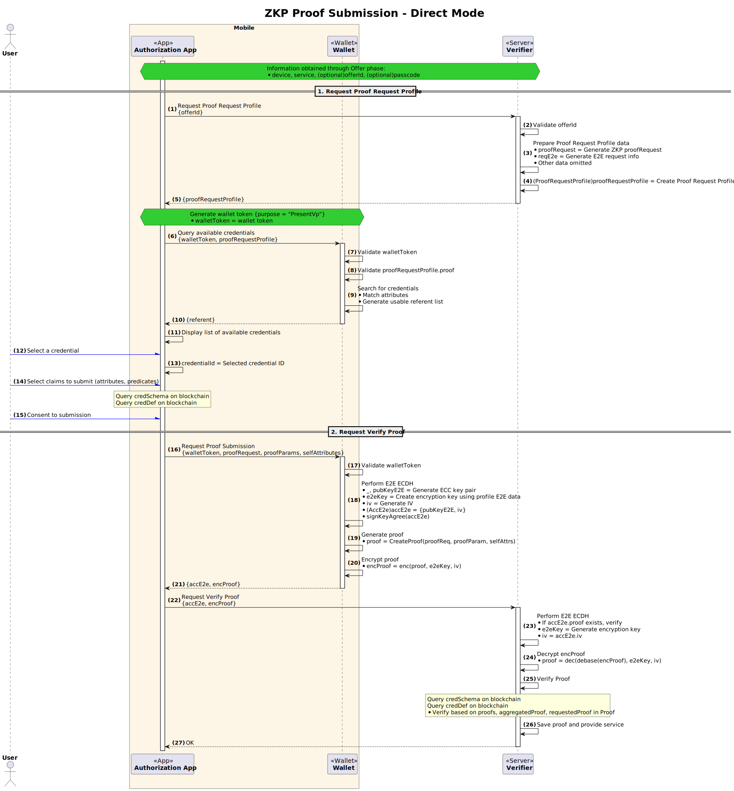

# ZKP Proof Submission

- **Subject:** Conceptual explanation of ZKP Proof submission
- **Author:** Open Source Development Team
- **Date:** 2025-05-12
- **Version:** v2.0.0

| Version | Date       | Changes         |
| ------- | ---------- | --------------- |
| v2.0.0  | 2025-05-12 | Initial version |

## 1. Overview

The OpenDID-based ZKP (Zero-Knowledge Proof) system provides a mechanism that allows users (Holders) to prove that they satisfy specific conditions without revealing their Credentials to external parties.
The ZKP proof submission process includes procedures where users generate and submit corresponding **Proof** based on **ProofRequest** issued by Verifiers.

This document comprehensively describes the components required for ZKP proof submission (Proof, ProofRequest), submission flow, and policy requirements.

## 2. ZKP Proof Submission Procedure

The overall process of proof verification using ZKP method includes the following steps:

### 2.1. Proof Request Reception

- The Verifier issues a **ProofRequest** to the Holder requesting proof.
- The ProofRequest includes attribute-based requests (`requestedAttributes`) and predicate-based requests (`requestedPredicates`).
- Each item can have constraints based on specific Credential Definitions (`credDefId`).

Example:
```json
"requestedAttributes": {
  "attributeReferent1": {
    "name": "zkpsex",
    "restrictions": [{ "credDefId": "did:omn:..." }]
  }
},
"requestedPredicates": {
  "predicateReferent1": {
    "name": "zkpsalary",
    "pType": "LE",
    "pValue": 50000000,
    "restrictions": [{ "credDefId": "did:omn:..." }]
  }
}
```

### 2.2. Proof Generation by Holder

- The Holder generates a Proof corresponding to the requested information from their Credentials.
- Public attributes are included in plain text, while conditional attributes are proven through zero-knowledge proofs.
- The Proof includes the following components:
  - `proofs`: SubProofs generated from individual Credentials
  - `aggregatedProof`: Aggregated information for overall proof
  - `requestedProof`: Mapping information for attribute-based and predicate-based requests
  - `identifiers`: Metadata information such as `credDefId`, `schemaId` of related Credentials

### 2.3. Proof Submission and Verification

- The generated Proof is submitted to the Verifier.
- The Verifier validates by confirming the following:
  - Credential Schema and Credential Definition consistency
  - Aggregated Proof validity
  - Whether attributes meet expected values
  - Whether conditions are satisfied (e.g., zkpsalary ≤ 50000000)

## 3. ZKP ProofRequest Policy

The following policies are defined to ensure data reliability and security during ZKP proof request and submission processes.

### 3.1. ProofRequest Structure Definition

ProofRequest has the following structure:

```c#
def object ProofRequest: "proofRequest"
{
  + string "name"
  + nonce "nonce"
  - object "requestedAttributes"
  - object "requestedPredicates"
}
```

- **`requestedAttributes`**: List of attribute-based requests
  - Each item includes `name` (attribute name) and `restrictions` (issuance conditions), etc.
- **`requestedPredicates`**: List of predicate-based requests
  - Each item includes `name`, `pType` (comparison operator), `pValue` (reference value), `restrictions`, etc.

### 3.2. Transmission Policy Summary

#### **1) Restrictions Transmission Policy (Server → Client)**

| Item Type       | `restrictions` Field Transmission       |
| --------------- | --------------------------------------- |
| **Predicate**   | ✅ **Mandatory Transmission**            |
| **Attribute**   | ⚠️ **Optional Transmission** (only when needed) |

- `Predicate` items must always specify `restrictions` for accurate condition-based proof.
- `Attribute` items can flexibly include or omit `restrictions` depending on the situation.

#### **2) Proof Transmission Policy (Client → Server)**

| `restrictions` Inclusion | Corresponding Attribute Transmission |
| ------------------------ | ------------------------------------ |
| Included                 | ✅ **Mandatory Transmission**         |
| Not Included             | ⚠️ **Optional Transmission** (selective transmission allowed) |

- The client responds according to the structure of the received ProofRequest, and if `restrictions` exist, the corresponding attribute must be transmitted.
- If not present, omission is allowed.

#### **3) Other Policies**

- ❗ **Attributes not included in ProofRequest** should **not** be included in the Proof.
- The principle is to submit Proof that accurately reflects only the requested items.
- **Self-Attested attribute**: Values claimed by users themselves, corresponding to information directly provided by users without cryptographic signatures or proof from Issuers. This is information flexibly provided based on user's self-declaration, which may have somewhat lower reliability but is used when flexibly providing additional information or supplementary information not included in formal credentials.

### 3.3. Example Policy Application

- A verifier can request the following proof from a user:
  - Gender (zkpsex): `Attribute` without `restrictions`
  - Income (zkpsalary): `Predicate` with `restrictions`

```json
"requestedAttributes": {
  "attributeReferent1": {
    "name": "zkpsex"
  }
},
"requestedPredicates": {
  "predicateReferent1": {
    "name": "zkpsalary",
    "pType": "LE",
    "pValue": 50000000,
    "restrictions": [ { "credDefId": "did:omn:..." } ]
  }
}
```

- In this case, the user generates a Proof using Credentials that satisfy the conditions, and attributes with `restrictions` must be submitted to the server.

## 4. Example of ZKP Proof Submission - Direct Mode
