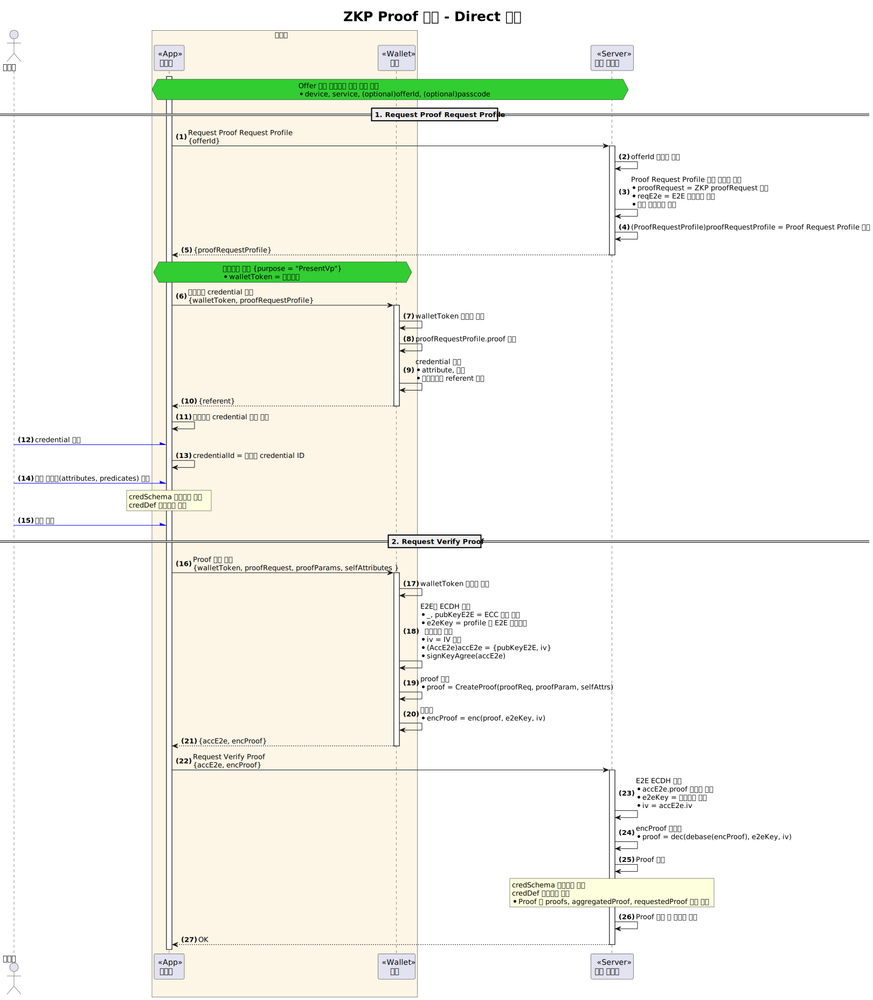

# ZKP Proof 제출

- 주제 : ZKP Proof 제출의 개념 설명
- 작성 : 오픈소스개발팀
- 일자 : 2025-05-12
- 버전 : v2.0.0

| 버전 | 일자       | 변경         |
| ------- | ---------- | --------------- |
| v2.0.0  | 2025-05-12 | 최초 작성 |

## 1. 개요

OpenDID 기반 ZKP(Zero-Knowledge Proof) 시스템에서는 사용자(Holder)가 자신이 보유한 Credential을 외부에 공개하지 않고도 특정 조건을 만족함을 증명할 수 있는 메커니즘이 제공된다.
ZKP Proof 제출 과정은 Verifier가 발급한 **ProofRequest**를 바탕으로 사용자가 이에 대응하는 **Proof**를 생성하고 제출하는 절차를 포함한다.

이 문서에서는 ZKP Proof 제출을 위해 필요한 구성요소(Proof, ProofRequest), 제출 흐름, 정책적 요구사항 등을 종합적으로 기술한다.

## 2. ZKP Proof 제출 절차

ZKP 방식으로 증명이 이루어지는 전체 과정은 다음과 같은 단계를 포함한다.

### 2.1. Proof Request 수신

- Verifier는 Holder에게 증명을 요청하는 **ProofRequest**를 발행한다.
- ProofRequest에는 속성 기반 요청(`requestedAttributes`)과 조건 기반 요청(`requestedPredicates`)이 포함된다.
- 각 항목은 특정 Credential Definition (`credDefId`)에 기반한 제약 조건을 가질 수 있다.

예시:
```json
"requestedAttributes": {
  "attributeReferent1": {
    "name": "zkpsex",
    "restrictions": [{ "credDefId": "did:omn:..." }]
  }
},
"requestedPredicates": {
  "predicateReferent1": {
    "name": "zkpsalary",
    "pType": "LE",
    "pValue": 50000000,
    "restrictions": [{ "credDefId": "did:omn:..." }]
  }
}
```

### 2.2. Holder의 Proof 생성

- Holder는 본인의 Credential로부터 요청된 정보에 대응하는 Proof를 생성한다.
- 공개 속성은 평문으로 포함되고, 조건 속성은 영지식 증명을 통해 증명된다.
- Proof에는 다음의 구성 요소가 포함된다:
  - `proofs`: 개별 Credential로부터 생성된 SubProof들
  - `aggregatedProof`: 전체 증명을 위한 집계 정보
  - `requestedProof`: 속성 기반 요청, 조건 기반 요청 등 매핑 정보
  - `identifiers`: 관련 Credential의 `credDefId`, `schemaId` 등 메타 정보

### 2.3. Proof 제출 및 검증

- 생성된 Proof는 Verifier에게 제출된다.
- Verifier는 다음을 확인하여 유효성을 검증한다.
  - Credential Schema 및 Credential Definition 일치 여부
  - Aggregated Proof 유효성
  - 속성의 기대값 충족 여부
  - 조건의 만족 여부 (ex: zkpsalary ≤ 50000000)

## 3. ZKP proofRequest 정책

ZKP Proof 요청과 제출 과정에서의 데이터 신뢰성과 보안성을 확보하기 위해 다음과 같은 정책을 정의한다.

### 3.1. ProofRequest 구조 정의

ProofRequest는 다음과 같은 구조를 가진다.

```c#
def object ProofRequest: "proofRequest"
{
  + string "name"
  + nonce "nonce"
  - object "requestedAttributes"
  - object "requestedPredicates"
}
```

- **`requestedAttributes`**: 속성 기반 요청 목록
  - 각 항목은 `name` (속성 이름)과 `restrictions` (발급 조건) 등을 포함한다.
- **`requestedPredicates`**: 조건 기반 요청 목록
  - 각 항목은 `name`, `pType` (비교연산자), `pValue` (기준값), `restrictions` 등을 포함한다.

### 3.2. 전송 정책 요약

#### **1) Restrictions 전송 정책 (서버 → 클라이언트)**

| 항목 유형       | `restrictions` 필드 전송 여부       |
| --------------- | ------------------------------------- |
| **Predicate**   | ✅ **필수 전송**                        |
| **Attribute**   | ⚠️ **옵션 전송** (필요 시에만 전송)        |

- `Predicate` 항목은 정확한 조건 기반 증명을 위해 항상 `restrictions`가 명시되어야 한다.
- `Attribute` 항목은 상황에 따라 유연하게 `restrictions`를 포함하거나 생략할 수 있다.

#### **2) Proof 전송 정책 (클라이언트 → 서버)**

| `restrictions` 포함 여부 | 해당 속성 전송 여부 |
| ------------------------ | ------------------------------- |
| 포함된 경우              | ✅ **필수 전송**                  |
| 포함되지 않은 경우       | ⚠️ **옵션 전송** (선택 전송 가능) |

- 클라이언트는 받은 ProofRequest의 구조에 맞춰 대응하며, `restrictions`가 있으면 해당 속성은 반드시 전송해야 한다.
- 없는 경우엔 생략이 허용된다.

#### **3) 기타 정책**

- ❗ **ProofRequest에 포함되지 않은 속성(attribute)** 은 Proof에 포함되어서는 **안 된다**.
- Proof는 요청된 항목만을 정확히 반영하여 제출하는 것이 원칙이다.
- **Self-Attested attribute** : 사용자가 스스로 주장하는 값으로, Issuer의 암호학적 서명이나 증명 없이 사용자가 직접 제공하는 정보에 해당한다. 사용자의 자기 선언에 기반하여 유연하게 제공되는 정보로서 신뢰성은 다소 낮을 수 있으나, 정식 자격증명에 포함되지 않은 추가 정보나 보완 정보를 유연하게 제공할 때 사용된다.

### 3.3. 예시 정책 적용

- 검증자는 사용자에게 다음의 증명을 요청할 수 있다:
  - 성별(zkpsex) : `Attribute`이며, `restrictions` 없음
  - 소득(zkpsalary) : `Predicate`이며, `restrictions` 있음

```json
"requestedAttributes": {
  "attributeReferent1": {
    "name": "zkpsex"
  }
},
"requestedPredicates": {
  "predicateReferent1": {
    "name": "zkpsalary",
    "pType": "LE",
    "pValue": 50000000,
    "restrictions": [ { "credDefId": "did:omn:..." } ]
  }
}
```

- 이 경우 사용자는 해당 조건을 만족하는 Credential을 이용해 Proof를 생성하고, `restrictions`이 포함된 속성은 서버에 반드시 제출해야 한다.

## 4. ZKP Proof 제출 - Direct 모드 예시
