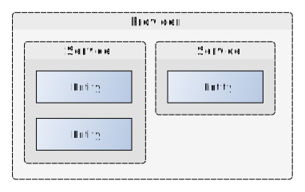
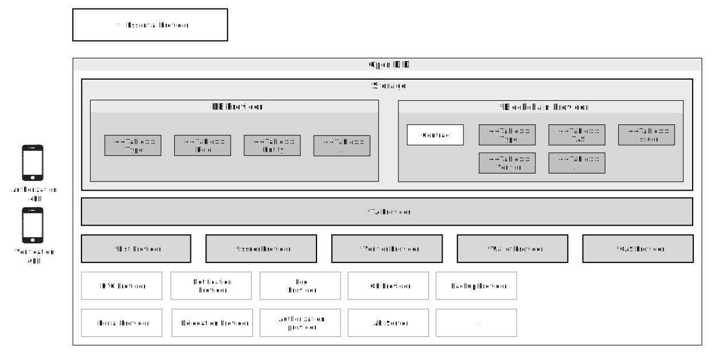

# Open DID Architecture
This document explains the main components that make up the Open DID system and provides an overall architecture diagram.

## Open DID Components
The components of the Open DID system include entities, services, and providers. Providers combine entities to offer services. The diagram below shows how these components are structured.

### Entities
Entities perform a single function. Each entity has a specific role, and the main entities in Open DID are as follows:
* **TA (Trusted Authority)**: Responsible for registering all providers into the Open DID system to establish trust relationships.
* **Issuer**: Holds the user's identity or qualification information and issues digital IDs to the users.
* **Verifier**: Requests and verifies the user's digital ID to provide services.

### Services
Services combine the functions of various entities into products. Services can be offered in various forms such as servers, apps, or SDKs. Examples of services include:
* **Digital ID Issuance and Management Service**
    * **Entities**: Issuer, Wallet, Notification
    * **Description**: A service that issues and manages digital IDs for users. The Issuer entity issues and renews digital IDs based on user identity information, the Wallet entity securely stores and manages issued digital IDs, and the Notification entity supports sending notifications related to ID issuance and renewal.

* **Notification and Log Management Service**
    * **Entities**: Notification, Log, Storage
    * **Description**: Manages notifications related to events occurring within the system and collects and stores all log data to provide necessary statistical data. The Notification entity sends notifications in a user-defined manner, the Log entity records and stores event logs, and the Storage entity securely stores and manages this data.

* **Integrated Security and Authentication Service**
    * **Entities**: KYC, OP
    * **Description**: Provides services for user authentication and authorization management. The KYC entity verifies and authenticates the user's identity, while the OP entity issues secure tokens based on the authenticated information and grants permissions to users.

## Overall Architecture
The diagram below represents the overall architecture of Open DID. To clearly illustrate the entities that make up Open DID, each provider is assumed to offer a single service, and that service provides the function of a single entity.

### Providers
Providers are entities that combine various services to offer comprehensive solutions.

#### TAS Provider
1.	Entity Registration: After authenticating the identity of all entities, register them in the OPEN DID system and grant appropriate permissions to the entities.
2.	Security Policy Management: Manage and apply security policies for entities in the OPEN DID system to establish trust relationships.

#### Issuer
1.	Digital ID Issuance: Possesses the user's identity or qualification information and can issue a digital ID to the user.
2.	Digital ID Renewal: When the user's identity information changes or the ID expires, a new ID can be created or renewed.
3.	Digital ID Revocation: Can revoke the digital ID upon user cancellation or withdrawal.

#### Verifier
1.	Digital ID Verification: Requests and verifies the user's digital ID to check if the user is authorized to use the service.
2.	Service Provision: Provides services to users with valid digital IDs.

#### Search Provider
1.	Wallet List Provision: Provides a list of wallets where the user can manage their digital IDs.
2.	Wallet Information Provision: Provides detailed information about the wallet (functions, security level, etc.) to help the user make informed choices.

#### CApp Provider
1.	App Status Verification: Checks if the user's app is in a normal state and verifies whether it is a trusted app.
2.	Wallet Trust Information Provision: Provides reliability information about the app requested by the user.

#### OP Provider
1.	Token Provision: Verifies the trust information provided by the user and provides a safe and valid token to the user.
2.	Authorization Management per Token: Grants permissions based on the tokens issued to the user.

#### Wallet Provider
1.	Key Storage Integration: Provides an interface to connect to storage (HSM, File, Vault) that can store wallet keys appropriate to the type (device/cloud).
2.	Wallet Status Verification: Checks if the user's wallet is in a normal state and verifies whether it is a trusted wallet.
3.	Wallet Trust Information Provision: Provides reliability information about the wallet requested by the user.
4.	Provision of Crypto Functions: Provides encryption/decryption, signing/signature verification, encoding/decoding functions.

#### List Provider
1.	Issuer List Provision: Provides a list of issuers for VC issuance.
2.	VC List Provision: Provides a list of VCs for issuance.

#### KYC Provider
1.	User Authentication: Performs user authentication for the use of digital IDs.
2.	Identity Information Provision: Provides identity information for the use of digital IDs.

#### Notification Provider
1.	User Notification Feature Provision: Sends messages to the user via email, SMS, or push notifications.
2.	Data and Token Management: Manages data and tokens for the notification feature.

#### Log Provider
1.	Log Recording: Collects and stores logs related to events that occur in the system.
2.	Statistics Provision: Extracts statistical data from the stored logs and provides it to the user.

#### Portal Provider
1.	Web Portal Service Provision: Provides a web portal service for using VC issuance and VP presentation services.

#### Delegated Issuer
1.	VC Issuance Delegation: Performs functions delegated for VC issuance.
2.	VP Submission Delegation: Performs functions delegated for VP submission.

#### Storage (Blockchain Provider)
1.	Blockchain Platform Provision: Provides a blockchain platform to store and manage necessary data for each entity.
2.	Data Management: Stores and manages data such as DID Docs and VC Meta.

#### Storage (DBMS Provider)
1.	Public Database Provision: Provides a public database to store and manage necessary data for each entity.
2.	Data Management: Stores and manages data such as public keys and VC Meta.

#### Backup Provider
1.	Data Backup: Provides functions to store and manage backup data such as wallets and VCs.