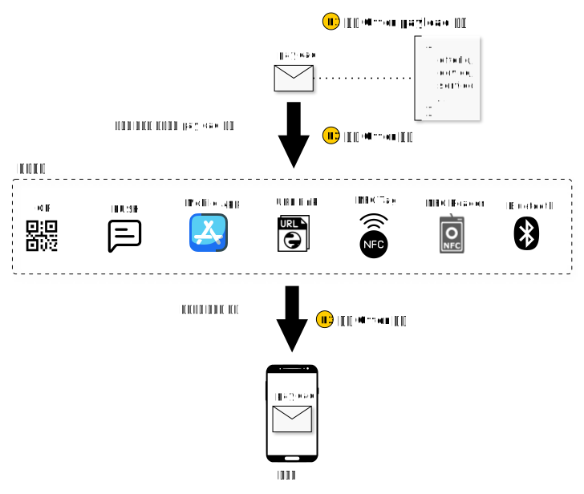
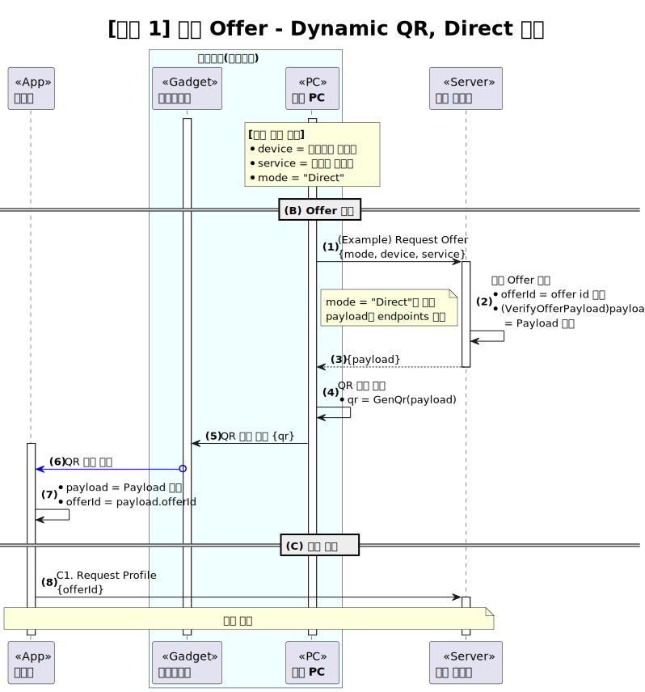
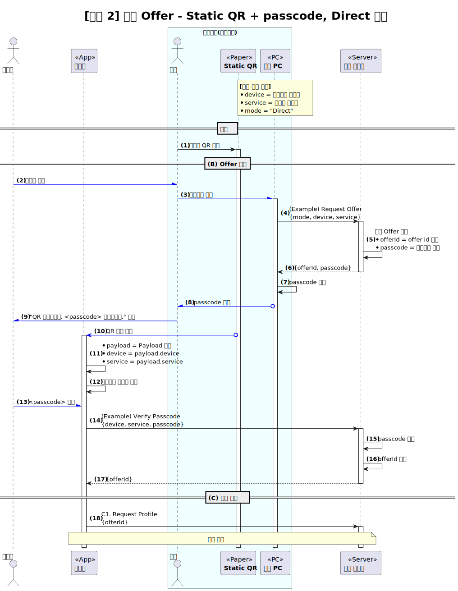
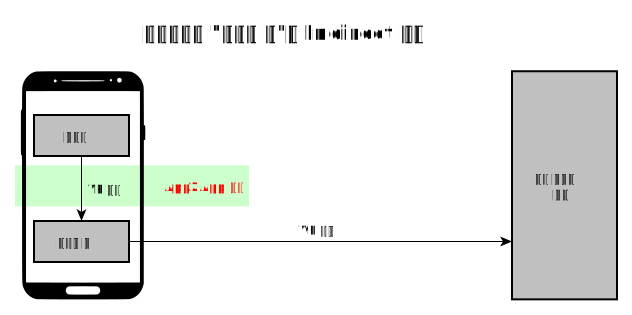
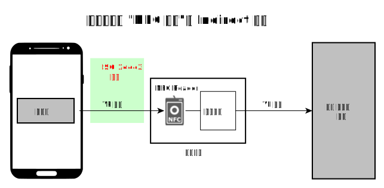
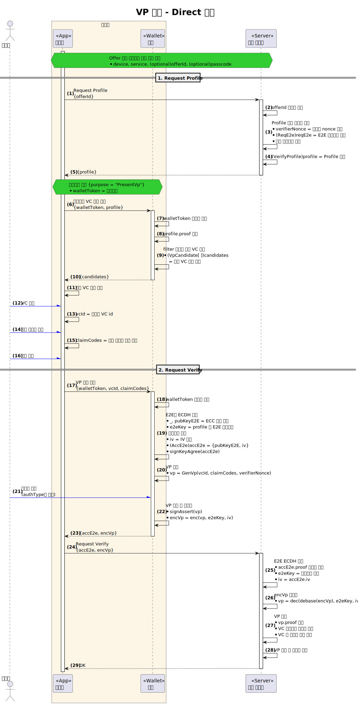

---
puppeteer:
    pdf:
        format: A4
        displayHeaderFooter: true
        landscape: false
        scale: 0.8
        margin:
            top: 1.2cm
            right: 1cm
            bottom: 1cm
            left: 1cm
    image:
        quality: 100
        fullPage: false
---

VP 제출
==

- 주제: VP 제출의 개념 설명
- 작성: 강영호
- 일자: 2024-06-05
- 버전: v1.2.0

개정이력
---

| 버전   | 일자       | 변경 내용                                               |
| ------ | ---------- | ------------------------------------------------------- |
| v1.0.0 | 2024-05-31 | 최초 작성                                               |
| v1.1.0 | 2024-06-04 | <li>VP offer → Verify offer(제출 offer) 용어 변경       |\
|        |            | <li>VpOfferPayload → VerifyOfferPayload 명칭 변경       |\
|        |            | <li>Present VP → Request Verify 명칭 변경               |\
|        |            | <li>Direct 모드 시 월렛이 아닌 인가앱이 제출            |
| v1.2.0 | 2024-06-05 | <li>표준의 범위 조정                                    |\
|        |            | <br>&nbsp;- Offer 단계는 VerifyOfferPayload 형식만 표준 |\
|        |            | <br>&nbsp;- 제출 단계는 offerId를 무조건 수신           |


목차
---

<!-- TOC tocDepth:2..4 chapterDepth:2..6 -->

- [1. 개요](#1-개요)
    - [1.1. 참조문서](#11-참조문서)
- [2. 공통사항](#2-공통사항)
    - [2.1. 데이터 타입 및 상수](#21-데이터-타입-및-상수)
- [3. 사전준비 절차](#3-사전준비-절차)
    - [3.1. 서비스 정의](#31-서비스-정의)
    - [3.2. 응대장치 정의](#32-응대장치-정의)
    - [3.3. 제출 Offer 전달매체 및 메시지 형식 정의](#33-제출-offer-전달매체-및-메시지-형식-정의)
- [4. 제출 절차](#4-제출-절차)
    - [4.1. Offer 단계](#41-offer-단계)
      - [4.1.1. VerifyOfferPayload](#411-verifyofferpayload)
      - [4.1.2. QR 코드를 이용한 예시](#412-qr-코드를-이용한-예시)
    - [4.2. 제출 단계](#42-제출-단계)
      - [4.2.1. 제출 모드](#421-제출-모드)
      - [4.2.2. Direct 모드 예시](#422-direct-모드-예시)

<!-- /TOC -->


<div style="page-break-after: always;"></div>

## 1. 개요

본 문서는 OpenDID의 VP 제출에 대한 전반적인 개념을 설명한다.
VP 제출 순서는 다음과 같다.

1. 사전준비 절차
    - (A) 계획 단계 (Planning)
        - (A1) 서비스 정의
        - (A2) 응대장치 정의
        - (A3) 제출 Offer 전달매체 및 메시지 형식 정의
1. 제출 절차
    - (B) Offer 단계 (Offering)
        - (B1) 제출 Offer payload 생성
        - (B2) 제출 Offer 송신
        - (B3) 제출 Offer 수신
    - (C) 제출 단계 (Presentation)
        - (C1) VerifyProfile 요청
        - (C2) VP 제출

### 1.1. 참조문서

| 참조명             | 문서명                                      | 위치 |
| ------------------ | ------------------------------------------- | ---- |
| [OSD]              | OpenDID Schema Definition Language          |      |
| [DATA-SPEC]        | (OpenDID) 데이터 명세서(Data Specification) |      |
| [VC-FORMAT]        | (OpenDID) VC format                         |      |
| [VP-FORMAT]        | (OpenDID) VP format                         |      |
| [PROFILE-FORMAT]   | (OpenDID) Profile format                    |      |


<div style="page-break-after: always;"></div>


## 2. 공통사항

### 2.1. 데이터 타입 및 상수

여기에 정의되지 않은 항목은 `[DATA-SPEC]`을 참조한다.

```c#
def enum PRESENT_MODE: "VP 제출 모드"
{
    "Direct"  : "direct mode",
    "Indirect": "indirect mode",
    "Proxy"   : "proxy mode",  // 현재 미지원
}
```


<div style="page-break-after: always;"></div>

## 3. 사전준비 절차

VP 제출 및 검증을 위한 사전준비 절차에서는 아래 항목을 수행한다.

- (A1) 서비스 정의
- (A2) 응대장치 정의
- (A3) 제출 Offer 전달매체 및 메시지 형식 정의

### 3.1. 서비스 정의

여기서 서비스라 함은 사용자가 VP를 제출함으로써 검증 사업자로부터 받게되는 유무형의 것을 의미한다.
아래는 서비스의 사례이다.

| 서비스 이름 | 내용                                        |
| ----------- | ------------------------------------------- |
| 회원가입    | 회원으로 가입한다.                          |
| 로그인      | 시스템에 로그인 한다.                       |
| 성인인증    | 사용자가 성인임을 인증하고 주류를 구매한다. |
| 본인확인    | 사용자의 신원을 확인하고 출입증을 교부한다. |

동일한 성인인증이더라도 서비스를 제공하는 사업자에 따라 사용자에게 제공하는 내용은 다를 수 있다.
그러므로 사용자가 어떤 정보를 제출하고, 사업자가 어떤 서비스를 제공할 것인지를 사업자가 스스로 정의하여야 한다.
서비스를 정의하면 다음의 항목이 구체화된다.

1. 서비스 식별자
2. 서비스 기본 정보
    - 이름, 설명, 로고, 참조 사이트 URL
3. VP 정책
    - (VC Schema) 어떤 VC를 제출하는가?
    - (`allowedIssuers`) 어떤 이슈어의 VC를 제출할 수 있는가?
    - (`requiredClaims`) 필수 제출 클레임은 무엇인가?
    - (`displayClaims`) 사용자가 제출여부를 선택할 수 있는 클레임은 무엇인가?
    - (`authType`) 사용자가 VP 제출 시 어떤 인증을 수행하여야 하는가?

### 3.2. 응대장치 정의

응대장치라 함은 인가앱과 검증 사업자 서버 사이에서 VP 제출을 돕거나 중계하는 사물이다.
아래는 응대장치의 사례이다.

| 분류       | 응대장치                                                     |
| ---------- | ------------------------------------------------------------ |
| 기계장치   | 자판기, 키오스크, 태블릿, PC+모니터, NFC 리더, 블루투스 장치 |
| 소프트웨어 | 브라우저, 검증 사업자 서비스 앱, PUSH 솔루션                 |
| 인쇄물     | 인쇄된 QR 코드                                               |
| 기타       | NFC 태그, RFID 태그                                          |

검증 사업자는 서비스마다 연계된 응대장치에 대해 아래의 항목을 정의한다.

- 제공할 응대장치 분류 정의
- 개별 응대장치마다 식별이 필요한 경우 장치 식별자 할당
    - 예를 들어, 민원창구마다 개별 응대장치를 구비한 경우 어떤 창구인지 확인하기 위한 식별자를 부여하여야 한다.

### 3.3. 제출 Offer 전달매체 및 메시지 형식 정의

제출 Offer의 목적은 다음과 같다.

- 개별 VP 제출 거래 식별
    - 어떤 응대장치에서 어떤 서비스를 요청하는가?
- VerifyProfile 요청을 위한 API endpoint 전달

본 문서에서는 `VerifyOfferPayload` 형식으로 payload만 정의한다.
각 전달매체 별로 payload를 어떻게 전달할 것인지는 본 문서의 범위 밖이므로
검증 사업자와 인가앱 사업자가 협의하여 메시지 형식과 전달 방법에 대해 정의하여야 한다.


<div style="page-break-after: always;"></div>

## 4. 제출 절차

제출 절차는 아래 그림과 같다.


### 4.1. Offer 단계

Offer 단계는 아래 그림과 같다.



- (B1) 제출 Offer payload 생성
    - `VerifyOfferPayload` 형식의 payload 데이터를 생성한다.
    - 일반적인 경우는 매 VP 제출 거래 시마다 payload를 생성하며, 이 때는 `offerId`를 포함한다.
    - 고정된 payload를 변경 없이 재사용할 수도 있으며 이 때에도 두 가지 경우가 있다.
        - locked: offerId 요청 시 서버가 지정한 passcode 제출 필요
        - unlocked: passcode 없이 offerId 요청
- (B2) 제출 Offer 송신
    - 지정된 인터페이스를 통해 payload를 전달한다.
    - 메시지 형식 또는 인터페이스마다 다를 수 있다.
- (B3) 제출 Offer 수신
    - 수신한 메시지로부터 payload를 추출한다.

Offer 단계에서는 표준 API를 정의하지 않고 payload에 대한 데이터 형식만 규정한다.
그러므로 payload를 어떤 방식으로 인가앱에 전달할지는 본 문서의 범위 밖이다.
다만, 제출 절차를 수행하기 위해서 제출 profile(VerifyProfile)을 요청하는 주체는 반드시 `offerId`를 사전에 획득하여야 한다.
일반적으로 인가앱이 이 주체가 되겠지만 상황에 따라 응대장치가 제출 profile을 요청하여 인가앱에 전달할 수도 있다. 

#### 4.1.1. VerifyOfferPayload

```c#
def object VerifyOfferPayload: "제출 offer payload"
{
    - uuid         "offerId"   : "제출 offer id", emptiable(false)
    + OFFER_TYPE   "type"      : "offer type", value("VerifyOffer")
    + PRESENT_MODE "mode"      : "제출 모드"
    + itemName     "device"    : "응대장치 식별자"
    + itemName     "service"   : "서비스 식별자"
    - array(url)   "endpoints" : "검증 사업자 API endpoint 목록"
    - utcDatetime  "validUntil": "제출가능 종료일시"
    - bool         "locked"    : "offer 잠김 여부", default(false)
}
```

- `offerId`: (Optional)제출 offer id
    - 매 offer마다 개별 거래에 대한 식별이 필요하거나 dynamic QR 사용 시 `offerId` 지정
    - `offerId`는 응대장치가 서버에 제출 거래 시작을 요청하여 획득 가능
- `device`: 응대장치 식별자
    - 검증 사업자의 어떤 장치에서 제출 offer를 제공하였는지를 확인하기 위한 식별자
    - 예를 들어, 기기번호 'W130-213' 자판기에서 QR을 표시한 경우 기기번호를 `device`에 지정하여 VP 제출 완료시 검증 사업자 서버에서 자판기로 바로 회신 가능
    - 웹서비스와 같이 특정 응대장치가 없는 경우 "WEB-BROWSER"와 같은 이름을 사용하여 브라우저에서 요청함을 확인
- `service`: 검증 사업자에 의해 지정된 서비스명
    - VP 제출에 의해 제공받는 서비스에 대한 식별자
    - 예: "login", "signup", "account-transfer", "login.did"
- `endpoints`: 검증 사업자 API를 호출하기 위한 주소 목록
    - `mode` = "Direct"인 경우 필수
- `locked`: endpoint로 API 호출 시 passcode 필요 여부
    - `offerId`가 없이 고정된 값을 사용하는 경우 재사용 방지를 위해 passcode 설정을 위한 용도
    - 예를 들어, 고객민원 창구 "16"번에서 static QR을 비치하여 VP 제출을 받으려는 경우 아래와 같이 설정 가능
        - {`offerId` 없음, `device`="16", `locked`=true, ...} 로 설정한 QR을 인쇄하여 창구에 부착
        - 창구 PC가 서버에 `device` 값과 함께 제출 offer를 요청하여 passcode "1234"를 할당받음
        - 창구 직원이 고객에게 "QR 스캔하시고 1234를 입력하세요."라고 안내
        - 고객 모바일에서 검증 사업자 서버로 VerifyProfile 요청 시 고객이 입력한 passcode를 전달
        - 검증 사업자 서버는 창구번호와 passcode가 일치할 경우 `offerId`를 응답

#### 4.1.2. QR 코드를 이용한 예시

Offer 단계를 보다 구체적으로 설명하기 위해 QR 코드 방식의 사례를 제시한다.
다음 두 가지의 QR 코드 방식을 적용한다.

1. Dynamic QR
    - QR 코드가 매번 변경됨
    - 사용자에게 QR 코드를 보여줄 디스플레이 장치 필요
2. Static QR + passcode
    - payload에 가변정보가 없어 QR 코드가 고정되므로 종이에 인쇄해서 부착 가능
    - `offerId` 요청 시 passcode 제출/검증 필요

두 가지 QR 코드 형식은 모두 동일하게 다음과 같이 정의한다.<br>
<span style="color:red">
(이는 사례에 불과하므로 표준으로 인식해서는 안 된다.)
</span>


**■ payload**

```json
{
    "type": "VerifyOffer",
    "mode": "Direct",
    "device": "N13-08",
    "service": "permission",
    "endpoints": ["https://example.com/vp"],
    "locked": true
}
```

상기 정의에 따라 실제 값을 적용하여 QR 코드를 생성하였다.

**■ encoded-payload**

※ 편의상 줄바꿈 한 것임

```
ewogICAgInR5cGUiOiAiVmVyaWZ5T2ZmZXIiLAogICAgIm1vZGUiOiAiRGlyZWN0IiwKICAgICJk
ZXZpY2UiOiAiTjEzLTA4IiwKICAgICJzZXJ2aWNlIjogInBlcm1pc3Npb24iLAogICAgImVuZHBv
aW50cyI6IFsiaHR0cHM6Ly9leGFtcGxlLmNvbS92cCJdLAogICAgImxvY2tlZCI6IHRydWUKfQ
```

**■ qr-code**

※ 편의상 줄바꿈 한 것임

```
opendid;v1;
ewogICAgInR5cGUiOiAiVmVyaWZ5T2ZmZXIiLAogICAgIm1vZGUiOiAiRGlyZWN0IiwKICAgICJk
ZXZpY2UiOiAiTjEzLTA4IiwKICAgICJzZXJ2aWNlIjogInBlcm1pc3Npb24iLAogICAgImVuZHBv
aW50cyI6IFsiaHR0cHM6Ly9leGFtcGxlLmNvbS92cCJdLAogICAgImxvY2tlZCI6IHRydWUKfQ
```

**■ QR 이미지**


##### 4.1.2.1. 제출 Offer - Dynamic QR 절차



##### 4.1.2.2. 제출 Offer - Static QR + passcode 절차




### 4.2. 제출 단계

제출 단계는 VerifyProfile을 입수하고, VP를 암호화하여 제출하는 과정이다.
제출 단계를 요약하면 다음과 같다.

1. (인가앱) VerifyOfferPayload 입수
    - QR, PUSH 등 다양한 방법으로 입수 가능 (out of scope)
1. (인가앱) VerifyProfile 입수
    - `mode` = "Direct"의 경우
        - (인가앱) VerifyOfferPayload 내에 기입된 endpoint에 API 호출하여 획득
    - `mode` = "Indirect"의 경우
        - (인가앱) 응대장치에 profile 요청
        - (응대장치) 검증 사업자에 profile 요청
1. (인가앱, 월렛) 월렛토큰 생성
1. (사용자) 제출 VC 및 클레임 선택
1. (인가앱) 월렛에 VP 생성 요청
1. (월렛) 사용자 동의받아 VP 생성하고 암호화
1. VP 제출
    - `mode` = "Direct"의 경우
        - (인가앱) VerifyProfile 내에 기입된 endpoint에 API 호출하여 VP 제출
    - `mode` = "Indirect"의 경우
        - (인가앱) 응대장치에 VP 제출
        - (응대장치) 검증 사업자에 VP 제출
1. (검증 사업자) VP 복호화하여 검증 후 서비스 제공

#### 4.2.1. 제출 모드

제출 모드는 VP를 어떤 경로로 제출하느냐에 대한 방법을 의미하며 다음의 모드가 있다.

| 모드       | 설명                                  | 지원 여부 |
| ---------- | ------------------------------------- | --------- |
| `Direct`   | 인가앱이 검증 사업자에 직접 제출      | 지원      |
| `Indirect` | 인가앱이 응대장치 등을 통해 간접 제출 | 지원      |
| `Proxy`    | 제3의 서버가 제출을 중계              | 미지원    |

##### 4.2.1.1. Direct 모드

Direct 모드는 인가앱이 profile 내에 지정된 endpoint 주소로 직접
`Request Verify` API를 호출하여 제출하는 형태이다.


##### 4.2.1.2. Indirect 모드

Indirect 모드는 인가앱이 응대장치에게 VP를 제출하고 응대장치가 `Request Verify` API를 호출하여 VP를 제출하는 형태이다.
그러므로 응대장치는 인가앱과 직접적으로 통신할 수 있는 수단을 가지고 있어야 이 모드를 사용할 수 있다.

■ App2App 예시



■ NFC 예시



##### 4.2.1.3. Proxy 모드

Proxy 모드는 인가앱과 검증 사업자 서버 사이에 둘 간의 데이터 교환을 중계해주는
서버(Proxy 서버 또는 중계서버)를 통하여 VP를 제출하는 형태이다.

인가앱이 먼저 제출할 VC를 선택하여 QR 코드를 표출하고 응대장치가 QR 코드를 스캔하여
검증 사업자 서버에 전달하여 제출 거래를 하려는 경우 검증 사업자 서버가 인가앱으로
접근할 방법이 필요하다.
서버는 통신을 위한 endpoint가 고정된 반면 모바일 앱은 고정된 주소가 없으므로 서버가
인가앱으로 접근할 수 있는 방법이 없다.
따라서 인가앱이 proxy 서버에 세션을 형성하여 세션 id(`sesId`)를 할당받고
검증 사업자에게 이를 전달함으로써 proxy 서버를 통한 데이터 교환이 가능해진다.
아래 그림이 Proxy 모드의 절차를 설명한다.


Proxy 모드는 개념만 소개하고 현재는 지원하지 않는 기능이다.

#### 4.2.2. Direct 모드 예시


