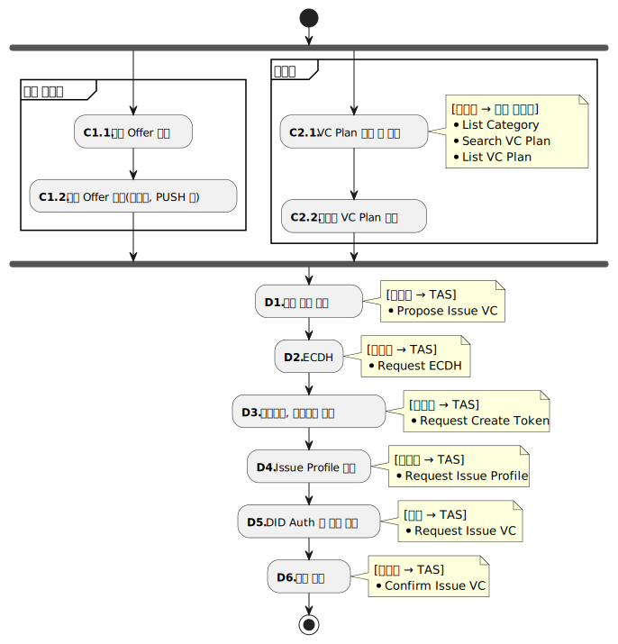
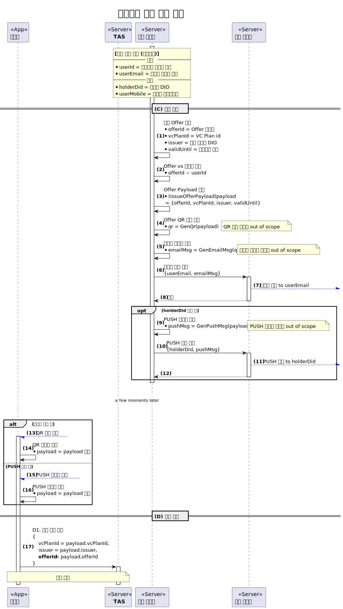

---
puppeteer:
    pdf:
        format: A4
        displayHeaderFooter: true
        landscape: false
        scale: 0.8
        margin:
            top: 1.2cm
            right: 1cm
            bottom: 1cm
            left: 1cm
    image:
        quality: 100
        fullPage: false
---

VC 발급
==

- 주제: VC 발급의 개념 설명
- 작성: 강영호
- 일자: 2024-08-19
- 버전: v1.1.3

개정이력
---

| 버전   | 일자       | 변경 내용                                                |
| ------ | ---------- | -------------------------------------------------------- |
| v1.0.0 | 2024-05-24 | 최초 작성                                                |
| v1.1.0 | 2024-05-28 | 1차 검토회의 의견 반영                                   |
| v1.1.1 | 2024-06-04 | <li>VcOfferPayload → IssueOfferPayload 명칭 변경         |\
|        |            | <li>Inspect Issue Propose → Inspect Propose 명칭 변경    |\
|        |            | <li>Generate Issue Profile → Generate Profile 명칭 변경  |
| v1.1.2 | 2024-06-11 | <li>4.3. "발급 단계" 절차도 수정                         |\
|        |            | <br>&nbsp;&nbsp;- DID Auth용 사용자 인증을 인가앱이 수행 |
| v1.1.3 | 2024-08-19 | <li>ECHD → ECDH 오타 수정                                |


목차
---

<!-- TOC tocDepth:2..4 chapterDepth:2..6 -->

- [1. 개요](#1-개요)
    - [1.1. 참조문서](#11-참조문서)
- [2. 공통사항](#2-공통사항)
    - [2.1. 데이터 타입 및 상수](#21-데이터-타입-및-상수)
- [3. 사전준비 절차](#3-사전준비-절차)
    - [3.1. VC Plan](#31-vc-plan)
        - [3.1.1. VC Plan 생애주기](#311-vc-plan-생애주기)
        - [3.1.2. VC Plan 데이터 구조](#312-vc-plan-데이터-구조)
- [4. 발급 절차](#4-발급-절차)
    - [4.1. 이슈어에 의한 발급 개시](#41-이슈어에-의한-발급-개시)
        - [4.1.1. IssueOfferPayload](#411-issueofferpayload)
    - [4.2. 사용자에 의한 발급 개시](#42-사용자에-의한-발급-개시)
    - [4.3. 발급 단계](#43-발급-단계)

<!-- /TOC -->


<div style="page-break-after: always;"></div>

## 1. 개요

본 문서는 OpenDID의 VC 발급에 대한 전반적인 개념을 설명한다.
VC 발급 순서는 다음과 같다.

1. 사전준비 절차
    - (A) 계획 단계 (Planning)
        - (A1) Claim 정의
        - (A2) VC Schema 정의 및 게시
        - (A3) Plan Manager 선정
        - (A4) (Optional) 대표 발급자 선정
    - (B) 등록 단계 (Registration)
        - (B1) VC Plan 등록
        - (B2) VC Plan 이슈어 등록
1. 발급 절차
    - (C) 개시 단계 (Initiation)
        - (C1) Issuer initiated
            - (C1.1) 발급 Offer 생성
            - (C1.2) 발급 Offer 메시지 발송 (QR, PUSH 등)
        - (C2) User initiated
            - (C2.1) VC Plan 검색 및 조회
                - List Category
                - Search VC Plan
                - List VC Plan
            - (C2.2) 발급할 VC Plan 선택
    - (D) 발급 단계 (Issuance)
        - (D1) 발급 시작 요청 - Propose Issue VC
        - (D2) ECDH (보안 세션 수립) - Request ECDH
        - (D3) 월렛토큰, 서버토큰 생성 - Request Create Token
        - (D4) Issue Profile 요청 - Request Issue Profile
        - (D5) DID Auth 및 발급 요청 - Request Issue VC
        - (D6) 발급 완료 - Confirm Issue VC

### 1.1. 참조문서

| 참조명             | 문서명                                      | 위치 |
| ------------------ | ------------------------------------------- | ---- |
| [OSD]              | OpenDID Schema Definition Language          |      |
| [DATA-SPEC]        | (OpenDID) 데이터 명세서(Data Specification) |      |
| [VC-SCHEMA-FORMAT] | (OpenDID) VC Schema format                  |      |
| [PROFILE-FORMAT]   | (OpenDID) Profile format                    |      |


<div style="page-break-after: always;"></div>


## 2. 공통사항

### 2.1. 데이터 타입 및 상수

여기에 정의되지 않은 항목은 `[DATA-SPEC]`을 참조한다.

```c#
def enum LOGO_IMAGE_TYPE: "logo image type"
{
    "jpg", "png"
}

def enum OFFER_TYPE: "offer type"
{
    "IssueOffer" : "발급 오퍼 정보",
    "VerifyOffer": "제출 오퍼 정보",
}

def object LogoImage: "logo image data"
{
    + LOGO_IMAGE_TYPE "format": "image format"
    + select(1)
    {
        ^ url       "link" : "logo image URL - 이미지를 다운로드할 URL"
        ^ multibase "value": "multibase(image) - 이미지 원본의 multibase"
    }
}
```


<div style="page-break-after: always;"></div>

## 3. 사전준비 절차

VC 발급을 위한 사전준비 절차는 아래 그림과 같다.


발급 사업자가 단독이 아닌 경우는 가장 먼저 발급 사업자 협의체인 컨소시엄을 구성하여야 한다.
단독인 경우는 Claim이나 VC Schema를 공유하지 않으므로 해당 사업자가 컨소시엄의 역할을 수행한다.

컨소시엄의 역할은 다음과 같다.

- 발급할 VC 정의
    - Claim 정의
    - VC Schema 정의
- VC Plan 관리자(Plan Manager) 선정 및 권한 위임
- Plan Manager에 의한 VC Plan 관리
    - VC Plan 생성 및 등록
    - 대표 발급자 등록
    - 발급에 참여하는 발급 사업자 목록 관리
    - VC Plan 상태 관리

VC Plan이 등록된 이후 각 발급 사업자는 자신의 정보를 등록하여야 한다.

- 이름, 설명, 참조 URL, 로고 이미지


### 3.1. VC Plan

**VC Plan**은 VC 발급 서비스에 대한 정보로서 다음의 정보를 포함한다.

- 발급 서비스의 명칭, 설명, 로고 이미지 등 기본 정보
- 발급할 VC의 내용이 무엇인지 (VC Schema)
- 누가 발급하는지 (delegator, allowedIssuers)
- 어떤 옵션이 있는지 (option)
- 누가 관리하는지 (manager)

#### 3.1.1. VC Plan 생애주기

VC Plan의 생애주기는 다음과 같다.


- ACTIVE (활성화)
    - VC Plan 생성 직후이며 발급이 가능한 상태
    - INACTIVE 상태로 전이 가능
- INACTIVE (비활성화)
    - Plan Manager에 의해 사용지 중지된 상태
    - ACTIVE 상태로 전이 가능
- REMOVED (삭제)
    - Plan Manager에 의해 삭제된 삭태


#### 3.1.2. VC Plan 데이터 구조

##### 3.1.2.1. VcPlan

목록 사업자의 관리자 화면 기준으로 VC Plan을 등록하기 위한 데이터 구조이다.

```c#
def object VcPlan: "VC plan 정보"
{
    + vcPlanId      "vcPlanId"   : "VC plan id"
    + string        "name"       : "VC plan 이름"
    + string        "description": "VC plan 설명"
    - url           "ref"        : "참조 페이지 URL"
    - LogoImage     "logo"       : "로고 이미지"
    - utcDatetime   "validFrom"  : "발급가능 시작일시"
    - utcDatetime   "validUntil" : "발급가능 종료일시"
    - array(string) "tags"       : "검색을 위한 해시태그 목록"
    
    + object "credentialSchema": "VC Schema 정보"
    {
        + url                    "id"  : "VC Schema URL"
        + CREDENTIAL_SCHEMA_TYPE "type": "VC Schema format type"
    }

    + object "option": "옵션 설정"
    {
        + bool "allowUserInit"    : "사용자에 의한 발급 개시 허용 여부"
        + bool "allowIssuerInit"  : "이슈어에 의한 발급 개시 허용 여부"
        + bool "delegatedIssuance": "대표 발급자에 의한 위임발급 여부"
    }

    // ~/option/delegatedIssuance (위임발급) 값에 따라 선택적
    + select(1)
    {
        // When 위임발급 = true
        ^ did "delegator": "위임(대표) 발급자 DID"

        // When 위임발급 = false
        ^ array(did) "allowedIssuers": "VC plan 사용이 허용된 발급 사업자 DID 목록"
    }

    // manager는 향후 plan의 내용이나 이슈어 정보를 수정할 권한을 가진 사업자를 의미
    + did "manager": "VC plan 관리 권한을 가진 엔티티"
}
```


<div style="page-break-after: always;"></div>

## 4. 발급 절차

VC 발급 절차는 아래 그림과 같다.



개시 단계에는 두 가지 흐름이 있다.

1. 이슈어에 의한 발급 개시
2. 사용자에 의한 발급 개시

### 4.1. 이슈어에 의한 발급 개시

이슈어는 발급할 VC의 holder 정보를 이미 가지고 있어서 이슈어가 사용자에게 발급 세션정보을 제공하는 방식이다.
이 발급 세션정보를 **Issue Offer**라고 칭한다.
예를 들어, 공무원증은 해당 공공기관에 소속된 직원에 한해 공무원증을 발급할 것이므로
미리 발급에 필요한 정보를 등록해 놓고 발급 링크를 전달하기만 하면된다.

이슈어에 의한 발급 개시는 다음의 사항을 전제한다.

1. 이슈어는 VC를 발급 받을 사용자에 대한 아래 정보를 이미 확보하고 있다.
    - (Mandatory) 사용자 계정, 이메일 주소
    - (Optional) DID, 모바일 전화번호
1. 이슈어는 사용자 본인인지 확인할 KYC 수단을 가지고 있다.
    - 예: 이메일 인증, 휴대폰본인확인, 공무원인증서 검증
1. 발급할 VC에 대한 VC Plan이 등록되어 있다.
1. 이슈어는 해당 VC Plan의 이슈어로 등록되어 있다.

아래 절차도는 이슈어에 의한 발급 개시 과정을 설명한다.
본 문서에서는 Issue Offer의 내용인 payload에 대해서만 정의하고 있으며
아래의 항목은 범위 밖으므로 구체적으로 정의하지 않는다.

- payload를 포함한 QR 코드 및 PUSH 메시지
- QR 코드를 포함한 이메일 메시지
- 기타 payload를 포함한 다른 인터페이스용 메시지

그러므로 각 구현에서는 payload만 표준을 따르고 나머지 형식은 각자의 요구사항에
맞게 자유롭게 정의하면 된다.



#### 4.1.1. IssueOfferPayload

```c#
def object IssueOfferPayload: "issue offer payload"
{
    + uuid        "offerId"   : "발급 offer id"
    + OFFER_TYPE  "type"      : "offer type", value("IssueOffer")
    + vcPlanId    "vcPlanId"  : "VC plan id"
    + did         "issuer"    : "issuer DID"
    - utcDatetime "validUntil": "발급가능 종료일시"
}
```

### 4.2. 사용자에 의한 발급 개시

사용자가 발급할 VC를 선택하여 발급을 개시하는 방식이다.


다음의 사항은 본 문서의 범위 밖이다.

- VC Plan 검색 및 조회 방법
- 조회된 VC Plan의 데이터 구조

다만 VC Plan 데이터에 다음의 정보는 반드시 포함하고 있어야 한다.

- VC Plan id
- 이슈어 DID

### 4.3. 발급 단계

개시 단계 이후에는 본격적으로 발급을 수행하는 발급 단계 절차를 수행한다.
발급 단계는 인가앱, 월렛, TAS, 이슈어가 각자의 역할을 유기적으로 수행하게 되는데
여기서는 전체적인 흐름만 설명하므로 자세한 내용은 아래 문서를 참고한다.

- TAS API
- Issuer API

ECDH, E2E 요청 및 수락 정보에 대한 서명은 선택사항이므로 아래 절차도에서 `signKeyAgree(...)` 부분은 생략이 가능하다.


