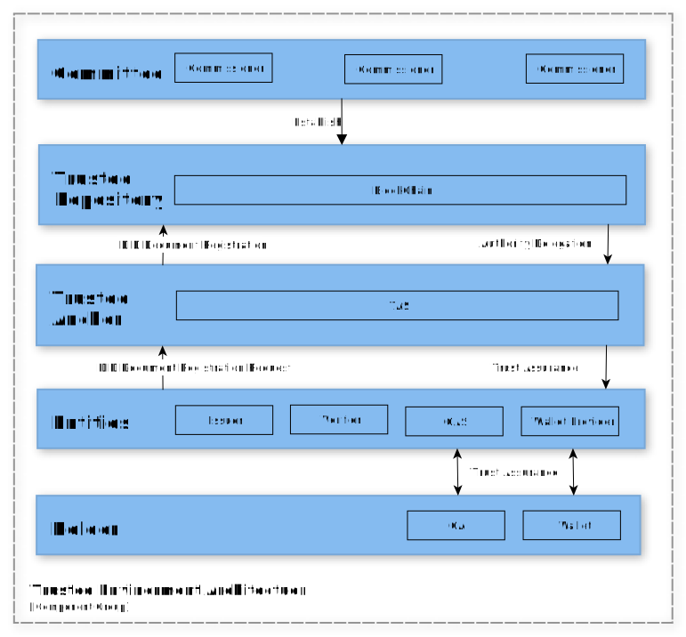

# Open DID 신뢰환경

- 주제 : Open DID 신뢰환경
- 작성 : 오픈소스개발팀
- 일자 : 2025-06-23
- 버전 : v2.0.0

| 버전 | 일자       | 변경         |
| ------- | ---------- | --------------- |
| v2.0.0  | 2025-06-23 | 최초 작성 |

 

## 신뢰환경 개요

- OpenDID 시스템은 참여자 간 **상호 신뢰**를 형성하기 위한 구조로, **제로 트러스트 원칙**을 기반으로 설계됩니다.
- **TAS**를 중심으로 신뢰체인을 형성하여 **탈중앙적 신뢰 기반**을 확립합니다.
- 누구든지 상대방의 **DID Document를 검증**할 수 있어 진위 여부를 확인할 수 있습니다.
- **블록체인 기반 저장소**를 통해 데이터 위·변조를 방지하고, 투명한 이력 추적이 가능합니다.

---

 

## 신뢰환경 아키텍처

- **신뢰체인 구성**: 위원회의 동의에 따라 신뢰환경을 설계 및 구성
- **신뢰 저장소 → TAS 권한 위임**
- **각 Entity → DID Document 등록 요청**
- **DID Document에는 공개키, 서명 등 핵심 정보 포함**
- **DID Document 검증 → 상호 신뢰 기반 형성**
- **가입증명서 발급 → 등록 엔티티의 신뢰성 보증**

---

 

## 신뢰환경 핵심요소

| 구성 요소              | 설명 |
|------------------------|------|
| **신뢰 저장소**         | 위원회의 동의로 최초 구성. 블록체인 등 분산 저장소로 구성되어 영구 보관 및 위변조 방지. |
| **TAS**                | 각 엔티티의 등록 및 관리를 수행하는 신뢰 관리자. |
| **DID Document**       | 엔티티의 DID, 공개키, 서명 등 정보를 담은 신뢰 문서. |
| **가입 증명서**         | 엔티티의 권한과 신뢰성을 보증하는 공식 증명서. |
| **엔티티 등록 및 인증** | 발급자, 검증자, 앱 등 구성원 등록 및 검증 절차. |
| **제로 트러스트 원칙**  | 시스템 내 모든 요청은 사전 검증이 필수. 기본적으로 신뢰하지 않음. |
| **전자서명 및 암호화**  | 진위성 및 무결성을 보장하는 핵심 기술. |

> OpenDID 신뢰환경은 모든 참여자가 신뢰 가능한, 위변조 불가능한 **디지털 신뢰 생태계**를 구축합니다.

---

 

## 신뢰환경 구축 절차

### 1. TAS 등록
- TAS는 **신뢰 등록 및 관리 역할**을 수행하는 핵심 주체입니다.
- 최상위 **신뢰 저장소**에 등록되어 신뢰 체인의 시작점을 형성합니다.

**과정:**
- TAS가 위원회에게 **DID Document 서명 요청**
- 위원회는 TAS의 DID Document를 Attestation을 생성
- 등록 완료 후 **가입 증명서 발급** 

---

### 2. Entity 등록
- 각 참여자는 TAS를 통해 DID Document를 등록 요청하고, 권한을 부여받습니다.
- TAS는 **역할 기반 권한 분류**를 통해 엔티티를 등록 및 관리합니다.

**과정:**
- Entity가 TAS에게 **자신의 DID Document 등록 요청**
- TAS가 등록을 수행하고, **가입 증명서 발급**

---

### 3. 가입 증명서 발급
- TAS는 등록 완료된 엔티티에 대해 **공식 신뢰 보증 문서**로서 가입 증명서를 발급합니다.
- 이 증명서는 해당 엔티티의 **신원 및 권한을 검증할 수 있는 크리덴셜**입니다.

---

 

## 참고

- 등록된 모든 DID Document와 증명서는 신뢰 저장소에 **공개적, 위변조 불가능**하게 저장됩니다.
- 시스템 내에서 발생하는 모든 상호작용은 **전자서명 기반**으로 진위 여부를 검증할 수 있습니다.
