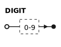
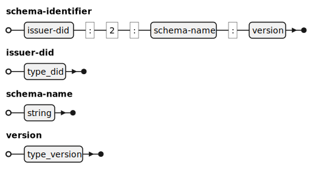
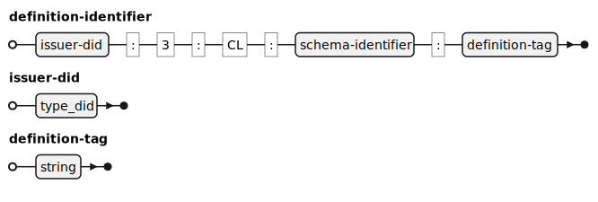

---
puppeteer:
    pdf:
        format: A4
        displayHeaderFooter: true
        landscape: false
        scale: 0.8
        margin:
            top: 1.2cm
            right: 1cm
            bottom: 1cm
            left: 1cm
    image:
        quality: 100
        fullPage: false
---

ZKP Data Specification
==

- Subject: Structure and Requirements of Key Data
- Author: Dongjun Park
- Date: 2025-04-30
- Version: v1.0.0

| Version | Date       | Change Description |
| ------- | ---------- | ------------------ |
| v1.0.0  | 2025-04-30 | Initial Draft      |

<div style="page-break-after: always;"></div>

Table of Contents
---

<!-- TOC tocDepth:2..3 chapterDepth:2..6 -->

- [ZKP Data Specification](#zkp-data-specification)
  - [Table of Contents](#table-of-contents)
  - [1. Overview](#1-overview)
    - [1.1. Notation](#11-notation)
      - [1.1.1. OSD](#111-osd)
      - [1.1.2. EBNF Diagram](#112-ebnf-diagram)
  - [2. Data Types](#2-data-types)
    - [2.1. General](#21-general)
      - [2.1.1. schema identifier](#211-schema-identifier)
      - [2.1.2. definition identifier](#212-definition-identifier)
      - [2.1.3. uuid](#213-uuid)
      - [2.1.4. credId](#214-credid)
  - [3. Constants](#3-constants)
    - [3.1. General](#31-general)
  - [4. Data Structures](#4-data-structures)
    - [4.1. General](#41-general)
      - [4.1.1. AttrReferent](#411-attrreferent)
      - [4.1.2. AttrSubReferent](#412-attrsubreferent)
      - [4.1.3. UserReferent](#413-userreferent)
      - [4.1.4. PredicateReferent](#414-predicatereferent)
      - [4.1.5. PredicateSubReferent](#415-predicatesubreferent)
      - [4.1.6. ProofParam](#416-proofparam)
      - [4.1.7. ReferentInfo](#417-referentinfo)
      - [4.1.8. Referent](#418-referent)
      - [4.1.9. ReferentAttributeValue](#419-referentattributevalue)
      - [4.1.10. ProofVerifyParam](#4110-proofverifyparam)
      - [4.1.11. BlindedCredentialSecrets](#4111-blindedcredentialsecrets)
      - [4.1.12. BlindedCredentialSecretsCorrectnessProof](#4112-blindedcredentialsecretscorrectnessproof)
      - [4.1.13. KeyCorrectnessProof](#4113-keycorrectnessproof)
      - [4.1.14. SubProof](#4114-subproof)
      - [4.1.15. PrimaryProof](#4115-primaryproof)
      - [4.1.16. AggregatedProof](#4116-aggregatedproof)
      - [4.1.17. RequestedProof](#4117-requestedproof)
      - [4.1.18. Identifiers](#4118-identifiers)
      - [4.1.19. PrimaryPredicateInequalityProof](#4119-primarypredicateinequalityproof)
      - [4.1.20. PrimaryEqualProof](#4120-primaryequalproof)
      - [4.1.21. Predicate](#4121-predicate)
      - [4.1.22. AttributeValue](#4122-attributevalue)
      - [4.1.23. AttributeInfo](#4123-attributeinfo)
      - [4.1.24. PredicateInfo](#4124-predicateinfo)
      - [4.1.25. SignatureCorrectnessProof](#4125-signaturecorrectnessproof)
      - [4.1.26. CredentialSignature](#4126-credentialsignature)
      - [4.1.27. PrimaryCredentialSignature](#4127-primarycredentialsignature)
      - [4.1.28. AvailableReferent](#4128-availablereferent)
      - [4.1.29. CredentialPrimaryKeyPair](#4129-credentialprimarykeypair)
      - [4.1.30. CredentialPrimaryPrivateKey](#4130-credentialprimaryprivatekey)
      - [4.1.31. CredentialPrimaryPublicKey](#4131-credentialprimarypublickey)
      - [4.1.32. publicKeyMetadata](#4132-publickeymetadata)
    - [4.2. CredentialOffer](#42-credentialoffer)
    - [4.3. CredentialRequest](#43-credentialrequest)
    - [4.4. Credential](#44-credential)
    - [4.5. ProofRequest](#45-proofrequest)
    - [4.6. Proof](#46-proof)
    - [4.7. CredentialDefinition](#47-credentialdefinition)
    - [4.8. CredentialSchema](#48-credentialschema)

<!-- /TOC -->

<div style="page-break-after: always;"></div>

## 1. Overview


This document defines the core data commonly used by various entities in OpenDID ZKP, such as:
- schemaId, credDefId, masterSecret, etc.
- document structures such as schema, definition, credential, proof, offer, proofRequest
- data structures commonly used in API specifications

Key data formats such as schema, definition, credential, proof, offer, proofRequest are detailed in separate documents.
If there are discrepancies between this document and individual ones, this document shall take precedence.

### 1.1. Notation

#### 1.1.1. OSD

The OSD (OpenDID Schema Definition Language) syntax is used to define data types and structures.

#### 1.1.2. EBNF Diagram

To clearly express the configuration of data types, etc., the EBNF (Extended Backus-Naur Form) format is used and converted into diagrams for better intuitive understanding.

Below are the terminal and non-terminal definitions used in this document.

**■ Terminal**





<div style="page-break-after: always;"></div>

## 2. Data Types

This section defines data types commonly used in OpenDID.

```c#
// General
def string schemaId     : "id. ex: did:omn:12345678abcdef:2:mdl:1.0"
def string credDefId    : "id. ex: did:omn:12345678abcdef:2:mdl:1.0:3:CL:did:omn:12345678abcdef:2:mdl:1.0:tag"

def string nonce        : "Positive, 80-bit SecureRandom value generated as a BigInteger"
def string version      : "version id. ex: '1', '2'", regex(/[0-9]+/)
def string tag          : "tag id. ex: Tag1, MDL2025, Voter2025" 
```

### 2.1. General

#### 2.1.1. schema identifier

A schema identifier, similar to a Java variable name.
Consists of uppercase/lowercase alphabets, digits, and underscores. Cannot start with a digit.



[Example]

- "did:omn:12345678abcdef:2:mdl:1.0"

#### 2.1.2. definition identifier

A definition identifier, similar to a Java variable name.
Consists of uppercase/lowercase alphabets, digits, and underscores. Cannot start with a digit.



[Example]

- "did:omn:12345678abcdef:2:mdl:1.0:3:CL:did:omn:12345678abcdef:2:mdl:1.0:tag"

<div style="page-break-after: always;"></div>

#### 2.1.3. uuid

UUID (Universally Unique Identifier) is a standard used in software construction,
standardized as part of the Distributed Computing Environment (DCE) by the Open Software Foundation (OSF).
It is used to create unique identifiers, and in the ZKP OpenDID project, it can be used for:

- credentialID
- transaction codes for identifying transactions
- message identifiers
- cases requiring distinct naming for items


[Examples]

- "44b70956-cd24-11ed-afa1-0242ac120002"
- "6dcdde42-c0d9-4f79-82fb-128a94ce709b"
- "7148d5c1-31a1-4ecd-87f9-b7b533b80692"

<div style="page-break-after: always;"></div>

#### 2.1.4. credId

An identifier in UUID format used to identify individual ZKP Credential documents.

## 3. Constants

### 3.1. General

```c#
def enum CREDENTIAL_TYPE: "Credential signature type"
{
    "CL": "CL signature for each 'attribute' including the blinded master secret in the Credential",
}

def enum MARKER_TYPE: "Used as a marker when creating schema and definition identifiers"
{
    2 : "Credential schema marker",
    3 : "Credential definition marker"
}

def enum PREDICATE_TYPE: "Predicate type"
{
    "GE": "Greater than or equal to",
    "LE": "Less than or equal to",
    "GT": "Greater than",
    "LT": "Less than"
}

def enum ATTR_TYPE: "Attribute type"
{
    "String": "String type",
    "Number": "Numeric type"
}
```
## 4. Data Structures

### 4.1. General

#### 4.1.1. AttrReferent

An object representing information related to attributes during the proof generation process.
It allows selective disclosure or hidden verification of certain attributes.

c#
def object AttrReferent: "attribute referent"
{   
    + string                   "name"               : "Attribute name" 
    + bool                     "checkRevealed"      : "Whether to reveal the attribute"
    + array(AttrSubReferent)   "referent"           : "AttrSubReferent", min_extend(1)   
}

- ~/name: A reference name used to identify a specific attribute in the proof.
- ~/checkRevealed: Indicates whether the attribute will be revealed in the proof.
  - If set to `true`, the verifier can see this attribute.
  - If `false`, the attribute will be verified using zero-knowledge proof (ZKP) without revealing its value.
- ~/referent: A list of AttrSubReferent objects providing detailed information of the attribute(s) being referred to in the proof.

#### 4.1.2. AttrSubReferent

Contains detailed information related to a specific attribute.

c#
def object AttrSubReferent: "attribute sub referent"
{   
    + string "raw"                        : "ex: seoul" 
    + uuid "credId"                       : "Credential ID"
    + definition-identifier "credDefId"   : "CredentialDefinition identifier"
}

- ~/raw: Original value of the attribute.
- ~/credId: ID of the credential containing the attribute.
- ~/credDefId: ID of the Credential Definition issued for a specific schema. It is used by verifiers to verify the validity of the credential.

#### 4.1.3. UserReferent

Represents user reference data associated with specific attributes in a credential. It defines which attributes are included in ZKP proofs.

c#
def object UserReferent: "user referent"
{   
    + uuid "credId"                       : "Credential ID"
    + string "raw"                        : "ex: seoul"
    + string "referentKey"                : "Referent Key"
    + string "referentName"               : "Referent Name"
    + bool   "isRevealed"                 : "Whether to reveal the attribute"
}

- ~/credId: Credential ID.
- ~/raw: Original attribute value.
- ~/referentKey: Internal reference key used during proof generation to distinguish between attributes.
- ~/referentName: Reference group name containing the attribute.
- ~/isRevealed: Indicates whether the attribute will be revealed.

#### 4.1.4. PredicateReferent

Used to verify specific conditions on attribute values (e.g., if age ≥ 18). This enables zero-knowledge verification without disclosing the actual value.

c#
def object PredicateReferent: "predicate referent"
{   
    + string "name"               : "Name defining the predicate check, e.g., zkpbirth" 
    + bool   "checkRevealed"      : "Whether to reveal the attribute"
    + array(referent)             : "PredicateSubReferent", min_extend(1)
}

- ~/name: Reference name identifying a predicate in the proof.
- ~/checkRevealed: If `false`, the value is not revealed but only the condition is verified using ZKP.
  - If `true`, the actual value may be disclosed (though typically false in predicate use).
- ~/referent: A list of attributes to be used in the predicate check.

#### 4.1.5. PredicateSubReferent

c#
def object PredicateSubReferent: "predicate sub referent"
{   
    + string "raw"                        : "ex: 20010101"
    + uuid "credId"                       : "Credential ID"
    + definition-identifier "credDefId"   : "CredentialDefinition identifier"
}

- ~/raw: Original attribute value.
- ~/credId: Credential ID that includes the attribute.
- ~/credDefId: ID of the Credential Definition issued by the issuer to verify the attribute using ZKP.

#### 4.1.6. ProofParam

A core structure used in proof generation, including credentials, attributes, and ZKP data.

c#
def object ProofParam: "proof param"
{   
    + object "referentInfo"     : "ReferentInfo" 
    + object "schema"           : "CredentialSchema" 
    + object "credDef"          : "CredentialDefinition"
}

- ~/referentInfo: Original attribute reference information.
- ~/schema: Credential schema.
- ~/credDef: Credential definition.

#### 4.1.7. ReferentInfo

Contains information on how a specific credential and its attributes are referenced and proved.

c#
def object ReferentInfo: "ReferentInfo"
{
    + object "referents"                  : "Referent", min_extend(1)
}

- ~/referents: A set of credentials used in proof requests.

#### 4.1.8. Referent

Includes information on how a specific credential and its attributes are referenced and proved.

c#
def object Referent: "Referent"
{
    + schema-identifier "schemaId"        : "Credential schema ID"
    + definition-identifier "credDefId"   : "CredentialDefinition ID"
    + object "attrs"                      : "ReferentAttributeValue", min_extend(1)
}

- ~/schemaId: ID defining the schema structure of the credential.
- ~/credDefId: ID used by the verifier to verify the credential's validity.
- ~/attrs: List of attributes used in the proof.

#### 4.1.9. ReferentAttributeValue

Information about the attributes to be proved.

c#
def object ReferentAttributeValue: "ReferentAttributeValue"
{
    + string "referentKey" : "Referent key"
    + bool   "isRevealed"  : "Whether the attribute is revealed"
}

- ~/referentKey: Key referenced in the proof request.
- ~/isRevealed: Whether this attribute is revealed (`true` or `false`).

#### 4.1.10. ProofVerifyParam

Defines which Schema and CredentialDefinition were used to generate the Proof.
```c#
def object ProofVerifyParam: "proof verify param"
{
    + object "schema"                 : "CredentialSchema"
    + object "credentialDefinition"   : "CredentialDefinition"
}
```
- `~/schema`: CredentialSchema
- `~/credentialDefinition`: CredentialDefinition

#### 4.1.11. BlindedCredentialSecrets

Part where blind signature technology is applied so that the issuer does not know specific attribute values when signing the credential.
```c#
def object BlindedCredentialSecrets: "BlindedCredentialSecrets"
{
    + string "u"                          : "u"
    + array(string)                       : "hiddenAttributes"
}
```
- `~/u`: Blinded message sent from the prover to the issuer. It hides actual attribute values during the signing process.
- `~/hiddenAttributes`: List of hidden attributes. These are concealed so the issuer can sign the credential without seeing their original values. For example, "master_secret" is the prover's private key and is a core element in ZKP linkage.

#### 4.1.12. BlindedCredentialSecretsCorrectnessProof

ZKP proof value that verifies the correctness of a blind signature request when issuing a ZKP-based credential.
```c#
def object BlindedCredentialSecretsCorrectnessProof: "BlindedCredentialSecretsCorrectnessProof"
{
    + string "c"            : "hash"
    + string "vDashCap"     : "vDashCap"
    + object "mCaps"        :  min_extend(1)
    {
        + string "masterSecret" : "master secret"
    }
}
```
- `~/c`: Hash value of the blinded message sent from the prover to the issuer.
- `~/vDashCap`: Value proving the blinded message was not tampered with.
- `~/cCaps`: Commit value for the masterSecret. Proves that the prover possesses the master secret.

#### 4.1.13. KeyCorrectnessProof

Data that proves the issuer's public key was correctly generated when the holder creates a CredentialRequest based on ZKP.
```c#
def object KeyCorrectnessProof: "KeyCorrectnessProof"
{
    + string "c"           : "hash"
    + string "xzCap"       : "xzCap"
    + object "xrCap"       : "xrCap", min_extend(1)
    {
        + string "masterSecret" : "Commit value for master secret owned by the user" 
    }
}
```
- `~/c`: Hash value for key correctness proof.
- `~/xzCap`: Part of the CredentialDefinition's public key.
- `~/xrCap`: Commit values of various attributes, proving that they are based on the original data in the Credential.

#### 4.1.14. SubProof

Includes PrimaryProof information.
```c#
def object SubProof: "SubProof"
{
    + PrimaryProof "primaryProof": "PrimaryProof"
}
```

#### 4.1.15. PrimaryProof

Includes both equality proof (eqProof) and inequality proof (neProofs).
```c#
def object PrimaryProof "primaryProof": "PrimaryProof"
{
    + PrimaryEqualProof "eqProof"                        : "PrimaryEqualProof"
    + array(PrimaryPredicateInequalityProof) "neProofs"  : "PrimaryPredicateInequalityProof"
}
```

#### 4.1.16. AggregatedProof

Proof data that combines multiple credentials into a single proof.
```c#
def object AggregatedProof: "AggregatedProof"
{
    + string "cHash"             : "cHash"
    + array(byte[]) "cList"      : "cList"
}
```
- `~/cHash`: Hash value verifying the integrity of the credential proof.
- `~/cList`: List of data used for aggregated proofs.

#### 4.1.17. RequestedProof

Values submitted to prove requested attributes, including whether they were revealed.
```c#
def object RequestedProof: "RequestedProof"
{
    + object "selfAttestedAttrs"   : "selfAttestedAttrs"
    + object "predicates"          : "predicates"
    + object "revealedAttrs"       : "revealedAttrs"
    + object "unrevealedAttrs"     : "unrevealedAttrs"
}
```
- `~/selfAttestedAttrs`: Attributes directly input and attested by the prover.
- `~/predicates`: Attributes included in inequality proofs (e.g., proving "zkpbirth" shows the user is born before Jan 3, 2020).
- `~/revealedAttrs`: List of values revealed to the verifier. ("raw" → original data, "encoded" → encrypted data)
- `~/unrevealedAttrs`: Attributes not revealed to the verifier.

#### 4.1.18. Identifiers

Information identifying which CredentialDefinition and Schema were used.
```c#
def object Identifiers: "Identifiers"
{
    + definition-identifier "credDefId" : "CredentialDefinition ID"
    + schema-identifier     "schemaId"  : "Schema ID"
}
```
- `~/credDefId`: ID of the CredentialDefinition issued by the issuer to verify the proof using the correct signing key.
- `~/schemaId`: ID defining the data structure (schema) of the credential.

#### 4.1.19. PrimaryPredicateInequalityProof

ZKP data that proves a requested attribute satisfies an inequality condition (e.g., ≤, ≥) without revealing the original value.
```c#
def object PrimaryPredicateInequalityProof: "PrimaryPredicateInequalityProof"
{
    + object "u"          : "u"
    + object "r"          : "r"
    + object "t"          : "t"
    + string "mj"         : "mj"
    + string "alpha"      : "alpha"
    + object "predicate"  : "predicate"
}
```
- `~/u`: Cryptographic value used in the proof.
- `~/r`: Commit value related to the prover’s attribute.
- `~/t`: Auxiliary cryptographic values used during ZKP.
- `~/mj`: Hash value based on the attribute.
- `~/alpha`: Random cryptographic value.
- `~/predicate`: Information on the inequality condition requested by the verifier.

#### 4.1.20. PrimaryEqualProof

Object containing equal proof data.
Used to prove exact match of attributes; some attributes may be revealed while others remain hidden.
```c#
def object PrimaryEqualProof: "PrimaryEqualProof"
{
    + object "revealedAttrs" : "revealedAttrs"
    + string "aPrime"        : "aPrime"
    + string "e"             : "e"
    + string "v"             : "v"
    + object "m"             : "m"
    + string "m2"            : "m2"
}
```
- `~/revealedAttrs`: List of revealed attributes (e.g., "zkpsex", "zkpaddr", "zkpasort").
- `~/aPrime`: Cryptographic value used in ZKP.
- `~/e`: Exponent value used in signature verification.
- `~/v`: Signature value used to verify credential integrity.
- `~/m`: Commit values for hidden attributes.
- `~/m2`: Additional verification element.

#### 4.1.21. Predicate

Predicate data used to verify whether a specific attribute satisfies an inequality condition.
```c#
def object Predicate: "Predicate"
{
    + PREDICATE_TYPE "pType" : "PREDICATE_TYPE"
    + int "pValue"           : "pValue"
    + string "attrName"      : "attrName"
}
```
- `~/pType`: Comparison operator (LE <=, GE >=, LT <, GT >).
- `~/pValue`: Target value for comparison (e.g., 20200103 for Jan 3, 2020).
- `~/attrName`: Name of the attribute to compare (e.g., "zkpbirth").

#### 4.1.22. AttributeValue

Data model describing how an attribute's value is stored and processed.
Includes both the original (raw) value and the encrypted (encoded) value.
```c#
def object AttributeValue : "AttributeValue"
{
    + string "encoded" : "Hashed or encrypted form of the original value"
    + string "raw"     : "male" : "Example: gender"
}
```
- `~/encoded`: Encrypted representation of the original attribute value.
- `~/raw`: Revealed original attribute value (e.g., "seoul" for address).
#### 4.1.23. AttributeInfo

A data model that describes how a specific attribute is requested and handled.
It is used by the verifier when requesting a particular attribute to be proven.
```c#
def object AttributeInfo : "AttributeInfo"
{
    + string "name"                        : "referent Key"
    + array(string) "restrictions"         : "Conditions limiting which Credential Definition can be used for this attribute"
}
```
- `~/name`: Name of the attribute to be proven (e.g., "zkpsex" for gender).
- `~/restrictions`: Conditions limiting which Credential Definition can be used for the attribute. These are IDs of the Credential Definitions where the attribute is present.

#### 4.1.24. PredicateInfo

A data model that describes how a specific predicate is requested and handled.
It is used by the verifier when requesting the user to prove a condition based on an attribute.
```c#
def object PredicateInfo : "PredicateInfo"
{
    + PREDICATE_TYPE "pType"              : "predicate type"
    + string "pValue"                     : "predicate value"
    + array(string) "restrictions"        : "Conditions limiting which Credential Definition can be used for this predicate"
}
```
- `~/pType`: Comparison operator. LE(<=), GE(>=), LT(<), GT(>).
- `~/pValue`: Value to compare against (e.g., 20200103 = Jan 3, 2020).
- `~/restrictions`: Conditions limiting which Credential Definition the attribute must come from.

#### 4.1.25. SignatureCorrectnessProof

A proof used to verify the integrity of a signature.
Ensures that the credential has been correctly signed and not tampered with.
```c#
def object SignatureCorrectnessProof : "SignatureCorrectnessProof"
{
    + string "se" : "Hash proving the signature has not been altered"
    + string "c"  : "Challenge hash used to validate consistency"
}
```
- `~/se`: Cryptographic element that ensures the integrity of the signature. If the credential is forged or altered, the `se` value would change and fail verification.
- `~/c`: Challenge value used in ZKP protocols. A random number generated to ensure verifiability without repetition or forgery.

#### 4.1.26. CredentialSignature

A data model containing the signature of a credential.
Used to verify that a credential has been signed correctly and has not been tampered with.
```c#
def object CredentialSignature : "CredentialSignature"
{
    + PrimaryCredentialSignature "pCredential"   : "Primary signature values and data"
}
```
- `~/pCredential`: Used to verify that the issuer correctly signed the credential and that it has not been tampered with.

#### 4.1.27. PrimaryCredentialSignature

Cryptographic signature issued by the issuer to prove the credential was validly issued.
```c#
def object PrimaryCredentialSignature : "PrimaryCredentialSignature"
{
    + string "a"  : "Part of the credential signature generated by the issuer"
    + string "e"  : "Public exponent used in signature verification"
    + string "v"  : "Core large integer value of the signature"
    + string "q"  : "Additional signature parameter"
    + string "m2" : "Extra signature element used in the credential"
}
```
- `~/a`: One of the core cryptographic elements in the signature.
- `~/e`: Cryptographic exponent that ensures the security of the signature.
- `~/v`: Main large integer value guaranteeing integrity of the signature.
- `~/q`: Additional cryptographic element for signature validation.
- `~/m2`: Extra verification parameter.

#### 4.1.28. AvailableReferent

Represents how the holder finds suitable credential attributes for a Proof Request during ZKP.
Defines which attributes and predicates can be used by the holder.
```c#
def object AvailableReferent : "AvailableReferent"
{
    + object "selfAttrReferent"  : "AttrReferent"
    + object "attrReferent"      : "AttrReferent"
    + object "predicateReferent" : "PredicateReferent"
}
```
- `~/selfAttrReferent`: List of self-attested attributes entered by the user.
- `~/attrReferent`: List of revealable attributes directly from credentials.
- `~/predicateReferent`: List of attributes usable in predicate checks (not revealed).

#### 4.1.29. CredentialPrimaryKeyPair

A core element in ZKP-based identity systems, used to generate and verify user credentials.
Includes the key pair created by the issuer for a Credential Definition.
```c#
def object CredentialPrimaryKeyPair : "CredentialPrimaryKeyPair"
{
    + object "privateKey"        : "CredentialPrimaryPrivateKey"
    + object "publicKey"         : "CredentialPrimaryPublicKey"
    + object "publicKeyMetadata" : "PublicKeyMetadata"
}
```
- `~/privateKey`: Private key information.
- `~/publicKey`: Public key information.
- `~/publicKeyMetadata`: Metadata about the public key.

#### 4.1.30. CredentialPrimaryPrivateKey

Large RSA prime numbers known only to the issuer.
```c#
def object CredentialPrimaryKeyPair : "CredentialPrimaryKeyPair"
{
    + string "p" : "First prime number"
    + string "q" : "Second prime number"
}
```
- `~/p, q`: Used to generate the private key and are not disclosed. Their product forms the public modulus `n`.

#### 4.1.31. CredentialPrimaryPublicKey

Public key used to issue and verify ZKP-based credentials.
```c#
def object CredentialPrimaryPublicKey : "CredentialPrimaryPublicKey"
{
    + string "n" :  "Public key modulus (p * q)"
    + string "z" :  "Additional public key element (used in ZKP calculations)"
    + string "s" :  "Part of the public key (used in ZKP verification)" 
    + object "r" :  "Public key elements per attribute", min_extend(2)
    {
        - string $attribute : "Public key for the attribute"
        + string "masterSecret" : "Master secret (linked to private key)"
    }
    + string "rctxt" : "Context value (used in ZKP protocol operations)"
}
```
- `~/n`: Public key modulus, generated by multiplying `p` and `q`.
- `~/z`: Value needed for ZKP operations.
- `~/s`: Public key component used with `n` in ZKP.
- `~/r`: Public key elements per attribute.
- `~/rctxt`: Additional context for ZKP computations.

#### 4.1.32. publicKeyMetadata

ZKP-based metadata related to public keys.
```c#
def object publicKeyMetadata : "publicKeyMetadata"
{
    + string "xz" :  "Additional public key metadata"
    + object "xr" :  "Per-attribute additional public key info", min_extend(2)
    {
        - string $attribute : "Public key for the attribute"
        + string "masterSecret" : "Master secret"
    }
}
```
- `~/xz`: Additional public key metadata.
- `~/xr`: Attribute-specific public key metadata (e.g., zkpsex, zkpbirth, zkpaddr).
### 4.2. CredentialOffer

A Credential Offer created by the issuer before issuing a credential to the user.
Based on this, the user generates a CredentialRequest and requests the credential from the issuer.
```c#
def object CredentialOffer: "credential offer"
{    
    + nonce "nonce"                               : "nonce"
    + schema-identifier "schemaId"                : "CredentialSchema identifier"
    + definition-identifier "credDefId"           : "CredentialDefinition identifier"
    + object "keyCorrectnessProof"   : "KeyCorrectnessProof"
}
```
- `~/nonce`: Random value used to prevent replay attacks (linked to CredentialRequest).
- `~/schemaId`: ID that defines the data structure (schema) of the credential.
- `~/credDefId`: ID of the CredentialDefinition created by the issuer. It indicates which signing key is used and helps the verifier validate the credential.
- `~/keyCorrectnessProof`: Proof ensuring the issuer used a valid public key. The holder verifies it at the request stage.

### 4.3. CredentialRequest

A request sent from the holder to the issuer to receive a credential.
This request is based on the Credential Offer and uses ZKP to protect sensitive data while maintaining trust.
```c#
def object CredentialRequest: "credential request"
{    
    + string "proverDID"                   : "prover DID"
    + definition-identifier "credDefId"    : "CredentialDefinition identifier"
    + nonce "nonce"                        : "nonce"
    + BlindedCredentialSecrets "blindedMs" : "BlindedCredentialSecrets"
    + BlindedCredentialSecretsCorrectnessProof "blindedMsCorrectnessProof" : "BlindedCredentialSecretsCorrectnessProof"
}
```
- `~/proverDID`: DID (Decentralized Identifier) of the holder — a unique identifier for the identity subject.
- `~/credDefId`: Credential Definition ID for the requested credential. Specifies its attributes and signing structure.
- `~/nonce`: Random nonce ensuring uniqueness of the request and security between offer and request.
- `~/blindedMs`: Blind (encrypted) data representing the holder's attributes to be sent to the issuer.
- `~/blindedMsCorrectnessProof`: Cryptographic proof that the blindedMs was generated correctly.

### 4.4. Credential

A digital certificate issued by the issuer to the holder, used in decentralized identity (DID) systems.
Based on ZKP, allowing verification without revealing raw data.
```c#
def object Credential: "credential"
{
    + identifier "schemaId"    : "CredentialSchema ID"
    + identifier "credDefId"   : "CredentialDefinition ID"
    + object "values"          : "attributes", min_extend(1)
    {
        + AttributeValue $attributeValue : "AttributeValue"
    }
    + CredentialSignature "signature"          : "Signature value"
    + SignatureCorrectnessProof "signatureCorrectnessProof"  : "Signature correctness proof"
}
```
- `~/schemaId`: ID defining the credential's schema.
- `~/credDefId`: ID of the CredentialDefinition indicating the issuer’s signing key used for this credential.
- `~/value`: Holds the attribute values included in the credential.
- `~/value/zkpsex`: Gender
- `~/value/zkpbirth`: Date of birth
- `~/value/zkpasort`: Personal ID number
- `~/value/zkpaddr`: Address
- `~/signature`: Cryptographic signature generated by the issuer when issuing the credential.
- `~/signatureCorrectnessProof`: Proof verifying the signature was correctly created.

### 4.5. ProofRequest

Defines the proof requirements requested by the verifier to the prover (user).
```c#
def object ProofRequest: "proofRequest"
{
    + string "name"                  : "proofs"
    + string "version"               : "version"
    + nonce  "nonce"                 : "nonce"
    - object "requestedAttributes"   : "AttributeInfo", min_extend(1)
    - object "requestedPredicates"   : "PredicateInfo", min_extend(1)
}
```
- `~/name`: Name of the Proof Request (e.g., "mdl").
- `~/version`: Version of the Proof Request (e.g., "1.0").
- `~/nonce`: Random nonce ensuring uniqueness of the proof request.
- `~/requestedAttributes`: Attributes the holder must reveal.
- `~/requestedPredicates`: Attributes the holder must satisfy according to specified conditions.

### 4.6. Proof

Proof data submitted by the holder in response to the verifier’s ProofRequest.
Uses ZKP to prove conditions or attributes without revealing the original data.
```c#
def object Proof: "proof"
{
    + array(SubProof)        "proofs"           : "proofs"
    + object AggregatedProof "aggregatedProof" : "aggregated proof"
    + object RequestedProof  "requestedProof"  : "requested proof"
    + array(Identifiers)     "identifiers"      : "identifiers"
}
```
- `~/proofs`: List of individual proofs per credential.
- `~/aggregatedProof`: Aggregated proof combining multiple credential proofs for joint verification.
- `~/requestedProof`: Information provided by the holder in response to the requested attributes and predicates.
- `~/identifiers`: List of CredentialDefinitions and Schemas used.

### 4.7. CredentialDefinition

Defines how to issue and sign credentials according to a specific CredentialSchema.
The issuer must create this definition before issuing any credential.
```c#
def object CredentialDefinition : "Credential Definition"
{
    + definition-identifier "id"          : "CredentialDefinition identifier"
    + schema-identifier     "schemaId"    : "CredentialSchema identifier"
    + string                "ver"         : "Version"
    + CREDENTIAL_TYPE       "type"        : "Credential signature type"
    + object                "value"       : "value"
    {
        + object "primary" : "CredentialPrimaryPublicKey"
    }
    + string "tag" : "tag"
}
```
- `~/schemaId`: ID defining the credential’s schema.
- `~/id`: ID of the CredentialDefinition created by the issuer.
- `~/ver`: Version of the CredentialDefinition.
- `~/type`: Credential signature type (e.g., CL signature for ZKP-based credentials).
- `~/value/primary`: Public signing key and cryptographic parameters used by the issuer.
- `~/tag`: Tag used to distinguish this CredentialDefinition (e.g., if multiple definitions exist for the same schema).

### 4.8. CredentialSchema

Defines the structure of attributes contained in a credential.
```c#
def object CredentialSchema: "CredentialSchema"
{
    + schema-identifier    "id"          : "CredentialSchema identifier"
    + string               "name"        : "CredentialSchema name"
    + string               "version"     : "CredentialSchema version"
    + array(string)        "attrNames"   : "attribute names"
    + string               "tag"         : "CredentialSchema tag"
}
```
- `~/id`: Unique identifier of the CredentialSchema, used for reference.
- `~/name`: Name of the schema.
- `~/version`: Schema version (multiple versions can exist for the same name).
- `~/attrNames`: List of attributes included in the credential.
- `~/tag`: Tag used to distinguish or filter schemas.
