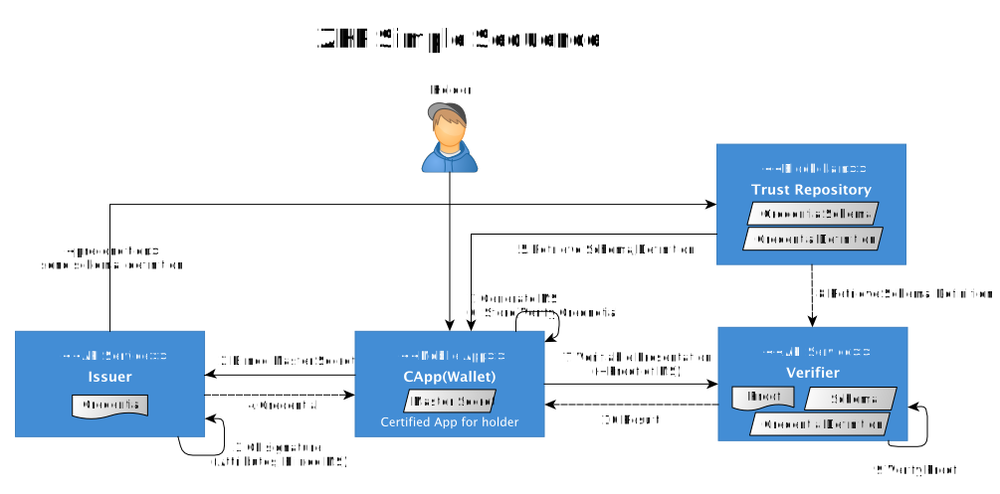
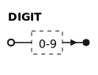
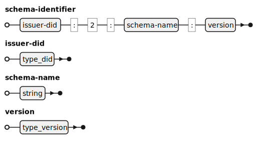
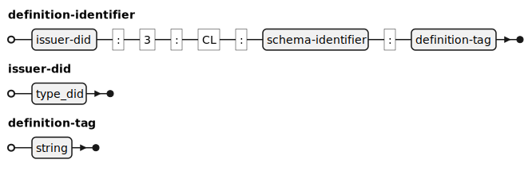

---
puppeteer:
    pdf:
        format: A4
        displayHeaderFooter: true
        landscape: false
        scale: 0.8
        margin:
            top: 1.2cm
            right: 1cm
            bottom: 1cm
            left: 1cm
    image:
        quality: 100
        fullPage: false
---

데이터 명세서 (ZKP Data Specification)
==

- 주제: 주요 데이터의 구조 및 요건
- 작성: 박동준
- 일자: 2025-04-30
- 버전: v1.0.0

| 버전   | 일자       | 변경 내용 |
| ------ | ---------- | --------- |
| v1.0.0 | 2025-04-30 | 초안 |


<div style="page-break-after: always;"></div>

목차
---

<!-- TOC tocDepth:2..3 chapterDepth:2..6 -->

- [데이터 명세서 (ZKP Data Specification)](#데이터-명세서-zkp-data-specification)
  - [목차](#목차)
  - [1. 개요](#1-개요)
    - [1.1. 표기법](#11-표기법)
      - [1.1.1. OSD](#111-osd)
      - [1.1.2. EBNF Diagram](#112-ebnf-diagram)
  - [2. 데이터 타입](#2-데이터-타입)
    - [2.1. General](#21-general)
      - [2.1.1. schema identifier](#211-schema-identifier)
      - [2.1.2. definition identifier](#212-definition-identifier)
      - [2.1.3. uuid](#213-uuid)
      - [2.1.4. credId](#214-credid)
  - [3. 상수](#3-상수)
    - [3.1. General](#31-general)
  - [4. 데이터 구조](#4-데이터-구조)
    - [4.1. General](#41-general)
      - [4.1.1. AttrReferent](#411-attrreferent)
      - [4.1.2. AttrSubReferent](#412-attrsubreferent)
      - [4.1.3. UserReferent](#413-userreferent)
      - [4.1.4. PredicateReferent](#414-predicatereferent)
      - [4.1.5. PredicateSubReferent](#415-predicatesubreferent)
      - [4.1.6. ProofParam](#416-proofparam)
      - [4.1.7. ReferentInfo](#417-referentinfo)
      - [4.1.8. Referent](#418-referent)
      - [4.1.9. ReferentAttributeValue](#419-referentattributevalue)
      - [4.1.10. ProofVerifyParam](#4110-proofverifyparam)
      - [4.1.11. BlindedCredentialSecrets](#4111-blindedcredentialsecrets)
      - [4.1.12. BlindedCredentialSecretsCorrectnessProof](#4112-blindedcredentialsecretscorrectnessproof)
      - [4.1.13. KeyCorrectnessProof](#4113-keycorrectnessproof)
      - [4.1.14. SubProof](#4114-subproof)
      - [4.1.15 PrimaryProof](#4115-primaryproof)
      - [4.1.16. AggregatedProof](#4116-aggregatedproof)
      - [4.1.17. RequestedProof](#4117-requestedproof)
      - [4.1.18. Identifiers](#4118-identifiers)
      - [4.1.19. PrimaryPredicateInequalityProof](#4119-primarypredicateinequalityproof)
      - [4.1.20. PrimaryEqualProof](#4120-primaryequalproof)
      - [4.1.21. Predicate](#4121-predicate)
      - [4.1.22. AttributeValue](#4122-attributevalue)
      - [4.1.23. AttributeInfo](#4123-attributeinfo)
      - [4.1.24. PredicateInfo](#4124-predicateinfo)
      - [4.1.25. SignatureCorrectnessProof](#4125-signaturecorrectnessproof)
      - [4.1.26. CredentialSignature](#4126-credentialsignature)
      - [4.1.27. PrimaryCredentialSignature](#4127-primarycredentialsignature)
      - [4.1.28. AvailableReferent](#4128-availablereferent)
      - [4.1.29. CredentialPrimaryKeyPair](#4129-credentialprimarykeypair)
      - [4.1.30. CredentialPrimaryPrivateKey](#4130-credentialprimaryprivatekey)
      - [4.1.31. CredentialPrimaryPublicKey](#4131-credentialprimarypublickey)
      - [4.1.32. publicKeyMetadata](#4132-publickeymetadata)
    - [4.2. CredentialOffer](#42-credentialoffer)
    - [4.3. CredentialRequest](#43-credentialrequest)
    - [4.4. Credential](#44-credential)
    - [4.5. ProofRequest](#45-proofrequest)
    - [4.6. Proof](#46-proof)
    - [4.7. CredentialDefinition](#47-credentialdefinition)
    - [4.8. CredentialSchema](#48-credentialschema)

<!-- /TOC -->


<div style="page-break-after: always;"></div>

## 1. 개요



본 문서는 OpenDID ZKP의 여러 엔티티가 공통으로 사용하는 아래와 같은 주요 데이터에 대하여 정의한다.
- schemaId, credDefId, masterSecret 등
- schema, definition, credential, proof, offer, proofRequest 등 문서 구조
- API 명세서에서 공용으로 사용하는 데이터 구조

schema, Definition, credential, proof, offer, proofRequest format 등 핵심적인 데이터는 별도의 문서로 상세하게 설명한다.
본 문서와 개별 문서의 내용이 상이한 경우에는 본 문서를 기준으로 한다.

### 1.1. 표기법

#### 1.1.1. OSD

데이터 타입이나 데이터 구조를 정의하기 위해 OSD (OpenDID Schema Definition Language)
문법을 사용한다.

#### 1.1.2. EBNF Diagram

데이터 타입 등의 구성을 구체적으로 표현하기 위해 EBNF(Extended Backus-Naur Form)
형식을 그림으로 변환하여 직관적으로 이해하기 쉽도록 구성하였다.

아래는 본문에서 사용한 terminal과 non-terminal을 정의하였다.

**■ Terminal**





<div style="page-break-after: always;"></div>

## 2. 데이터 타입

본 장은 OpenDID에서 공통으로 사용하는 데이터 타입을 정의한다.

```c#
// General
def string schemaId     : "id. ex: did:omn:12345678abcdef:2:mdl:1.0"
def string credDefId    : "id. ex: did:omn:12345678abcdef:2:mdl:1.0:3:CL:did:omn:12345678abcdef:2:mdl:1.0:tag"

def string nonce        : "양수, 비트길이(80)의 안전한(SecureRandom)난수로 BigInteger객체로 생성"
def string version      : "version id. ex: '1', '2'", regex(/[0-9]+/)
def string tag          : "tag id. ex: Tag1, MDL2025, Voter2025" 

```

### 2.1. General

#### 2.1.1. schema identifier

Java 언어의 변수명과 같은 식별자 이름이다.
알파벳 대소문자, 숫자, 언더바로만 구성되며, 첫 글자는 숫자로 시작할 수 없다.



[예시]

- "did:omn:12345678abcdef:2:mdl:1.0"


#### 2.1.2. definition identifier

Java 언어의 변수명과 같은 식별자 이름이다.
알파벳 대소문자, 숫자, 언더바로만 구성되며, 첫 글자는 숫자로 시작할 수 없다.



[예시]

- "did:omn:12345678abcdef:2:mdl:1.0:3:CL:did:omn:12345678abcdef:2:mdl:1.0:tag"


<div style="page-break-after: always;"></div>

#### 2.1.3. uuid

UUID(Universally Unique Identifier)는 소프트웨어 구축에 쓰이는 식별자 표준으로,
개방 소프트웨어 재단(OSF)이 분산 컴퓨팅 환경(DCE)의 일부로 표준화하였다.
고유한 식별자를 만들기 위해 사용하며 ZKP OpenDID 프로젝트에서는 다음과 같은 용도로 사용할 수 있다.

- credentialID,
- 트랜잭션을 식별하기 위한 거래코드
- 메시지 식별자
- 기타 다른 것과 구분이 필요하여 특정 항목에 이름을 부여하는 경우


[예시]

- "44b70956-cd24-11ed-afa1-0242ac120002"
- "6dcdde42-c0d9-4f79-82fb-128a94ce709b"
- "7148d5c1-31a1-4ecd-87f9-b7b533b80692"
<div style="page-break-after: always;"></div>

#### 2.1.4. credId

개별 ZKP Credential 문서를 식별하기 위한 식별자로 UUID 형식을 사용한다.

## 3. 상수

### 3.1. General

```c#
def enum CREDENTIAL_TYPE: "Credential 서명 타입"
{
    "CL": "Credential 내 blinded master secret을 포함한 'attribute' 각각 CL 서명",
}

def enum MARKER_TYPE: "schema, definition identifier 생성시 구분자로 사용"
{
    2 : "Credential schema marker",
    3 : "Credential definition marker"
}

def enum PREDICATE_TYPE: "predicate type"
{
    "GE": "크거나 같음",
    "LE": "작거나 같음",
    "GT": "큰",
    "LT": "작은"
}

def enum ATTR_TYPE: "attribute type"
{
    "String": "문자형",
    "Number": "숫자형"
}
```

## 4. 데이터 구조

### 4.1. General

#### 4.1.1. AttrReferent

증명(proof) 생성 과정에서 속성(attribute)과 관련된 정보를 표현하는 객체이다.
특정 속성을 선택적으로 공개하거나, 검증자에게 공개하지 않고 증명을 할 수 있습니다.
```c#
def object AttrReferent: "attribute referent"
{   
    + string                   "name"               : "어트리뷰트 이름" 
    + bool                     "checkRevealed"      : "드러낼 어트리뷰트 유무"
    + array(AttrSubReferent)   "referent"           : "AttrSubReferent", min_extend(1)   
}
```
- `~/name`: 증명의 특정 속성(attribute)을 식별하는 참조 이름
- `~/checkRevealed`: 해당 속성이 증명에서 공개(reveal)될지 여부를 나타 냄 
  - `true` 로 설정되면, 증명을 검증하는 검증자(verifier)가 해당 속성을 볼 수 있습니다.
  - `false` 이면, 영지식 증명 방식으로 해당 속성값이 공개되지 않고 검증됩니다.
- `~/referent`: attrSubReferent는 증명에서 참조되는 속성(attribute)의 세부 정보를 포함하는 리스트입니다.
속성은 여러 개일 수 있으며, 배열([]) 안에 여러 개의 객체가 들어갈 수 있습니다.

#### 4.1.2. AttrSubReferent

특정 속성(attribute)과 관련된 정보를 담고 있으며, 다음 요소를 포함합니다.
```c#
def object AttrSubReferent: "attribute sub referent"
{   
    + string "raw"                        : "ex: seoul" 
    + uuid "credId"                       : "credential ID"
    + definition-identifier "credDefId"   : "CredentialDefinition 식별자"
}
```
- `~/raw`: 속성의 원본 값
- `~/credId`: 속성이 포함된 credential의 ID
- `~/credDefId`: 발급자가 특정 스키마에 대해 생성한 증명서 정의(CredentialDefinition)의 ID, CredentialDefinition은 해당증명서가 어떤 서명키로 발급되었는지 나타내며 검증자가 이를 이용하여 증명서의 유효성을 검증함

#### 4.1.3. UserReferent

증명서의 특정 속성과 관련된 사용자의 참조 데이터를 나타냅니다. 이를 통해 ZKP 증명 과정에서 어떤 속성이 포함될지 정의할 수 있습니다.
```c#
def object UserReferent: "user referent"
{   
    + uuid "credId"                       : "credential ID"
    + string "raw"                        : "ex: seoul"
    + string "referentKey"                : "referent Key"
    + string "referentName"               : "referent Name"
    + bool   "isRevealed"                 : "드러낼 어트리뷰트 유무"
}
```
- `~/credId`: credential ID
- `~/raw`: 속성의 원본 값
- `~/referentKey`: 해당 속성을 특정하는 내부 참조 키, 증명 생성 과정에서 내부적으로 사용되는 키(AttrReferent에 연결)로, 다른 속성들과 구분하는 역할
- `~/referentName`: 속성이 포함된 참조 그룹 이름
- `~/isRevealed`: 해당 속성이 공개될지 여부

#### 4.1.4. PredicateReferent

속성 값에 대한 특정 조건(예: 나이가 18세 이상인지 여부)을 검증할 때 사용됩니다. 이는 속성 값 자체를 공개하지 않고 특정한 조건을 만족하는지만 증명하는 역할을 합니다.
```c#
def object PredicateReferent: "predicate referent"
{   
    + string "name"               : "수행하는 조건검사의 이름 정의, ex) zkpbirth" 
    + bool   "checkRevealed"      : "드러낼 어트리뷰트 유무"
    + array(referent)             : "PredicateSubReferent" min_extend(1)
}
```
- `~/name`: 증명의 특정 속성(predicate)을 식별하는 참조 이름
- `~/checkRevealed`: 이 값이 false이면, 속성 값이 공개되지 않고 영지식 증명 방식으로 특정 조건만 검증됩니다.
즉, "20010101"(2001년 1월 1일)라는 값 자체는 검증자에게 공개되지 않지만, 예를 들어 "이 사용자가 18세 이상인지" 여부를 증명하는 데 사용할 수 있습니다.
만약 true라면, 속성 값이 공개될 수 있습니다. 하지만 일반적으로 PredicateReferent는 속성 값을 공개하지 않기 때문에 false로 설정됩니다.
- `~/referent`: 증명할 속성을 리스트 형태로 참조

#### 4.1.5. PredicateSubReferent

```c#
def object PredicateSubReferent: "predicate sub referent"
{   
    + string "raw"                        : "ex: 20010101"
    + uuid "credId"                       : "Credential ID"
    + definition-identifier "credDefId"   : "CredentialDefinition 식별자"
}
```
- `~/raw`: 속성의 원본 값
- `~/credId`: 속성이 포함된 credential의 ID
- `~/credDefId`: 발급자가 특정 스키마에 대해 생성한 증명서 정의(CredentialDefinition)의 ID, CredentialDefinition은 해당증명서가 어떤 서명키로 발급되었는지 나타내며 검증자가 이를 이용하여 증명서의 유효성을 검증함

#### 4.1.6. ProofParam

Proof 생성 과정에서 사용되는 주요 구조체 중 하나로, 사용자가 제공하는 증명서(credential), 속성(attribute), 그리고 영지식 증명(Zero-Knowledge Proof, ZKP)에 필요한 데이터들을 포함
```c#
def object ProofParam: "predicate referent"
{   
    + object "referentInfo"     : "ReferentInfo" 
    + object "schema"           : "CredentialSchema" 
    + object "credDef"          : "CredentialDefinition"
}
```
- `~/referentInfo`: 속성의 원본 값
- `~/schema`: CredentialSchema
- `~/credDef`: CredentialDefinition

#### 4.1.7. ReferentInfo

특정 Credential과 그 속성(attribute)이 어떻게 참조되고 증명되는지를 나타내는 정보를 포함
```c#
def object ReferentInfo: "ReferentInfo"
{
    + object "referents"                  : "Referent", min_extend(1)
}
```
- `~/referents`: 증명 요청에 사용되는 Credential의 집합


#### 4.1.8. Referent

특정 Credential과 그 속성(attribute)이 어떻게 참조되고 증명되는지를 나타내는 정보를 포함
```c#
def object Referent: "Referent"
{
    + schema-identifier "schemaId"        : "CredentialSchema 식별자"
    + definition-identifier "credDefId"   : "CredentialDefinition 식별자"
    + object "attrs"                      : "ReferentAttributeValue", min_extend(1)
}
```
- `~/schemaId`: 증명서(Credential)의 데이터 구조(스키마)를 정의하는 ID
- `~/credDefId`: 발급자가 특정 스키마에 대해 생성한 증명서 정의(CredentialDefinition)의 ID, CredentialDefinition은 해당증명서가 어떤 서명키로 발급되었는지 나타내며 검증자가 이를 이용하여 증명서의 유효성을 검증함
- `~/attrs`: Credential에서 증명에 사용되는 속성(attribute) 목록

#### 4.1.9. ReferentAttributeValue

증명할 속성들에 대한 정보
```c#
def object ReferentAttributeValue: "ReferentAttributeValue"
{
    + string "referentKey" : "referent Key"
    + bool   "isRevealed"  : "isRevealed"
}
```
- `~/referentKey`: Proof Request에서 참조되는 Key 값
- `~/isRevealed`: 해당 속성이 공개(Revealed)되었는지 여부 (true 또는 false)

#### 4.1.10. ProofVerifyParam

어떤 Schema, CredentialDefinition을 기반으로 Proof을 생성했는지 정의
```c#
def object ProofVerifyParam: "proof verify param"
{
    + object "schema"                 : "CredentialSchema"
    + object "credentialDefinition"   : "CredentialDefinition"
}
```
- `~/schema`: CredentialSchema
- `~/credentialDefinition`: CredentialDefinition

#### 4.1.11. BlindedCredentialSecrets

블라인드 서명(Blind Signature)을 사용하여 발급자(Issuer)가 Credential을 서명할 때, 발급자가 특정 속성 값을 알지 못하도록 숨기는 기술이 적용된 부분입니다.
```c#
def object BlindedCredentialSecrets: "BlindedCredentialSecrets"
{
    + string "u"                          : "u"
    + array(string)                       : "hiddenAttributes"
}
```
- `~/u`: 피증명인이 발급자에게 보낼 블라인드 메시지(Blinded Message). 발급자가 서명할 때 실제 Credential의 특정 속성 값을 직접 알지 못하도록 하는 역할을 함.
- `~/hiddenAttributes`: 숨겨진 속성(Hidden Attributes) 목록. 이 속성들은 발급자가 Credential을 서명할 때 원본 값을 보지 않고도 증명할 수 있도록 숨김 처리됨. 예: "master_secret"은 피증명인의 비밀 키로 사용되며, 이는 영지식 증명에서 Credential을 연결하는 핵심 요소.

#### 4.1.12. BlindedCredentialSecretsCorrectnessProof

ZKP 기반 Credential을 발급 시, 블라인드 서명 요청이 올바르게 생성되었음을 증명하는 ZKP 증명 값.
```c#
def object BlindedCredentialSecretsCorrectnessProof: "BlindedCredentialSecretsCorrectnessProof"
{
    + string "c"            : "hash"
    + string "vDashCap"     : "vDashCap"
    + object "mCaps"        :  min_extend(1)
    {
        + string "masterSecret" : "master secret"
    }
}
```
- `~/c`: 피증명인이 발급자에게 보낼 블라인드 메시지(Blinded Message). 발급자가 서명할 때 실제 Credential의 특정 속성 값을 직접 알지 못하도록 하는 역할을 함.
- `~/vDashCap`: blindedMs 메시지가 변조되지 않았음을 증명하는 값.
- `~/cCaps`: masterSecret에 대한 커밋(commit) 값. 피증명인이 자신의 Master Secret을 보유하고 있음을 증명하는 데 사용됨.
 
#### 4.1.13. KeyCorrectnessProof

ZKP 기반 holder가 CredentialRequest 생성시, 발급자의 공개키(public key)가 올바르게 생성되었는지 증명하기 위한 데이터(키 정합성 증명)
```c#
def object KeyCorrectnessProof: "KeyCorrectnessProof"
{
    + string "c"           : "hash"
    + string "xzCap"       : "xzCap"
    + object "xrCap"       : "xrCap", min_extend(1)
    {
        + string "masterSecret" : "사용자가 소유한 master secret에 대한 커밋 값" 
    }
}
```
- `~/c`: 키 정합성 증명을 위한 해시값
- `~/xzCap`: CredentialDefinition의 공개키(public key)의 일부
- `~/xrCap`: 공개키에 대한 여러 속성들의 커밋값, 개별 속성값들이 원본 Credential에 포함된 데이터를 바탕으로 생성되었음을 증명하는 역할을 함

#### 4.1.14. SubProof

PrimaryProof(기본증명)정보를 포함
```c#
def object SubProof: "SubProof"
{
    + PrimaryProof "primaryProof": "PrimaryProof"
}
```

#### 4.1.15 PrimaryProof

기본적인 동등성 증명(Equality Proof, eqProof)과 부등식 증명(Inequality Proof, neProofs)을 포함합니다.
```c#
def object PrimaryProof "primaryProof": "PrimaryProof"
{
    + PrimaryEqualProof "eqProof"                        : "PrimaryEqualProof"
    + array(PrimaryPredicateInequalityProof) "neProofs"  : "PrimaryPredicateInequalityProof"
}
```

#### 4.1.16. AggregatedProof

다수의 Credential을 함께 증명할 수 있도록 결합한 증명 데이터.
```c#
def object AggregatedProof: "AggregatedProof"
{
    + string "cHash"             : "cHash"
    + array(byte[]) "cList"      : "cList"
}
```
- `~/cHash`: Credential 증명의 무결성을 확인하는 해시 값.
- `~/cList`: 집계 증명을 위한 데이터 리스트.

#### 4.1.17. RequestedProof

검증자가 요청한 속성을 증명하기 위해 제출된 값(원본 공개 여부 포함).
```c#
def object RequestedProof: "RequestedProof"
{
    + object "selfAttestedAttrs"   : "selfAttestedAttrs"
    + object "predicates"          : "predicates"
    + object "revealedAttrs"       : "revealedAttrs"
    + object "unrevealedAttrs"     : "unrevealedAttrs"
}
```
- `~/selfAttestedAttrs`: 피증명인이 직접 입력하여 증명한 속성
- `~/predicates`: 부등식 증명(requestedPredicates)이 포함된 속성 ("zkpbirth" 속성에 대해 "나이가 2020년 1월 3일 이전 출생자인지" 증명한 결과.)
- `~/revealedAttrs`: 검증자에게 공개된 속성 값 목록. ("row" → 원본 데이터, "encoded" → 암호화된 데이터.)
- `~/unrevealedAttrs`: 검증자에게 공개되지 않은 속성 목록

#### 4.1.18. Identifiers

어떤 CredentialDefinition 및 Schema가 사용되었는지 식별하는 정보.
```c#
def object Identifiers: "Identifiers"
{
    + definition-identifier "credDefId" : "CredentialDefinition 식별자"
    + schema-identifier     "schemaId"  : "Schema 식별자"
}
```
- `~/credDefId`: 발급자가 특정 스키마에 대해 생성한 증명서 정의(CredentialDefinition)의 ID, CredentialDefinition은 해당증명서가 어떤 서명키로 발급되었는지 나타내며 검증자가 이를 이용하여 증명서의 유효성을 검증함
- `~/schemaId`: 증명서(Credential)의 데이터 구조(스키마)를 정의하는 ID

#### 4.1.19. PrimaryPredicateInequalityProof

검증자(Verifier)가 요청한 특정 속성이 부등식 조건(예: ≤, ≥)을 만족함을 피증명인(Holder)이 증명하기 위한 영지식 증명(ZKP) 데이터입니다.
즉, 피증명인은 자신의 원본 데이터를 공개하지 않고도, 특정 조건을 만족하는지만 증명할 수 있습니다.
```c#
def object PrimaryPredicateInequalityProof: "PrimaryPredicateInequalityProof"
{
    + object "u"          : "u"
    + object "r"          : "r"
    + object "t"          : "t"
    + string "mj"         : "mj"
    + string "alpha"      : "alpha"
    + object "predicate"  : "predicate"
}
```
- `~/u`: 증명 과정에서 사용되는 암호학적 값(U values).
- `~/r`: 피증명인의 속성 값과 관련된 커밋(commit) 값.
- `~/t`: 영지식 증명 과정에서 사용되는 보조 암호학적 값.
- `~/mj`: 속성 값을 기준으로 한 해시 값.
- `~/alpha`: 암호학적 난수 값.
- `~/predicate`: 검증자가 요청한 부등식 조건 정보.

#### 4.1.20. PrimaryEqualProof

동등성 증명(Equal Proof) 데이터를 포함하는 객체.
동등성 증명을 사용하여 검증자가 특정 속성이 정확히 일치하는지 증명할 수 있음.
피증명인은 특정 속성만 공개할 수도 있으며, 나머지는 숨길 수 있음.
revealedAttrs(공개된 속성)과 m(숨겨진 속성)으로 구분됨.
```c#
def object PrimaryEqualProof: "PrimaryEqualProof"
{
    + object "revealedAttrs" : "revealedAttrs"
    + string "aPrime"        : "aPrime"
    + string "e"             : "e"
    + string "v"             : "v"
    + object "m"             : "m"
    + string "m2"            : "m2"
}
```
- `~/revealedAttrs`: 검증자에게 공개된 속성 값 목록. (예: "zkpsex", "zkpaddr", "zkpasort")
- `~/aPrime`: 영지식 증명에서 사용되는 암호학적 값 중 하나.
- `~/e`: 암호학적 지수(Exponent) 값.
- `~/v`: 서명 값으로, Credential의 무결성을 확인하는 데 사용됨.
- `~/m`: 피증명인이 공개하지 않은 속성들의 암호학적 커밋 값.
- `~/m2`: 추가적인 검증 요소.

#### 4.1.21. Predicate

특정 속성이 부등식 조건을 만족하는지를 검증하는 데 사용되는 Predicate(조건) 데이터입니다.
즉, 피증명인(Holder)이 자신의 속성이 특정 기준을 충족함을 증명하는 데 활용됩니다.
```c#
def object Predicate: "Predicate"
{
    + PREDICATE_TYPE "pType" : "PREDICATE_TYPE"
    + int "pValue"           : "pValue"
    + string "attrName"      : "attrName"
}
```
- `~/pType`: 비교 연산자. LE(<=), GE(>=), LT(<), GT(>) 사용 가능.
- `~/pValue`: 비교할 기준 값 (예: 20200103, 즉 2020년 1월 3일).
- `~/attrName`: 비교할 속성의 이름 (예: "zkpbirth", 즉 생년월일).

#### 4.1.22. AttributeValue

속성(Attribute)의 값이 어떻게 저장되고 처리되는지를 나타내는 데이터 모델입니다.
즉, 속성의 원본 값과 해당 값을 암호화하여 표현한 값을 포함하는 정보입니다.
영지식 증명(ZKP)에서는 encoded 값을 사용하여 원본 데이터를 직접 노출하지 않고도 해당 값이 증명되었음을 검증 가능.
```c#
def object AttributeValue : "AttributeValue"
{
    + string "encoded" : "원본 값을 수치화하여 저장한 것으로 해시함수 또는 특정 암호화 알고리즘을 사용하여 생성됨"
    + string "raw"     : "male" : "예시) 성별"
}
```
- `~/encoded`: 원본 속성 값의 암호화된 표현(Encoded Value).
- `~/raw`: 공개된 원본 속성 값 (예: "seoul", 즉 주소).

#### 4.1.23. AttributeInfo

특정 속성(Attribute)이 어떻게 요청되고 처리되는지를 나타내는 데이터 모델입니다.
즉, 검증자(Verifier)가 특정 속성을 증명하도록 요청할 때 사용되는 정보입니다.
```c#
def object AttributeInfo : "AttributeInfo"
{
    + string "name"                        : "referent Key"
    + array(string) "restrictions"         : "해당 속성을 어떤 Credential Definition에서 가져올지를 제한하는 조건."
}
```
- `~/name`: 증명해야 할 속성 이름 (예: "zkpsex", 즉 성별).
- `~/restrictions`: 해당 속성을 어떤 Credential Definition에서 가져올지를 제한하는 조건. 속성이 포함된 Credential Definition의 ID (특정 기관이 발급한 Credential에서만 속성을 사용할 수 있도록 제한).
  
#### 4.1.24. PredicateInfo

특정 속성(Predicate)이 어떻게 요청되고 처리되는지를 나타내는 데이터 모델입니다.
즉, 검증자(Verifier)가 특정 속성을 증명하도록 요청할 때 사용되는 정보입니다.
```c#
def object PredicateInfo : "PredicateInfo"
{
    + PREDICATE_TYPE "pType"              : "predicate type"
    + string "pValue"                     : "predicate value"
    + array(string) "restrictions"        : "해당 속성을 어떤 Credential Definition에서 가져올지를 제한하는 조건."
}
```
- `~/pType`: 비교 연산자. LE(<=), GE(>=), LT(<), GT(>) 사용 가능.
- `~/pValue`: 비교할 기준 값 (예: 20200103, 즉 2020년 1월 3일).
- `~/restrictions`: 해당 속성을 어떤 Credential Definition에서 가져올지를 제한하는 조건. 속성이 포함된 Credential Definition의 ID (특정 기관이 발급한 Credential에서만 속성을 사용할 수 있도록 제한).

#### 4.1.25. SignatureCorrectnessProof

서명(Signature)의 무결성을 검증하는 데 사용되는 SignatureCorrectnessProof 데이터입니다.
즉, Credential이 올바르게 서명되었으며 변조되지 않았음을 검증할 때 사용됩니다.
```c#
def object SignatureCorrectnessProof : "SignatureCorrectnessProof"
{
    + string "se" : "서명이 변조되지 않았음을 증명하는 해시 값."
    + string "c"  : "정합성을 검증하기 위한 보조 해시 값."
}
```
- `~/se`: 서명의 무결성을 보장하는 암호학적 요소. 서명 값(v)이 올바르게 생성되었으며, Credential이 변조되지 않았음을 보장하는 데 사용됨.
Credential이 위조되거나 수정되었다면, se 값이 달라지기 때문에 검증에서 실패.
- `~/c`: 증명 검증에 사용되는 챌린지 값(Challenge value). 영지식 증명 프로토콜(ZKP)에서 랜덤한 값을 생성하여 검증자가 검증할 수 있도록 하는 역할.
서명이 동일한 방식으로 검증될 수 있도록, 특정 방식으로 생성된 난수 값.
검증자는 c 값을 사용하여 Credential이 올바르게 서명되었는지를 확인.

#### 4.1.26. CredentialSignature

Credential(자격 증명)의 서명(Signature) 정보를 포함하는 데이터 모델입니다.
즉, Credential이 올바르게 서명되었으며 변조되지 않았음을 검증하는 데 사용됩니다.
```c#
def object CredentialSignature : "CredentialSignature"
{
    + PrimaryCredentialSignature "pCredential"   : "Primary 각 서명 값과 데이터"
}
```
- `~/pCredential`: Credential의 발급자가 올바르게 서명했는지, 그리고 Credential이 변조되지 않았는지를 검증하는 데 사용됨.
  
#### 4.1.27. PrimaryCredentialSignature

Credential을 발급한 기관(Issuer)이 이 Credential이 정당하게 발급되었음을 증명하는 암호학적 서명(Signature)을 포함
```c#
def object PrimaryCredentialSignature : "PrimaryCredentialSignature"
{
    + string "a"  : "발급자가 생성한 Credential 서명의 일부."
    + string "e"  : "공개 지수(Exponent)로, 서명 검증 시 사용됨."
    + string "v"  : "서명의 핵심 요소인 큰 정수 값."
    + string "q"  : "추가적인 서명 관련 파라미터."
    + string "m2" : "Credential에서 사용된 추가적인 서명 요소."
}
```
- `~/a`: Credential 서명의 중요한 암호학적 요소 중 하나.
- `~/e`: 암호학적 지수(Exponent), 서명의 보안성을 보장하는 역할.
- `~/v`: Credential 서명의 무결성을 보장하는 큰 정수 값.
- `~/q`: 서명 검증에 사용되는 또 다른 암호학적 요소.
- `~/m2`: 추가적인 검증 요소, Credential의 무결성을 보장.

#### 4.1.28. AvailableReferent

ZKP 증명 과정에서 사용자가 자신의 Credential을 검색하고, 증명 요청(Proof Request)에 맞는 Credential 속성을 찾는 과정을 나타냅니다.
즉, 사용자가 보유한 Credential 중에서 어떤 속성을 공개할 수 있고, 어떤 속성을 predicate 검증할 수 있는지를 보여줍니다
사용자가 증명할 수 있는 속성(Attribute)과 조건(Predicate) 목록을 정의
```c#
def object AvailableReferent : "AvailableReferent"
{
    + object "selfAttrReferent"  : "AttrReferent"
    + object "attrReferent"      : "AttrReferent"
    + object "predicateReferent" : "PredicateReferent"
}
```
- `~/selfAttrReferent`: 사용자가 직접 입력한(Self-Attested) 속성 목록
- `~/attrReferent`: 공개 가능한(Credential에서 직접 제공할 수 있는) 속성 목록
- `~/predicateReferent`: Predicate 검증에 사용할 속성 목록 (값은 공개되지 않음)

#### 4.1.29. CredentialPrimaryKeyPair
영지식증명(ZKP) 기반 인증 시스템에서 사용자의 인증 정보를 생성하고 검증하는 데 필수적인 요소입니다.
이 데이터는 Issuer(발급자)가 생성하는 Credential Definition의 키 쌍을 포함합니다.
즉, 발급자가 특정 속성(Attribute)에 대해 증명 가능한 공개키 및 비밀키를 설정하는 과정에서 사용됩니다.
```c#
def object CredentialPrimaryKeyPair : "CredentialPrimaryKeyPair"
{
    + object "privateKey"        : "CredentialPrimaryPrivateKey"
    + object "publicKey"         : "CredentialPrimaryPublicKey"
    + object "publicKeyMetadata" : "PublicKeyMetadata"
}
```
- `~/privateKey`: 개인키 정보
- `~/publicKey`: 공개키 정보
- `~/publicKeyMetadata`: 공개키 메타정보 

#### 4.1.30. CredentialPrimaryPrivateKey
Issuer(발급자)만 알고 있는 RSA 기반의 대형 소수
```c#
def object CredentialPrimaryKeyPair : "CredentialPrimaryKeyPair"
{
    + stirng "p" : "첫 번째 소수"
    + string "q" : "두 번째 소수"
}
```
- `~/p, q`: 이 값들은 비밀키(Private Key)를 생성하는 데 사용되며, 공개되지 않음. 두 개의 큰 소수를 곱해 공개키 n을 생성하는 데 활용됨.

#### 4.1.31. CredentialPrimaryPublicKey
ZKP 기반의 Credential을 발급하고 검증하는 데 사용되는 공개키(Public Key)입니다.
```c#
def object CredentialPrimaryPublicKey : "CredentialPrimaryPublicKey"
{
    + string "n" :  "공개키 모듈러스(p * q)"
    + string "z" :  "추가적인 공개키 요소 (ZKP 계산에 사용)"
    + string "s" :  "공개키의 일부 (ZKP 검증 시 사용)" 
    + object "r" :  "속성(Attribute)에 대한 공개키 요소", min_extend(2)
    {
        /* 
        ... 예시 (순서 보장 필요)
        - string "zkpsex" : "zkpsex의 공개키"
        - string "zkpasort" : "zkpasort의 공개키"
        - string "zkpaddr" : "zkpaddr의 공개키"
        - string "zkpbirth" : "zkpbirth의 공개키"
        */
        - string $attribute : "attribute의 공개키"
        + string "masterSecret" : "마스터 시크릿 (개인 비밀키 관련))"
    }
    + string "rctxt" : "컨텍스트 값 (ZKP 프로토콜 내부 연산에 활용)"
}
```
- `~/n`: 공개키 모듈러스 값으로, p * q의 곱으로 생성됨.
- `~/z`: ZKP 계산에 필요한 값.
- `~/s`: 공개키의 일부로, 영지식 증명 과정에서 n과 함께 사용됨.
- `~/r`: 각 속성(Attribute)에 대한 공개키 요소
- `~/rctxt`: ZKP 증명에서 중요한 추가적인 컨텍스트 정보.


#### 4.1.32. publicKeyMetadata
ZKP 기반의 공개키 메타데이터 입니다.
```c#
def object publicKeyMetadata : "publicKeyMetadata"
{
    + string "xz" :  "추가적인 공개키 메타정보"
    + object "xr" :  "속성(Attribute)별 추가적인 공개키 정보" min_extend(2)
    {
        /* 
        ... 예시 (순서 보장 필요)
        - string "zkpsex" : "zkpsex의 공개키"
        - string "zkpasort" : "zkpasort의 공개키"
        - string "zkpaddr" : "zkpaddr의 공개키"
        - string "zkpbirth" : "zkpbirth의 공개키"
        */
        - string $attribute : "attribute의 공개키"
        + string "masterSecret" : "마스터 시크릿"
    }
}
```
- `~/xz`: 추가적인 공개키 메타정보
- `~/xr`: 속성(Attribute)별 추가적인 공개키 정보 (ex: zkpsex, zkpbirth, zkpsort, zkpaddr, mastersecret 등 특정 속성을 검증할 때 사용됨)

### 4.2. CredentialOffer

발급자가 사용자에게 Credential을 발급해주기 전에 생성하는 Credential Offer, 이를 기반으로 사용자는 CredentialRequest를 생성하고 발급자에게 요청하여 Credential을 발급 받는 프로세스를 진행하게 됨.
```c#
def object CredentialOffer: "credential offer"
{    
    + nonce "nonce"                               : "nonce"
    + schema-identifier "schemaId"                : "CredentialSchema 식별자"
    + definition-identifier "credDefId"           : "CredentialDefinition 식별자"
    + object "keyCorrectnessProof"   : "KeyCorrectnessProof"
}
```
- `~/nonce`: 재사용 공격을 방지하기 위해 사용되는 난수 값 (Credential Request와 연관)
- `~/schemaId`: 증명서(Credential)의 데이터 구조(스키마)를 정의하는 ID
- `~/credDefId`: 발급자가 특정 스키마에 대해 생성한 증명서 정의(CredentialDefinition)의 ID, CredentialDefinition은 해당증명서가 어떤 서명키로 발급되었는지 나타내며 검증자가 이를 이용하여 증명서의 유효성을 검증함
- `~/keyCorrectnessProof`: 발급자가 올바른 공개 키를 사용했을을 보장하는 증명값, 증명서 요청 단계에서 Holder가 발급자의 공개키가 올바른지 확인하기 위함

### 4.3. CredentialRequest

사용자(Holder)가 Credential을 받기 위해 발급자(Issuer)에게 보내는 요청입니다. 이 요청은 Credential Offer를 기반으로 생성되며, ZKP(영지식 증명) 방식을 사용하여 민감한 정보를 보호하면서 신뢰할 수 있는 방식으로 Credential을 요청합니다.
```c#
def object CredentialRequest: "credential request"
{    
    + string "proverDID"                   : "prover DID"
    + definition-identifier "credDefId"    : "Credential Definition 식별자"
    + nonce "nonce"                        : "nonce"
    + BlindedCredentialSecrets "blindedMs" : "BlindedCredentialSecrets"
    + BlindedCredentialSecretsCorrectnessProof "blindedMsCorrectnessProof" : "BlindedCredentialSecretsCorrectnessProof"
}
```
- `~/proverDID`: 사용자(Holder)의 DID(Decentralized Identifier). 신원 주체(Holder)를 나타내는 고유한 식별자.
- `~/credDefId`: 요청하는 Credential의 Credential Definition ID. 발급 기관이 정의한 Credential Definition을 가리키며, 발급할 Credential의 속성과 서명 체계를 정의함.
- `~/nonce`: 요청의 유일성을 보장하기 위한 무작위 난수(Nonce). Credential Offer와 Credential Request 간의 보안성을 유지하는 역할.
- `~/blindedMs`: 사용자의 속성을 블라인드 처리한(암호화된) 상태로 발급자에게 제공하는 데이터
- `~/blindedMsCorrectnessProof`: blindedMs가 올바르게 생성되었음을 증명하는 암호학적 증명 데이터
- 
### 4.4. Credential

Credential은 발급자(Issuer)가 피증명인(Holder)에게 제공하는 디지털 증명서로, 탈중앙화 신원 증명(DID) 시스템에서 사용됩니다.
이 Credential은 영지식 증명(ZKP) 방식을 기반으로 하며, 검증자(Verifier)가 원본 데이터를 직접 확인하지 않고도 그 유효성을 검증할 수 있도록 합니다.
```c#
def object Credential: "credential"
{
    + identifier "schemaId"    : "CredentialSchema ID"
    + identifier "credDefId"   : "CredentialDefinition ID"
    + object "values"          : "attributes", min_extend(1)
    {
        /* 
        ... 예시 (순서 보장 필요)
        - string "zkpsex" : "성별"
        - string "zkpasort" : "면허번호"
        - string "zkpaddr" : "주소"
        - string "zkpbirth" : "생년월일"
        */
        + AttributeValue $attributeValue : "AttributeValue"
    }
    + CredentialSignature "signature"          : "서명 값"
    + SignatureCorrectnessProof "signatureCorrectnessProof"  : "서명 검증 값"
}
```
- `~/schemaId`: 증명서(Credential)의 데이터 구조(스키마)를 정의하는 ID
- `~/credDefId`: 발급자가 특정 스키마에 대해 생성한 증명서 정의(CredentialDefinition)의 ID, CredentialDefinition은 해당증명서가 어떤 서명키로 발급되었는지 나타내며 검증자가 이를 이용하여 증명서의 유효성을 검증함
- `~/value`: Credential에 포함된 속성(Attribute) 값을 저장합니다.
- `~/value/zkpsex`: 성별
- `~/value/zkpbirth`: 생년월일
- `~/value/zkpasort`: 개인식별번호
- `~/value/zkpaddr`: 주소
- `~/signature`: 발급자가 Credential을 발급할 때 생성한 암호학적 서명(Signature)을 포함합니다. 이는 Credential의 진위 여부를 검증하는 데 사용됩니다
- `~/signatureCorrectnessProof`: Credential이 올바르게 서명되었음을 증명하는 정합성 증명(Correctness Proof) 데이터를 포함.

### 4.5. ProofRequest

검증자가 증명자(사용자)에게 요구하는 증명 조건을 정의
```c#
def object ProofRequest: "proofRequest"
{
    + string "name"                  : "proofs"
    + string "version"               : "version"
    + nonce  "nonce"                 : "nonce"
    - object "requestedAttributes"   : "AttributeInfo", min_extend(1)
    - object "requestedPredicates"   : "PredicateInfo", min_extend(1)
}
```
- `~/name`: Proof Request의 이름. (예: "mdl")
- `~/version`: Proof Request의 버전 (예: "1.0")
- `~/nonce`: 난수 값 (증명 요청의 고유성을 보장)
- `~/requestedAttributes`: 사용자가 공개해야 하는 속성 정보
- `~/requestedPredicates`: 사용자가 조건을 만족해야 하는 속성 정보

### 4.6. Proof

검증자(Verifier)가 요청한 Proof Request에 대해 피증명인(Holder)이 제출한 증명(Proof) 데이터.
Proof는 영지식 증명(ZKP) 방식을 활용하여 원본 데이터를 직접 공개하지 않고도 특정 속성 또는 조건을 만족함을 증명할 수 있도록 한다.
```c#
def object Proof: "proof"
{
    + array(SubProof)        "proofs"           : "proofs"
    + object AggregatedProof "aggregatedProof" : "aggregated proof"
    + object RequestedProof  "requestedProof"  : "requested proof"
    + array(Identifiers)     "identifiers"      : "identifiers"
}
```
- `~/proofs`: 각 Credential에 대한 증명(Proof) 정보 목록.
- `~/aggregatedProof`: 여러 Credential 증명을 결합하여 검증할 수 있도록 하는 집계 증명(Aggregated Proof).
- `~/requestedProof`: 검증자가 요청한 속성 및 조건에 대해 피증명인이 제공한 정보.
- `~/identifiers`: 사용된 Credential들의 CredentialDefinition 및 Schema 정보를 포함.

### 4.7. CredentialDefinition

Credential Definition(CredDef)을 정의하는 정보입니다.
특정 Credential Schema에 따라 Credential을 발급하는 방식과 서명 방식을 정의합니다.
발급자(Issuer)가 Credential을 발급하려면 반드시 CredentialDefinition을 생성해야 합니다.
```c#
def object CredentialDefinition : "Credential 정의"
{
    + definition-identifier "id"          : "CredentialDefinition 식별자"
    + schema-identifier     "schemaId"    : "CredentialSchema 식별자"
    + string                "ver"         : "Version"
    + CREDENTIAL_TYPE       "type"        : "Credential 서명 타입"
    + object                "value"       : "value"
    {
        + object "primary" : "CredentialPrimaryPublicKey"
    }
    + string "tag" : "태그"
}
```
- `~/schemaId`: 증명서(Credential)의 데이터 구조(스키마)를 정의하는 ID
- `~/id`: 발급자가 특정 스키마에 대해 생성한 증명서 정의(CredentialDefinition)의 ID, CredentialDefinition은 해당증명서가 어떤 서명키로 발급되었는지 나타내며 검증자가 이를 이용하여 증명서의 유효성을 검증함
- `~/ver`: CredentialDefinition의 버전(Version).
- `~/type`: Credential의 서명 방식(Type). CL은 CL 서명(Clairaut-Lippold) 방식을 의미하며, 영지식 증명(ZKP) 기반 Credential 발급에 사용되는 기본 서명 방식.
- `~/value/primary`: 발급자 서명 키 및 암호학적 파라메터
- `~/tag`: CredentialDefinition을 식별하는 태그(Tag). 동일한 스키마(Schema)라도 여러 CredentialDefinition이 존재할 수 있으며, 이를 구분하는 역할.

### 4.8. CredentialSchema

특정 Credential이 포함하는 속성(attribute)들과 해당 데이터의 구조를 정의하는 역할을 합니다.

```c#
def object CredentialSchema: "Credentialschema"
{
    + schema-identifier    "id"          : "CredentialSchema 식별자"
    + string               "name"        : "CredentialSchema 이름"
    + string               "version"     : "CredentialSchema 버전"
    + array(string)        "attrNames"   : "attribute 별 이름"
    + string               "tag"         : "CredentialSchema 태그"
}
```
- `~/id`: CredentialSchema의 고유 식별자(ID). 특정 스키마를 참조하기 위해 사용됨.
- `~/name`: 스키마의 이름
- `~/version`: 스키마의 버전(Version). 같은 이름의 스키마라도 여러 버전이 존재할 수 있음.
- `~/attrNames`: 	Credential이 포함하는 속성(Attributes)들의 목록.
- `~/tag`: 스키마를 구별하거나 필터링하는데 사용되는 태그