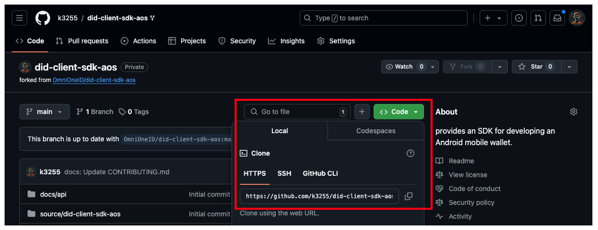
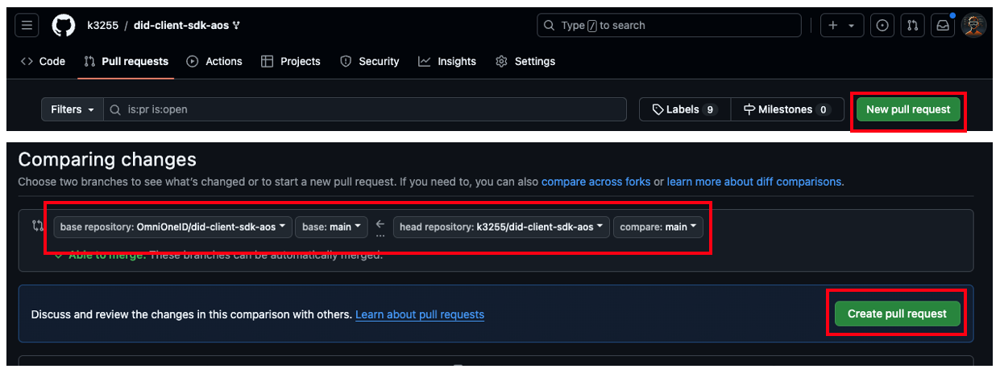
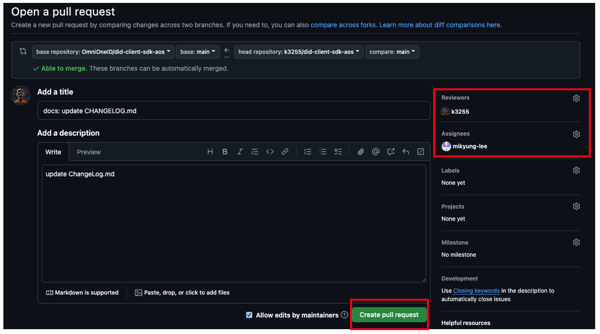

# Contribution Process Guide via GitHub

## Contribution Targets

| Target         | Description                                                                                                                               |
|----------------|-------------------------------------------------------------------------------------------------------------------------------------------|
| Source Code    | Improve code quality, add new features, fix bugs, optimize performance, write test cases, and perform refactoring work.                    |
| Documentation  | Update project documentation, write API documentation, add usage examples, and contribute to translations.                                |
| Template Improvement | Improve or add new templates for issues, PRs, bug reports, feature suggestions, and security vulnerability reporting to ensure consistency among contributors. |
| GitHub Action Configuration | Build and enhance CI/CD pipelines, automate build and deployment processes, integrate testing automation, and incorporate code analysis tools. |
| Testing        | Write and improve automated test cases such as unit tests, integration tests, etc.                                                       |
| Issue Resolution & Management | Resolve existing issues, create new issues, report bugs, provide feedback, and suggest new features to improve the project. |
| Security       | Identify and fix security vulnerabilities, write security policies, update dependencies to enhance security.                              |

## Contribution Process
- Fork the project you want to contribute to (e.g., OmniOneID/did-client-sdk-aos) using your personal GitHub account (e.g., k3255).


- Clone the forked repository from your GitHub account to your development environment.




`$ git clone https://github.com/k3255/did-client-sdk-aos.git`

- Navigate to the cloned directory and check the status of the Git repository.


`$ cd did-client-sdk-aos`

`$ git remote -v`
```
origin	https://github.com/k3255/did-client-sdk-aos.git (fetch)
origin	https://github.com/k3255/did-client-sdk-aos.git (push)
```

- Add an additional remote repository.

`$ git remote add upstream https://github.com/OmniOneID/did-client-sdk-aos.git`

`$ git remote -v`
```
origin	https://github.com/k3255/did-client-sdk-aos.git (fetch)
origin	https://github.com/k3255/did-client-sdk-aos.git (push)
upstream	https://github.com/OmniOneID/did-client-sdk-aos.git (fetch)
upstream	https://github.com/OmniOneID/did-client-sdk-aos.git (push)
```

- Fetch the latest changes from the upstream repository to update your local information.

`$ git fetch upstream`

- Checkout to a specific branch (e.g., main) from the upstream repository to use as the base for your work, applying the branch's files locally.

`$ git checkout upstream/main`

- Create a new temporary branch using the `-b` option and checkout to that branch.

`$ git checkout -b feature/modify-document`
```
Switched to a new branch 'feature/modify-document'
```

`$ git branch`
```
* feature/modify-document
  main
```

- Modify the desired content (e.g., CHANGELOG.md)


- Build and run tests to ensure there are no issues with the changes.
- Check the Git status to see which files are not staged.

`$ git status`
```
On branch feature/modify-document
Changes not staged for commit:
  (use "git add <file>..." to update what will be committed)
  (use "git restore <file>..." to discard changes in working directory)
	modified:   CHANGELOG.md

no changes added to commit (use "git add" and/or "git commit -a")
```

`$ git diff`
```
diff --git a/CHANGELOG.md b/CHANGELOG.md
index 4031c54..b51e4a5 100644
--- a/CHANGELOG.md
+++ b/CHANGELOG.md
```

- Stage the files you want to commit to the upstream repository (you can stage multiple modified files).

`$ git add CHANGELOG.md`

`$ git status`
```
On branch feature/modify-document
Changes to be committed:
  (use "git restore --staged <file>..." to unstage)
	modified:   CHANGELOG.md
```

- Commit the staged files with a clear and concise one-line commit message.

`$ git commit -m "docs: update CHANGELOG.md"`
```
[feature/modify-document 09870dd] docs: update CHANGELOG.md
 1 file changed, 1 insertion(+), 1 deletion(-)
```

`$ git status`
```
On branch feature/modify-document
nothing to commit, working tree clean
```

- Fetch the latest changes from the upstream repository (this step is essential and should not be skipped; regularly checking for updates is also a good practice).

`$ git fetch upstream`

- Rebase your branch onto the latest changes from the upstream repository. If there are any conflicts with the latest state of the repository, the contributor must resolve them before proceeding with the next steps.

`$ git rebase upstream/main`
```
Current branch feature/modify-document is up to date.
```

- Push your working branch to your GitHub repository.

`$ git push origin feature/modify-document`
```
Enumerating objects: 5, done.
Counting objects: 100% (5/5), done.
Delta compression using up to 10 threads
Compressing objects: 100% (3/3), done.
Writing objects: 100% (3/3), 300 bytes | 300.00 KiB/s, done.
Total 3 (delta 2), reused 0 (delta 0), pack-reused 0
remote: Resolving deltas: 100% (2/2), completed with 2 local objects.
remote: 
remote: Create a pull request for 'feature/modify-document' on GitHub by visiting:
remote:      https://github.com/k3255/did-client-sdk-aos/pull/new/feature/modify-document
remote: 
To https://github.com/k3255/did-client-sdk-aos.git
 * [new branch]      feature/modify-document -> feature/modify-document
```

- When you access your forked repository on GitHub, the “Compare & pull request” button will be activated. Click it to create a pull request.



- Review the created pull request and assign reviewers and assignees.



- After the reviewer leaves an approval comment, the approver will merge the pull request into the main branch.
